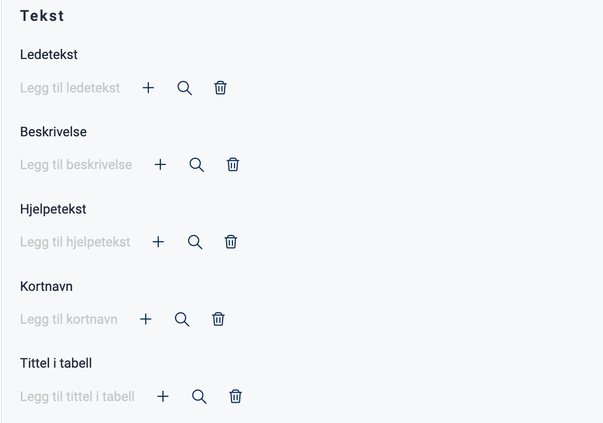

{}
🚧 This documentation is a work in progress.
{}

---

## Usage

Checkboxes are often used in forms to gather input from the user, allowing them to select one or more options from a list.

#### Use checkboxes when:
* Users can select multiple options from a list.
* An explicit choice needs to be made to use the settings (e.g., confirming that the user has read a document).

### Anatomy


{}
1. **Heading** - Question or instruction.
2. **Checkbox** - The choice control.
3. **Label** - Text label associated with the checkbox.
{}

### Style

* Checkboxes should always have an associated label on the right side.

### Best Practices

* Checkboxes with disabled options should be avoided.
    If an option is unavailable, it should be removed, and an explanation should be provided for why the option is missing.

### Content guidelines

* Keep labels short and descriptive.
* Start all labels with a capital letter.
* Do not include punctuation after labels.

### Related

* If the user can only select one option from a list, use [radio buttons](../radiobuttons).
* For a more compact way to display multiple options with single selection, use a [dropdown menu](../dropdown).

## Properties

The following is an autogenerated list of the properties available for {} based on the component's JSON schema file (linked below).

{}
We are currently updating how we implement components, and the list of properties may not be entirely accurate.
{}

{}

## Configuration

{}
We are currently updating Altinn Studio with more configuration options!
 The documentation is continuously updated, but more settings may be available than described here, and some settings may be in beta.
{}

### Add component

You can add a component in [Altinn Studio Designer](/app/getting-started/ui-editor/) by dragging it from the left-side panel to the middle page area.
Select the component to bring up the settings panel.

### Text (`textResourceBindings`)




You can create a new text by clicking on the plus sign or select an existing one by clicking on the magnifying glass. See [Adding and Editing Texts in an App](/app/development/ux/texts/#add-and-change-texts-in-an-application) for more information.






Tekst kan legges til direkte som en tekststreng eller ved å oppgi nøkkelen til en [tekstressurs](/app/development/ux/texts/#add-and-change-texts-in-an-application).


App/ui/layouts/{page}.json


```json{hl_lines="4-10"}
{
  "id": "komponent-id",
  "type": "Checkboxes",
  "textResourceBindings": {
          "title": "",
          "description": "",
          "help": "",
          "shortName": "",
          "tableTitle": ""
        }
}
```





{}
1. **Ledetekst** (`textResourceBindings.title`): A heading with a question or instruction.
2. **Beskrivelse** (`textResourceBindings.description`): Description. Text for further description or elaboration.
3. **Hjelpetekst** (`textResourceBindings.help`): Help text. When help text is filled out, a question mark will appear next to the heading. Click on the question mark to display the text as a popup. Can be used for explanations, examples, use cases, etc.

- **Kortnavn** (`textResourceBindings.shortName`): Short name. Overrides the title of the component used in the default `required` validation message.
- **Tittel i tabell** (`textResourceBindings.tableTitle`): Table title. Overrides the title of the component used in column headers when the component is within repeating groups.
{}

### Data Model

To store and manipulate the data collected by the component, the component must be linked to a field in a [data model](/app/development/data/data-modeling/#data-models).
 The values of the options must match the data type of the field.




Select the field you want to link the component to from the dropdown menu.
 If there are no fields available, you must first [upload a data model](/app/development/data/data-modeling/#upload-and-display-data-model).






Insert the name of the field you want to link the component to within curly braces under `dataModelBindings`.


App/ui/layouts/{page}.json


```json{hl_lines="4-6"}
{
  "id": "komponent-id",
  ...
  "dataModelBindings": {
    "simpleBinding": "MyDataModel.SomeField"
    }
}
```




### Adding Checkboxes

Checkboxes can be added manually or by using [code lists](/app/development/data/options).

#### Manually (`options`)



Select "Manuelt" and click "Legg til flere" to add a new checkbox. Choose or create a new text to add a label (`label`).

The checkbox comes with a pre-filled value (`value`), which is the data that is stored when the user makes a selection.
 The value can be changed as desired. If the component is linked to a data model, the values should correspond to the data type (e.g., boolean, string, number) specified in the model.






App/ui/layouts/{page}.json


```json{hl_lines="4-9"}
{
  "id": "komponent-id",
  ...
  "options": [
          {
            "label": "Alternativ 1",
            "value": "1"
          }
        ]
}
```




#### Code List (`optionsId`)

A [code list](/app/development/data/options) is a predefined list of options.




To add options from a code list, select "Kodeliste" and enter a code list ID.
 To use a custom (dynamic) code list, click "Bytt til egendefinert kodeliste" (switch to custom code list).


If you wish to [secure dynamic code lists](/app/development/data/options/dynamic-codelists/#secured-dynamic-options), you can check this option:






App/ui/layouts/{page}.json


```json{hl_lines="4-5"}
{
  "id": "komponent-id",
  ...
  "optionsId": "land",
  "secure": true
}
```



#### Kilde (`source`)

Another way to add options is by linking the component to a code list based on form data stored within the app itself.
 You can do this by adding a source (`source`); please refer to the [documentation](/nb/app/development/data/options/repeating-group-codelists/) for instructions on how to configure this.









App/ui/layouts/{page}.json


```json{hl_lines="4-9"}
{
  "id": "komponent-id",
  ...
  "source": {
    "group": "some.group",
    "label": "dropdown.label",
    "value": "some.group[{0}].someField",
    "description": "",
    "helpText": ""
  }
}
...
```



**Documentation for code lists**
- [Link a Component to a Code List](/app/development/data/options/#connect-the-component-to-options-code-list)
- [Static Code Lists](/app/development/data/options/static-codelists/)
- [Dynamic Code Lists](/app/development/data/options/dynamic-codelists/)
- [Code lists based on repeating groups from the data model](/app/development/data/options/repeating-group-codelists/)

### Checkbox settings









App/ui/layouts/{page}.json


```json{hl_lines="4-7"}
{
  "id": "komponent-id",
  ...
  "readOnly": false,
  "required": true,
  "layout": "row",
  "preselectedOptionsIndex": 0
}
```


 
- **Feltet skal være skrivebeskyttet** (`readOnly`): Field is read only. Disables the component when enabled (`true`).
- **Feltet skal være påkrevd** (`required`): Field is required when enabled (`true`).
- **Visning** (`layout`): Layout. Can be column (`column`) (default) or row (`row`).
- **Forhåndsvalgt verdi** (`preselectedOptionsIndex`): Sets a preselected value. Options are zero-indexed, so the first option is `0`, the second is `1`, and so on.


### General settings









App/ui/layouts/{page}.json


```json{hl_lines="4-9"}
{
  "id": "komponent-id",
  ...
  "renderAsSummary": false,
  "hidden": false,
  "pageBreak": {
    "breakBefore": "auto",
    "breakAfter": "auto"
  }
}
```



- **Oppsummering** (`renderAsSummary`): Indicates whether the field should be included in a summary or not (default: `false`).
- **Feltet skal skjules** (`hidden`): Indicates whether the field should be hidden or not (default: `false`).
- **PDF-innstillinger** (`pageBreak`): Indicates whether a page break should be added before or after the component. Can be either: `auto` (default), `always`, or `avoid`.

---

{}
The following settings are not yet supported in the form editor but can be configured manually.
{}

### Horizontal alignment with `grid`

The `grid` property controls horizontal alignment based on a 12-column layout.
 Items are allocated fractions of 12 which sets their width relative to the screen width.
  In the example below, we set the component's width to 2/12 of the screen width for all screen sizes (from `xs` and up).





App/ui/layouts/{page}.json


```json{hl_lines=["4-6"]}
{
  "id": "komponent-id",
  ...
  "grid": {
      "xs": 2,
    }
}
```



You can also use `grid` to place items side by side.

See [Components placed side by side (grid)](/app/development/ux/styling/#components-placed-side-by-side-grid) for details and examples.

<!-- ## Examples -->