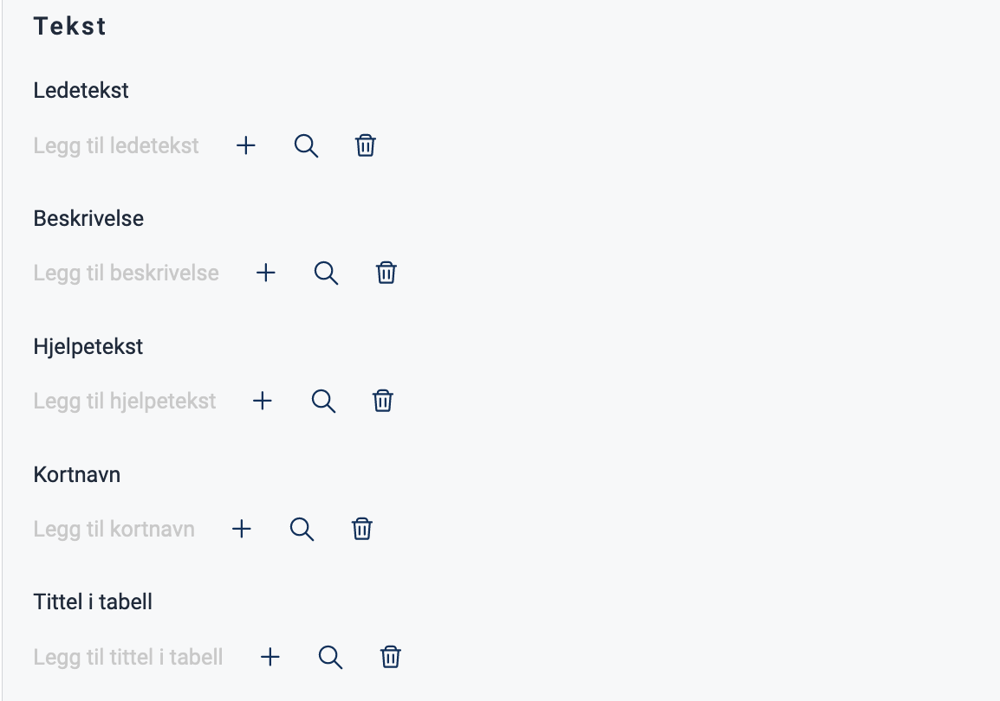
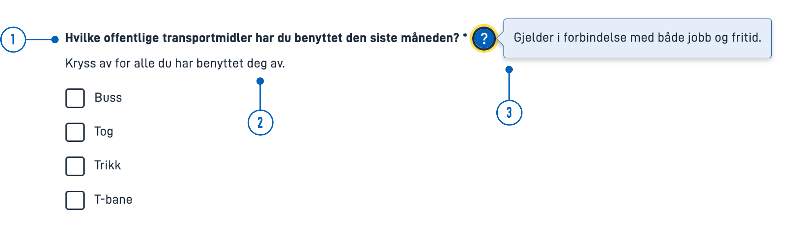
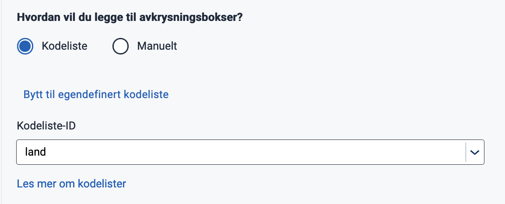
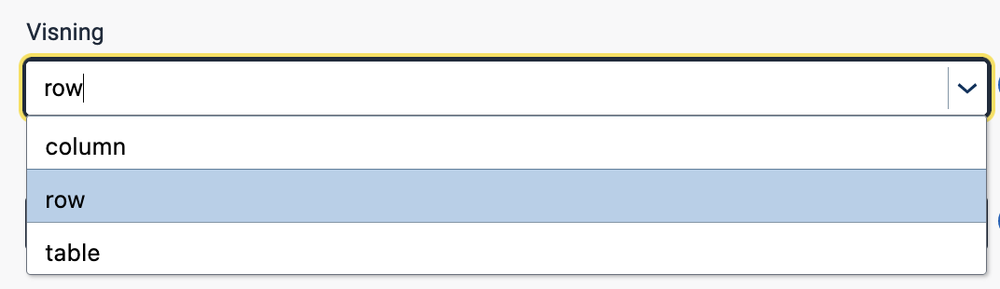

{}
🚧 Denne dokumentasjonen er under oppdatering.
{}

---

## Bruk

Avkrysningsbokser brukes ofte i skjemaer for å samle input fra brukeren,
 slik at de kan velge ett eller flere alternativer fra en liste.
 
 #### Bruk avkrysningsbokser når:
 * Brukere kan velge flere alternativer fra en liste.
 * Det må gjøres et eksplisitt valg for å bruke innstillingene (f.eks. bekrefte at brukeren har lest et dokument).

### Anatomi


{}
1. **Overskrift** - Spørsmål eller instruksjon.
2. **Avkrysningsboks** - Valgkontrollen.
3. **Etikett** - Tekstetikett knyttet til avkrysningsboksen.
{} 

### Stil

* Avkrysningsbokser bør alltid ha en tilknyttet etikett på høyre side.

### Beste praksis

* Avkrysningsbokser med deaktivert valg bør unngås.
    Hvis et alternativ er utilgjengelig bør det fjernes og en forklaring gitt for hvorfor alternativet mangler.

 ### Veiledning for innhold

* Hold etikettene korte og beskrivende.
* Begynn alle etiketter med stor bokstav.
* Ikke inkluder tegnsetting etter etikettene.

### Relatert

* Hvis brukeren bare kan velge ett alternativ fra en liste, bruk [radioknapper](../radiobuttons).
* For en mer kompakt måte å vise flere alternativer med enkeltvalg, bruk en [rullegardinmeny](../dropdown).

## Egenskaper

Følgende er en liste over tilgjengelige egenskaper for {}. Listen er automatisk generert basert på komponentens JSON schema (se link).

{}
Vi oppdaterer for øyeblikket hvordan vi implementerer komponenter. Listen over egenskaper kan derfor være noe unøyaktig.
{}

<!-- Shortkoden `component-props` genererer automatisk en liste over komponentegenskaper fra komponentens JSON schema.
Komponentnavnet kan gis eksplisitt som argument (f.eks. `component-props "Grid"`).
Hvis ingen argument gis, henter shortkoden komponentnavnet fra 'schemaname' i frontmatter. -->

{}

## Konfigurering

### Legg til komponent

Du kan legge til en komponent i [Altinn Studio Designer](/nb/app/getting-started/ui-editor/) ved å dra den fra venstre sidepanel til midten av siden.
Når du velger komponenten, vises et panel med innstillinger for den på høyre side.

{}
Vi oppdaterer for øyeblikket Altinn Studio med flere muligheter for innstillinger!
 Dokumentasjonen oppdateres fortløpende, men det kan være flere innstillinger tilgjengelig enn det som beskrives her og noen innstillinger kan være i betaversjon.
{}

### Tekst




Du kan opprette en ny tekst ved å klikke på pluss-tegnet eller velge en eksisterende ved å klikke på forstørrelsesglasset. Se [Legge til og endre tekster i en app](/nb/app/development/ux/texts/#legge-til-og-endre-tekster-i-en-app) for mer info.






Tekst kan legges til direkte som en tekststreng eller ved å oppgi nøkkelen til en [tekstressurs](/nb/app/development/ux/texts/#legge-til-og-endre-tekster-i-en-app).


App/ui/layouts/{page}.json


```json{hl_lines="5-11"}
...
  "data": {
    "layout": [
      ...
      "textResourceBindings": {
          "title": "",
          "description": "",
          "help": "",
          "shortName": "",
          "tableTitle": ""
        }
    ]
  }
...
```





{}
1. **Ledetekst** (`textResourceBindings.title`): Overskrift med spørsmål eller instruksjon.
2. **Beskrivelse** (`textResourceBindings.description`): Tekst for ytterligere beskrivelse eller utdyping.
3. **Hjelpetekst** (`textResourceBindings.help`): Når hjelpetekst er fylt ut vil et spørsmålstegn vises ved siden av ledeteksten. Klikk på spørsmålstegnet for å vise teksten som en popup.
Kan brukes til forklaring, eksempler, brukssituasjoner osv.
- **Kortnavn** (`textResourceBindings.shortName`): Overstyrer tittelen til komponenten som brukes i den standard `required` valideringsmeldingen.
- **Tittel i tabell** (`textResourceBindings.tableTitle`): Overstyrer tittelen til komponenten som blir brukt i kolonneheader når komponenten befinner seg i repeterende grupper.
{}

### Datamodell

For at det skal være mulig å lagre og manipulere informasjonen må komponenten kobles til et felt i en [datamodell](/nb/app/development/data/data-modeling/#datamodeller).
Verdien for avkrysningsboksen må samsvare med datatypen for feltet. 




Velg feltet du ønsker å koble komponenten til fra nedtrekksmenyen.
 Hvis det ikke er noen felter tilgjengelig må du først [laste opp en datamodell](/nb/app/development/data/data-modeling/#laste-opp-og-vise-datamodell).






Legg navnet på feltet du ønsker å koble komponenten til i krøllparenteser under `dataModelBindings`.


App/ui/layouts/{page}.json


```json{hl_lines=["7"]}
...
  "data": {
    "layout": [
      {
        "id": "checkbox-offentlig-transport",
        "type": "Checkboxes",
        "dataModelBindings": {"OffentligTransport.sisteMnd"},
        ...
      }
    ]
  }
...
```



### Legge til avkrysningsbokser

Avkrysningsbokser kan legges til manuelt eller ved hjelp av forhåndsdefinerte [kodelister](/nb/app/development/data/options).

#### Manuelt



Velg "Manuelt" og klikk "Legg til flere" for å til en ny avkrysningsboks. Velg eller opprett ny tekst for å legge til etikett (`label`).

Avkrysningsboksen kommer med en forhåndsutfylt verdi (`value`), som er dataen som lagres når brukeren gjør et valg.
 Verdien kan endres etter ønske.
  Hvis komponenten er tilknyttet en datamodell, må verdiene tilsvare datatypen (for eksempel boolsk, streng, tall) som er angitt i modellen.







App/ui/layouts/{page}.json


```json{hl_lines=["6-11"]}
...
"data": {
  "layout": [
    {
      ...
       "options": [
          {
            "label": "Alternativ 1",
            "value": "1"
          }
        ]
    }
  ]
}
...
```



#### Kodeliste

En [kodeliste](/nb/app/development/data/options) er en forhåndsdefinert liste med alternativer.




For å legge til avkrysningsbokser fra en kodeliste, velg 'Kodeliste' og angi en kodeliste ID (for å bruke en egendefinert (dynamisk) kodeliste, klikk på "Bytt til egendefinert kodeliste").







App/ui/layouts/{page}.json


```json{hl_lines="8"}
...
"data": {
  "layout": [
      {
      "id": "checkbox-offentlig-transport",
      "type": "Checkboxes",
      ...
      "optionsID": "land"
    }
  ]
}
...
```




For mer informasjon om kodelister, se
- [Koble en komponent til kodeliste](/nb/app/development/data/options/#koble-en-komponent-til-kodeliste)
- [Statiske kodelister](/nb/app/development/data/options/static-codelists/)
- [Dynamiske kodelister](/nb/app/development/data/options/dynamic-codelists/)

### Visning

Standard visning er kolonne (`column`), men du kan endre til rad (`row`) i nedtrekksmenyen (`table` har ingen funksjon for avkrysningsbokser).










App/ui/layouts/{page}.json


```json{hl_lines="8"}
...
  "data": {
    "layout": [
       {
        "id": "Checkboxes-kodeliste",
        "type": "Checkboxes",
        "optionsId": "land",
        "layout": "row"
      },
    ]
  }
...
```




