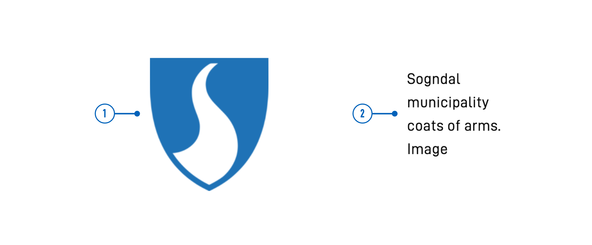
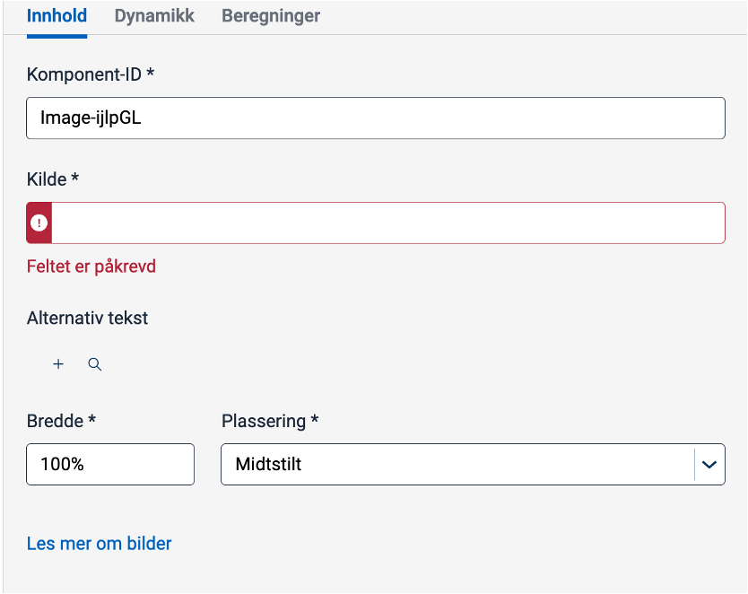

<!-- HOW TO USE THIS TEMPLATE
- Read the comments within each section for guidance.
- Delete comments and content that are not relevant.
- When the documentation is ready for publishing, remove "hidden: false" from the frontmatter.
- If the documentation is complete, remove the warning that it's a work in progress.

See Image and Accordion for examples.
-->

{}
🚧 This documentation is a work in progress.
{}

---

## Usage

<!-- Brief description of the component and how it is used. -->

### Anatomy

<!-- 

Image/diagram with numbered callouts.
1. Take a screenshot of the basic version of the component with good copy (text).
2. Use the [PowerPoint file](../numbered-callouts-anatomy.pptx) to add numbers to the screenshot
3. Group screenshot and numbering, save as image, and add to documentation
4. Include key with description of callouts below using anatomy-list shortcode (see example for formatting).

Example:



{}
1. **Image**: Photo, screenshot, illustration, or graphic.
2. **Alternative text**: Used by screen readers and displayed if the image can not be rendered.
{} 

-->

<!-- 
Add the following sections if relevant:

### Behavior

(How the component behaves in different contexts)

### Style

(Visual styling (e.g. alignment, padding, dos and don'ts))

### Best Practices

(Industry standards, dos and don'ts)

### Content guidelines

(E.g. punctuation rules, standard labels, etc.)

### Accessibility

(Component-specific best practices for accessibility.)

### Mobile

(How to apply component in mobile environments.)

### Related

(List of related components or patterns, include links)

-->

## Properties

The following is an autogenerated list of the properties available for {} based on the component's JSON schema file (linked below).

{}
We are currently updating how we implement components, and the list of properties may not be entirely accurate.
{}

<!-- The `component-props` shortcode automatically generates a list of component properties from the component's json schema.
The component name can be explicitly given as argument (e.g. `component-props "Grid"`).
If no argument is given, the shortcode pulls the component name from 'schemaname' in the frontmatter. -->

{}

## Configuration

### Add component

You can add a component in [Altinn Studio Designer](/app/getting-started/ui-editor/) by dragging it from the left-side panel to the middle page area.
Selecting the component brings up its configuration panel on the right-hand side.

### Settings in Altinn Studio Designer

{}
We are currently updating Altinn Studio with more configuration options!
 The documentation is continuously updated, but more settings may be available than described here, and some settings may be in beta.
{}




Property settings available in Altinn Studio Designer.

<!--
Screenshot of settings panel in Designer.
Key with description of settings. See example for format. Include property (code) name in parentheses.

Example:



- **Komponent-ID** (`id`): Automatically generated component ID (editable).
- **Kilde** (`src`): Link or path to the [image source](#image-source).
- **Alternativ tekst** (`textResourceBindings.altTextImg`): Alternative text. Create new or pick existing [text resource](/app/development/ux/texts/#add-and-change-texts-in-an-application).
- **Bredde** (`width`): Image width as a percentage, with 100% as the original image size.
- **Plassering** (`align`): [Horizontal alignment of image](#horizontal-alignment-with-align).

-->




Corresponding settings in the page's JSON file.

<!--
Replace "component code" in the below code block with the actual component code that corresponds to the settings in Designer.

Indicate line numbers to highlight the component code (e.g. hl_lines="4-13").
 -->


App/ui/layouts/{page}.json


```json{hl_lines=""}
{
  "data": {
    "layout": [
      // component code
    ]
  }
}
```





<!-- 
Add sections describing the configuration of properties specific for the component.
- Use the below Designer/Code tabs shortcode to display the settings.
- Include screenshots and examples where appropriate.
- If the settings are not available in Altinn Studio, use only the Code tab and add the following shortcode directly under the section heading:
    {}
    The settings for this property is currently not available in Altinn Studio and must be configured manually.
    {}
- Add file path or other info within the code-title shortcode (shown at the top of the code block)
- Consider highlighting relevant parts of the code
  - Examples:
    single line: hl_lines="5"
    range: hl_lines="4-13"
    multiple lines and ranges: hl_lines=["1-4", "7", "20"]

Shortcode for tabs:












```{hl_lines=[""]}


```


-->