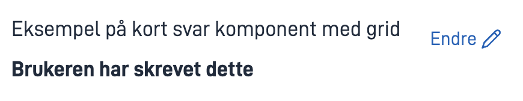

## Usage

The Summary2 component lets you display a summary of either a component, page or layoutSet, either in the current or previous tasks.

It is customizable to suit your needs, and is also used for generating PDFs. 

### Anatomy


For examples of how Summary2 looks in different components, [see this example app](https://ttd.apps.tt02.altinn.no/ttd/component-library)


## Configuration

#### Component Summary

The most basic way to use the component is to show a summary of a single component.

For example, if you want to show a summary of a simple input field configured like this:

```json{hl_lines="6-"}
{
  "id": "MyInputFieldID",
  "type": "Input",
}
```

your Summary2 configuration would look like this:

```json{hl_lines="6-"}
{
        "id": "MySummary2ID",
        "type": "Summary2",
        "target": {
          "type": "component",
          "id": "MyInputFieldID"
        }
}
```
The resulting Summary2 output would look like this:



#### Page Summary

If you would like to show a summary of an entire page, you would set the ```target.type``` property to ```"page"``` like so:

```json{hl_lines="6-"}
{
        "id": "MySummary2ID",
        "type": "Summary2",
        "target": {
          "type": "page",
          "id": "MyLayoutFilename"
        }
}
```

In this case, the ```target.id``` is set to the name of the layout page I want to render, so I would have a file called MyLayoutFilename.json in my project.

#### Layoutset Summary

It is also possible to render a summary of an entire layoutSet. In this case, you would set the ```target.type``` property to ```"layoutSet"``` like so:

```json{hl_lines="6-"}
{
        "id": "MySummary2ID",
        "type": "Summary2",
        "target": {
          "type": "layoutSet",
          "id": "MyLayoutSet"
        }
}
```

In this case, you would have a layoutSet called ```MyLayoutSet``` in your project.
This would render a summary of all the pages and components in the layoutSet.

#### Rendering summaries of previous tasks

You can also render summaries of components, pages and layoutSets that exist in previous tasks.

To do this, simply specify the ```target.taskId``` like so:

```json{hl_lines="6-"}
{
  "id": "Summary2-previous-page",
  "type": "Summary2",
  "target": {
    "type": "page",
    "taskId": "Task_1",
    "id": "AddressPage"
 }
}
```

The behaviour is exactly like before with regard to ```target.type``` and ```target.id```, except that we are specifying ```taskId```.

### Overrides

For each component in your summary, you can configure different overrides to suit your needs.

To configure an override, use the override field of the Summary2 component like so:

```json{hl_lines="6-"}
{
        "id": "MySummary2ID",
        "type": "Summary2",
        "target": {
          "type": "component",
          "id": "MyComponentID"
        },
         "overrides": [
           {
             "componentId": "MyComponentID",
             "displayType": "string"
           }
         ]
}
```

Here are the overrides that are common for all components:

| Parameter       | Type    | Required | Description                                                                                                 |
|-----------------|---------|----------|-------------------------------------------------------------------------------------------------------------|
| componentId     | string  | yes      | ID of the compoment you are overriding                                                                      |
| hidden          | boolean | no       | Exclude the component from summary                                                                          |
| forceShow       | boolean | no       | Will force show the component in a summary even if hideEmptyFields is set to true in the summary component. |
| emptyFieldText  | string  | no       | Custom text to show for empty fields.                                                                       |
| hideEmptyFields | boolean | no       | Exclude empty fields for summary. Only works if the field is not required.                                  |

In addition, a few components support component-specific overrides:

#### Checkbox and MultipleSelect

| Parameter       | Type                       | Required | Description                             |
|-----------------|----------------------------|----------|-----------------------------------------|
| displayType     | enum: ```list \| string``` | no       | Display the summary as a list or string |

#### Group

| Parameter       | Type    | Required | Description                                   |
|-----------------|---------|----------|-----------------------------------------------|
| isCompact     | boolean | no       | Option to display a compact version of groups |