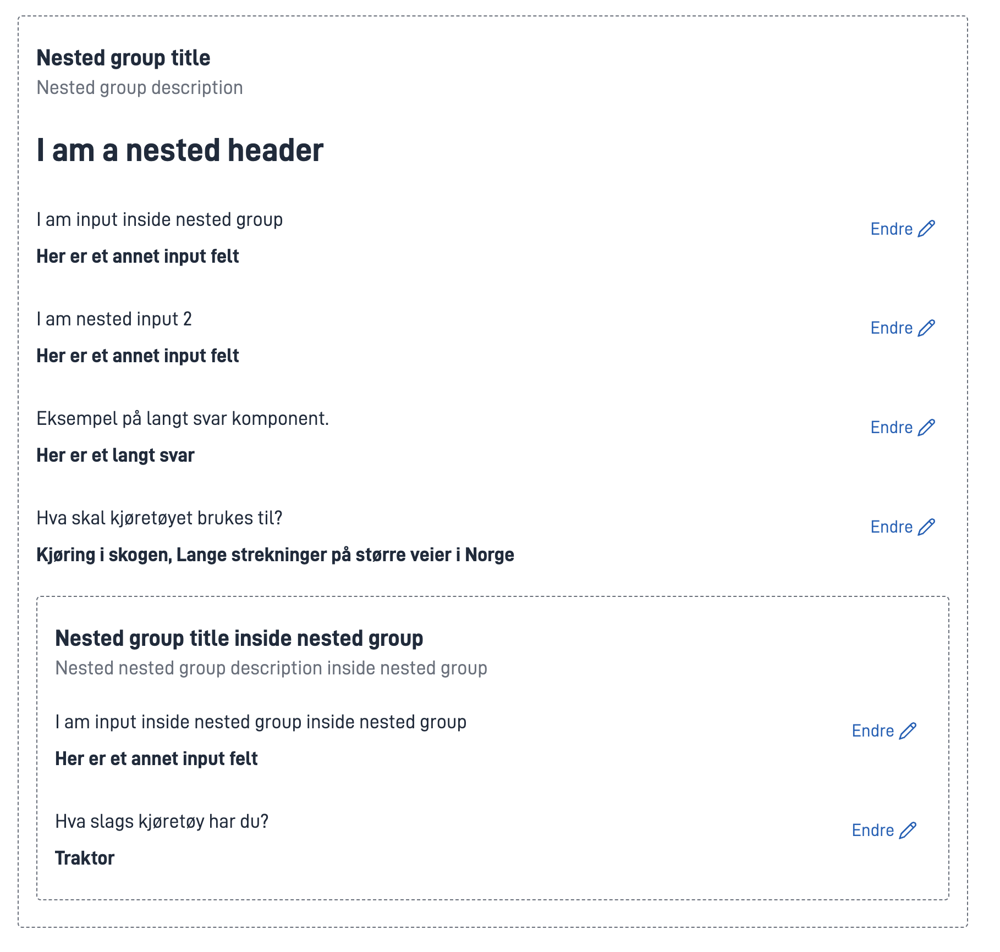

---

title: Summary2  
linktitle: Summary2  
description: Lar deg vise oppsumemeringer av komponenter, sider og layoutSets  
schemaname: Summary2  
weight: 10   
toc: true
---

## Bruk

Summary2-komponenten lar deg vise en oppsummering av enten en komponent, side eller layoutSet, enten i nåværende eller tidligere oppgaver.

Den kan tilpasses for å dekke dine behov, og brukes også for å generere PDF.

### Oppbygning



For eksempler på hvordan Summary2 ser ut i forskjellige komponenter, [se dette eksempelprogrammet](https://ttd.apps.tt02.altinn.no/ttd/component-library)

## Konfigurasjon

#### Komponentoppsummering

Den mest grunnleggende måten å bruke Summary2 på er å vise en oppsummering av en enkelt komponent.

For eksempel, hvis jeg vil vise en oppsummering av et enkelt input felt konfigurert slik:

```json{hl_lines="6-"}
{
  "id": "MyInputFieldID",
  "type": "Input",
}
```

vil min Summary2 konfigurasjon se slik ut:

```json{hl_lines="6-"}
{
        "id": "MySummary2ID",
        "type": "Summary2",
        "target": {
          "type": "component",
          "id": "MyInputFieldID"
        }
}
```

Det resulterer i en oppsummering som ser slikt ut:


#### Sideoppsummering

Hvis du vil vise en oppsummering av en hel side, vil setter ```target.type``` egenskapen til ```"page"``` slik:

```json{hl_lines="6-"}
{
        "id": "MySummary2ID",
        "type": "Summary2",
        "target": {
          "type": "page",
          "id": "MyLayoutFilename"
        }
}
```

I dette tilfellet er ```target.id``` satt til navnet på layout-siden jeg vil vise, det vil si at jeg hadde da hadde hatt en fil kalt MyLayoutFilename.json i prosjektet mitt.

#### Layoutsett-oppsummering

Det er også mulig å vise en oppsummering av et helt layoutSet. I dette tilfellet vil du sette ```target.type``` egenskapen til ```"layoutSet"``` slik:

```json{hl_lines="6-"}
{
        "id": "MySummary2ID",
        "type": "Summary2",
        "target": {
          "type": "layoutSet",
          "id": "MyLayoutSet"
        }
}
```

I dette tilfellet vil jeg ha et layoutsett kalt ```MyLayoutSet``` i prosjektet mitt. Dette vil vise en oppsummering av alle sidene og komponentene i layoutsettet.

#### Vise oppsummeringer av tidligere oppgaver

Du kan også vise oppsummeringer av komponenter, sider og layoutsett som eksisterer i tidligere oppgaver.

For å gjøre dette, spesifiserer du ganske enkelt ```target.taskId``` slik:

```json{hl_lines="6-"}
{
  "id": "Summary2-previous-page",
  "type": "Summary2",
  "target": {
    "type": "page",
    "taskId": "Task_1",
    "id": "AddressPage"
 }
}
```

Konfigurasjonen er nøyaktig som før med hensyn til ```target.type``` og ```target.id```, bortsett fra at vi spesifiserer ```taskId```.

### Overstyringer

For hver komponent i oppsummeringen din kan du konfigurere forskjellige overstyringer for å passe dine behov.

For å konfigurere en overstyring, bruk ```overrides``` feltet til Summary2-komponenten slik:

```json{hl_lines="6-"}
{
        "id": "MySummary2ID",
        "type": "Summary2",
        "target": {
          "type": "component",
          "id": "MyComponentID"
        },
         "overrides": [
           {
             "componentId": "MyComponentID",
             "displayType": "string"
           }
         ]
}
```

Her er overstyringene som er felles for alle komponenter:

| Parameter       | Type    | Påkrevd | Beskrivelse                                                                                                            |
|-----------------|---------|---------|------------------------------------------------------------------------------------------------------------------------|
| componentId     | string  | ja      | ID-en til komponenten du overstyrer                                                                                    |
| hidden          | boolean | nei     | Ekskluder komponenten fra oppsummeringen                                                                               |
| forceShow       | boolean | nei     | Vil tvangsvise komponenten i en oppsummering selv om hideEmptyFields er satt til true i oppsummeringskomponenten. |
| emptyFieldText  | string  | nei     | Egendefinert tekst som skal vises for tomme felt.                                                                      |
| hideEmptyFields | boolean | nei     | Ekskluder tomme felt fra oppsummeringen. Fungerer bare hvis feltet ikke er påkrevd.                                    |

I tillegg støtter noen komponenter komponentspesifikke overstyringer:

#### Checkbox og MultipleSelect

| Parameter       | Type                       | Påkrevd | Beskrivelse                              |
|-----------------|----------------------------|---------|------------------------------------------|
| displayType     | enum: ```list \| string``` | nei     | Vis oppsummeringen som en liste eller streng |

#### Group

| Parameter       | Type    | Påkrevd | Beskrivelse                                   |
|-----------------|---------|---------|-----------------------------------------------|
| isCompact       | boolean | nei     | Mulighet for å vise en kompakt versjon av grupper |