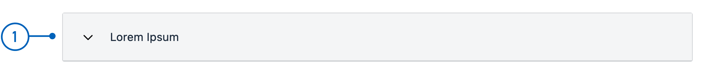

{}
🚧 This documentation is a work in progress.
{}

---

## Usage

The Accordion component allows users to expand and collapse content sections by clicking on the header,
 allowing for a space-efficient and organized way to present information.

### Anatomy




{}
1. **Header**: The clickable section title that users interact with to expand or collapse the content.
2. **Content Area**: The area that expands or collapses, revealing or hiding additional information when the header is clicked. 
{} 

<!-- 
Add the following sections if relevant:

### Behavior

(How the component behaves in different contexts)

### Style

(Visual styling (e.g. alignment, padding, dos and don'ts))

### Best Practices

(Industry standards, dos and don'ts)

### Content guidelines

(E.g. punctuation rules, standard labels, etc.)

### Accessibility

(Component-specific best practices for accessibility.)

### Mobile

(How to apply component in mobile environments.)

-->
### Related

- [`AccordionGroup`](../accordiongroup/)


## Properties

| **Property** | **Type**                                       | **Description** |
|--------------|------------------------------------------------|-----------------|
| `children`   | array | An array with the component ID of all components belonging to the group. **Enum:** `"Paragraph" \| "Button"` |
| `textResourceBindings.title` | string | Clickable section title  |

<!-- The following is an autogenerated list of the properties available for {} based on the component's JSON schema file (linked below).

{}
We are currently updating how we implement components, and the list of properties may not be entirely accurate.
{}

The `component-props` shortcode automatically generates a list of component properties from the component's json schema.
The component name can be explicitly given as argument (e.g. `component-props "Grid"`).
If no argument is given, the shortcode pulls the component name from 'schemaname' in the frontmatter.

{} -->

## Configuration

### Add component

You can add a component in [Altinn Studio Designer](/app/getting-started/) by dragging it from the left-side panel to the middle page area.
Selecting the component brings up its configuration panel on the right-hand side.

### Settings in Altinn Studio Designer

{}
We are currently updating Altinn Studio with more configuration options!
 The documentation is continuously updated, but more settings may be available than described here, and some settings may be in beta.
{}




Property settings available in Altinn Studio Designer.

{}
**NB!** The property `children` is required and must be [added manually](#children).
{}


- **Komponent-ID** (`id`): Automatically generated component ID (editable).




Corresponding settings in the page's JSON file.


App/ui/layouts/{page}.json


```json{hl_lines="6-9"}
...

{
  "data": {
    "layout": [
       {
        "id": "Accordion-3uoJMS",
        "type": "Accordion"
      }
    ]
  }
}
```




### Add title and elements

<br>

#### `textResourceBindings.title`

The title for the Accordion can be added as text directly or referenced via a text key to a [text resource](/nb/app/development/ux/texts/#legge-til-og-endre-tekster-i-en-app).

#### `children`

Specify which components you want to expand by adding their IDs to an array under `children`.

The following types can be added to an `Accordion`:
- `Paragraph`
- `Button`

<br>

#### Example

Accordion with a paragraph and a button as child elements.





App/ui/layouts/{page}.json


```json{hl_lines=["9-12"]}
...

{
  "data": {
    "layout": [
       {
        "id": "Accordion-3uoJMS",
        "type": "Accordion",
        "textResourceBindings": {
          "title": "Lorem ipsum"
        },
        "children": ["lorem-ipsum", "ok-button"]
      },
      {
        "id": "lorem-ipsum",
        "type": "Paragraph",
        "textResourceBindings": {
          "title": "Paragraph.loremIpsum1"
        },
        "dataModelBindings": {}
      },
      {
        "id": "ok-button",
        "type": "Button",
        "dataModelBindings": {},
        "textResourceBindings": {
          "title": "OK"
        }
      }
    ]
  }
}
```




### Heading Level

The default heading level is `2`. To change it, add the `headingLevel` property as shown in the code example below.
`headingLevel` can take values of `2 | 3 | 4 | 5 | 6`.





App/ui/layouts/{page}.json


```json{hl_lines="13"}
...

{
  "data": {
    "layout": [
       {
        "id": "Accordion-3uoJMS",
        "type": "Accordion",
        "textResourceBindings": {
          "title": "Lorem ipsum"
        },
        "children": ["lorem-ipsum", "ok-button"],
        "headingLevel": 3
      },
      ...
    ]
  }
}
```

