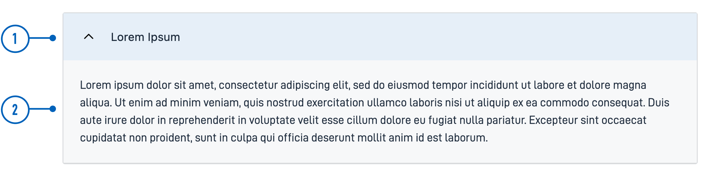

{}
🚧 Denne dokumentasjonen er under oppdatering.
{}

---

## Bruk

Accordion er en trekkspill-komponent som lar brukere utvide og lukke seksjoner med innhold ved å klikke på overskriften,
 noe som gir en plassbesparende og organisert måte å presentere informasjon på.

### Anatomi




{}
1. **Overskrift**: Den klikkbare seksjonstittelen som brukere samhandler med for å utvide eller lukke innholdet.
2. **Innholdsområde**: Området som utvider eller kollapser, som viser eller skjuler ytterligere informasjon når overskriften klikkes. 
{} 

<!-- 
Legg til følgende seksjoner dersom de er relevante:

### Oppførsel

(Hvordan komponenten oppfører seg i ulike sammenhenger.)

### Stil

(Visuell styling, e.g. plassering, padding, "dos and don'ts")

### Beste praksis

(Bransjestandarder, "dos and don'ts")

### Veiledning for innhold

(E.g. regler for tegnsetting, standard etiketter, etc.)

### Relatert

(Liste over relaterte komponenter, inkluder lenker.)

-->

## Egenskaper

*Kommer snart*

<!-- Følgende er en liste over tilgjengelige egenskaper for {}. Listen er automatisk generert basert på komponentens JSON schema (se link).

{}
Vi oppdaterer for øyeblikket hvordan vi implementerer komponenter. Listen over egenskaper kan derfor være noe unøyaktig.
{}

{} -->

## Konfigurering

### Legg til komponent

Du kan legge til en komponent i [Altinn Studio Designer](/nb/app/getting-started/ui-editor/) ved å dra den fra venstre sidepanel til midten av siden.
Når du velger komponenten, vises et panel med innstillinger for den på høyre side.

### Innstillinger i Altinn Studio Designer

{}
Vi oppdaterer for øyeblikket Altinn Studio med flere muligheter for innstillinger!
 Dokumentasjonen oppdateres fortløpende, men det kan være flere innstillinger tilgjengelig enn det som beskrives her og noen innstillinger kan være i betaversjon.
{}




Innstillinger for egenskaper tilgjengelig i Altinn Studio Designer.

{}
**NB!** Accordions egenskap `children` må [legges til manuelt](#children) for å unngå feilmelding.
{}


- **Komponent-ID** (`id`): Automatisk generert komponent-ID (kan redigeres).




Korresponderende innstillinger i sidens JSON-fil.


App/ui/layouts/{page}.json


```json{hl_lines="6-9"}
...

{
  "data": {
    "layout": [
       {
        "id": "Accordion-3uoJMS",
        "type": "Accordion"
      }
    ]
  }
}
```




### Legg til overskrift og underelementer

<br>

#### `textResourceBindings.title`

Overskriften for Accordion kan legges til som en tekst direkte eller refereres via en tekstnøkkel til en [tekstressurs](/nb/app/development/ux/texts/#legge-til-og-endre-tekster-i-en-app).

#### `children`

Spesifiser hvilke komponenter du vil kunne ekspandere ved å legge deres ID-er i en array under `children`.

Følgende typer kan legges til en `Accordion`:
- `Paragraph`
- `Button`

<br>

#### Eksempel

Accordion med et avsnitt og en knapp som underelementer.





App/ui/layouts/{page}.json


```json{hl_lines=["9-12"]}
...

{
  "data": {
    "layout": [
       {
        "id": "Accordion-3uoJMS",
        "type": "Accordion",
        "textResourceBindings": {
          "title": "Lorem ipsum"
        },
        "children": ["lorem-ipsum", "ok-button"]
      },
      {
        "id": "lorem-ipsum",
        "type": "Paragraph",
        "textResourceBindings": {
          "title": "Paragraph.loremIpsum1"
        },
        "dataModelBindings": {}
      },
      {
        "id": "ok-button",
        "type": "Button",
        "dataModelBindings": {},
        "textResourceBindings": {
          "title": "OK"
        }
      }
    ]
  }
}
```




### Nivå for overskrift

Standard nivå for overskrift er `2`. For å endre, legg til egenskapen `headingLevel` som i eksempelet under.
 `headingLevel` kan ta verdiene `2 | 3 | 4 | 5 | 6`.





App/ui/layouts/{page}.json


```json{hl_lines="13"}
...

{
  "data": {
    "layout": [
       {
        "id": "Accordion-3uoJMS",
        "type": "Accordion",
        "textResourceBindings": {
          "title": "Lorem ipsum"
        },
        "children": ["lorem-ipsum", "ok-button"],
        "headingLevel": 3
      },
      ...
    ]
  }
}
```



