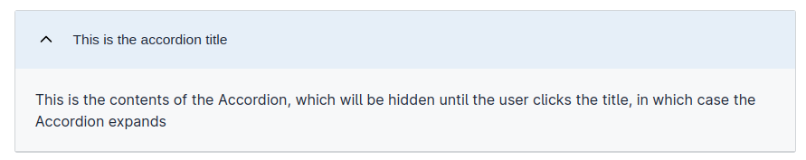
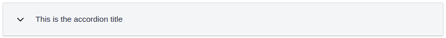

## Eksempel

```json
...
{
  "id": "accordion",
  "type": "Accordion",
  "headingLevel": 2,
  "children": ["paragraph", "paragraph-2"]
},
{
  "id": "paragraph",
  "type": "Paragraph",
  "textResourceBindings": {
    "title": "accordion-paragraph-test"
  },
  "dataModelBindings": {}
},
{
  "id": "paragraph-2",
  "type": "Paragraph",
  "textResourceBindings": {
    "title": "Dette er en tittel med litt mere tekst"
  },
  "dataModelBindings": {}
},
...
```

## Konfigurering

For å konfigurere en `Accordion`, legger du ganske enkelt til en ny komponent med typen `Accordion`
til layout-filen. Spesifiser deretter hvilke andre komponenter du vil kunne ekspandere ved å
legge til deres ID-er til `Accordion`-komponenten sin `children`-egenskap.

Følgende typer kan legges til en `Accordion`:
- `Paragraph`
- `Button`

## Egenskaper
- `headingLevel`: Nivået på overskriftelementet til `Accordion`. Kan være en av disse verdiene `2 | 3 | 4 | 5 | 6`. Standardverdien er `2`.
