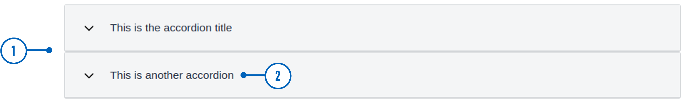
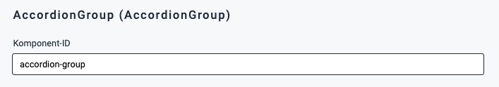
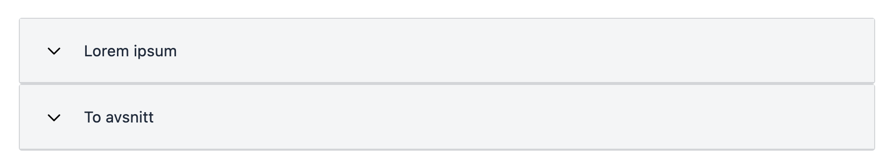
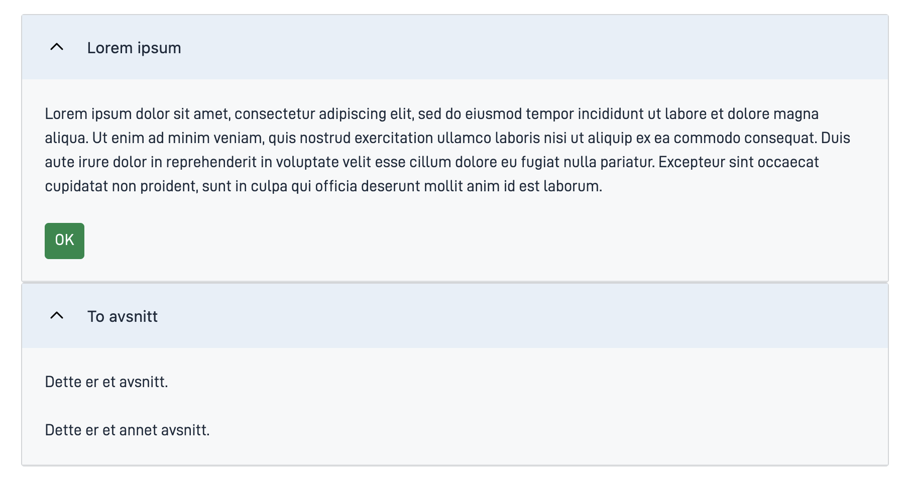

{}
🚧 This documentation is a work in progress.
{}

---

## Usage

`AccordionGroup` is used to group related [`Accordion`](../accordion/) components.

### Anatomy




{}
1. **AccordionGroup**: Grouping of two or more Accordion components.
2. **Header**: The clickable section title that users interact with to expand or collapse the content.
3. **Content Area**: The area that expands or collapses, revealing or hiding additional information when the header is clicked.

**Note**: Header and content area are properties of the `Accordion` child elements.

{} 

<!-- 
Add the following sections if relevant:

### Behavior

(How the component behaves in different contexts)

### Style

(Visual styling (e.g. alignment, padding, dos and don'ts))

### Best Practices

(Industry standards, dos and don'ts)

### Content guidelines

(E.g. punctuation rules, standard labels, etc.)

### Accessibility

(Component-specific best practices for accessibility.)

### Mobile

(How to apply component in mobile environments.)

-->
### Related

- [`Accordion`](../Accordion/)


## Properties

| **Property** | **Type**                                       | **Description** |
|--------------|------------------------------------------------|-----------------|
| `children`   | array | An array with the component ID of all components belonging to the group. **Enum:** `"Accordion"` | 

<!-- The following is an autogenerated list of the properties available for {} based on the component's JSON schema file (linked below).

{}
We are currently updating how we implement components, and the list of properties may not be entirely accurate.
{} -->

<!-- The `component-props` shortcode automatically generates a list of component properties from the component's json schema.
The component name can be explicitly given as argument (e.g. `component-props "Grid"`).
If no argument is given, the shortcode pulls the component name from 'schemaname' in the frontmatter. -->

<!-- {} -->

## Configuration

### Add component

You can add a component in [Altinn Studio Designer](/app/getting-started/ui-editor/) by dragging it from the left-side panel to the middle page area.
Selecting the component brings up its configuration panel on the right-hand side.

### Settings in Altinn Studio Designer

{}
We are currently updating Altinn Studio with more configuration options!
 The documentation is continuously updated, but more settings may be available than described here, and some settings may be in beta.
{}




Property settings available in Altinn Studio Designer.

{}
**NB!** To avoid an error message, the `children` property must be added to the component's code.
 See [Add child elements](#add-child-elements)
{}



- **Komponent-ID** (`id`): Automatically generated component ID (editable).




Corresponding settings in the page's JSON file.

{}
**NB!** To avoid an error message, the `children` property must be added to the component's code.
 See [Add child elements](#add-child-elements)
{}


App/ui/layouts/{page}.json


```json{hl_lines=""}
{
  "data": {
    "layout": [
      {
        "id": "accordion-group",
        "type": "AccordionGroup"
      }
    ]
  }
}
```





### Add child elements

Specify which components of type `Accordion` you want to group by adding their component ID's to the `children` property as shown below.
The `Accordion` components must be added to the same page.
 The order of the components in the group is given by the order of the component ID's in `children`.





App/ui/layouts/{page}.json


```json{hl_lines=""}
...
{
  "data": {
    "layout": [
      {
        "id": "accordion-group",
        "type": "AccordionGroup",
        "children": [
          "accordion1",
          "accordion2"
        ]
      },
      ...
    ]
  }
}
...
```



## Example





App/ui/layouts/{page}.json


```json{hl_lines=""}
{
  "$schema": "https://altinncdn.no/schemas/json/layout/layout.schema.v1.json",
  "data": {
    "layout": [
      {
        "id": "accordion-group",
        "type": "AccordionGroup",
        "children": [
          "accordion1",
          "accordion2"
        ]
      },
      {
        "id": "accordion1",
        "type": "Accordion",
        "textResourceBindings": {
          "title": "Lorem ipsum"
        },
        "children": [
          "paragraph1",
          "ok-button"
        ]
      },
      {
        "id": "accordion2",
        "type": "Accordion",
        "textResourceBindings": {
          "title": "To avsnitt"
        },
        "headingLevel": 2,
        "children": [
          "paragraph2",
          "paragraph3"
        ]
      },
      {
        "id": "paragraph1",
        "type": "Paragraph",
        "textResourceBindings": {
          "title": "text.loremIpsum"
        },
        "dataModelBindings": {}
      },
      {
        "id": "paragraph2",
        "type": "Paragraph",
        "textResourceBindings": {
          "title": "Dette er et avsnitt."
        },
        "dataModelBindings": {}
      },
      {
        "id": "paragraph3",
        "type": "Paragraph",
        "textResourceBindings": {
          "title": "Dette er et annet avsnitt."
        },
        "dataModelBindings": {}
      },
      {
        "id": "ok-button",
        "type": "Button",
        "dataModelBindings": {},
        "textResourceBindings": {
          "title": "OK"
        }
      }
    ]
  }
}
```






