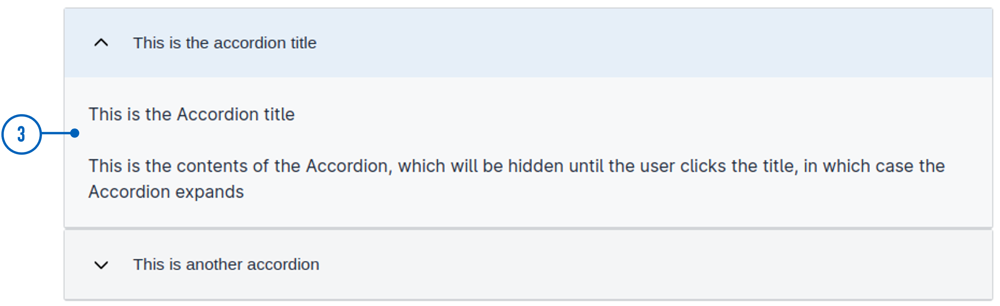

{}
🚧 Denne dokumentasjonen er under oppdatering.
{}

---

## Bruk

`AccordionGroup` brukes til å gruppere relaterte [`Accordion`-komponenter](../accordion/).

### Anatomi




{}
1. **AccordionGroup**: Gruppe med to eller flere Accordion-komponenter.
2. **Overskrift**: Den klikkbare seksjonstittelen som brukere samhandler med for å utvide eller lukke innholdet.
3. **Innholdsområde**: Området som utvider eller kollapser, som viser eller skjuler ytterligere informasjon når overskriften klikkes.

**Merk**: Overskrift og innholdsområde er egenskaper ved `Accordion` underelementer.

{} 

<!-- 
Legg til følgende seksjoner dersom de er relevante:

### Oppførsel

(Hvordan komponenten oppfører seg i ulike sammenhenger.)

### Stil

(Visuell styling, e.g. plassering, padding, "dos and don'ts")

### Beste praksis

(Bransjestandarder, "dos and don'ts")

### Veiledning for innhold

(E.g. regler for tegnsetting, standard etiketter, etc.)

### Tilgjengelighet

(Komponent-spesifikk beste praksis for tilgjengelighet.)

### Mobil

(Hvordan implementere komponent i mobile miljøer.)

-->
### Relatert

- [`Accordion`](../Accordion/)


## Egenskaper

| **Egenskap** | **Type**                                       | **Beskrivelse** |
|--------------|------------------------------------------------|-----------------|
| `children`   | array | En array med ID'en til komponenter som tilhører gruppen. | 

<!-- Følgende er en liste over tilgjengelige egenskaper for {}. Listen er automatisk generert basert på komponentens JSON schema (se link).

{}
Vi oppdaterer for øyeblikket hvordan vi implementerer komponenter. Listen over egenskaper kan derfor være noe unøyaktig.
{} -->

<!-- Shortkoden `component-props` genererer automatisk en liste over komponentegenskaper fra komponentens JSON schema.
Komponentnavnet kan gis eksplisitt som argument (f.eks. `component-props "Grid"`).
Hvis ingen argument gis, henter shortkoden komponentnavnet fra 'schemaname' i frontmatter. -->

<!-- {} -->

## Konfigurering

### Legg til komponent

Du kan legge til en komponent i [Altinn Studio Designer](/nb/app/getting-started/ui-editor/) ved å dra den fra venstre sidepanel til midten av siden.
Når du velger komponenten, vises et panel med innstillinger for den på høyre side.

### Innstillinger i Altinn Studio Designer

{}
Vi oppdaterer for øyeblikket Altinn Studio med flere muligheter for innstillinger!
 Dokumentasjonen oppdateres fortløpende, men det kan være flere innstillinger tilgjengelig enn det som beskrives her og noen innstillinger kan være i betaversjon.
{}




Innstillinger for egenskaper tilgjengelig i Altinn Studio Designer.

{}
**NB!** For å unngå feilemlding må egenskapen `children` legges til i koden.
 Se [Legg til underelementer](#legg-til-underelementer)
{}


- **Komponent-ID** (`id`): Automatisk generert komponent-ID (kan redigeres).




Korresponderende innstillinger i sidens JSON-fil.

{}
**NB!** For å unngå feilemlding må egenskapen `children` legges til i koden.
 Se [Legg til underelementer](#legg-til-underelementer)
{}


App/ui/layouts/{page}.json


```json{hl_lines=""}
{
  "data": {
    "layout": [
      {
        "id": "accordion-group",
        "type": "AccordionGroup"
      }
    ]
  }
}
```




### Legg til underelementer

Spesifiser hvilke komponenter av typen `Accordion` du vil gruppere ved å legge til deres ID-er til `AccordionGroup`-komponenten sin `children`-egenskap som vist under.
`Accordion`-komponentene som skal grupperes må legges til den samme siden.
 Rekkefølgen i gruppen bestemmes av rekkefølgen på komponent-ID'ene i `children`.





App/ui/layouts/{page}.json


```json{hl_lines=""}
...
{
  "data": {
    "layout": [
      {
        "id": "accordion-group",
        "type": "AccordionGroup",
        "children": [
          "accordion1",
          "accordion2"
        ]
      },
      ...
    ]
  }
}
...
```



## Eksempel





App/ui/layouts/{page}.json


```json{hl_lines=""}
{
  "$schema": "https://altinncdn.no/schemas/json/layout/layout.schema.v1.json",
  "data": {
    "layout": [
      {
        "id": "accordion-group",
        "type": "AccordionGroup",
        "children": [
          "accordion1",
          "accordion2"
        ]
      },
      {
        "id": "accordion1",
        "type": "Accordion",
        "textResourceBindings": {
          "title": "Lorem ipsum"
        },
        "children": [
          "paragraph1",
          "ok-button"
        ]
      },
      {
        "id": "accordion2",
        "type": "Accordion",
        "textResourceBindings": {
          "title": "To avsnitt"
        },
        "headingLevel": 2,
        "children": [
          "paragraph2",
          "paragraph3"
        ]
      },
      {
        "id": "paragraph1",
        "type": "Paragraph",
        "textResourceBindings": {
          "title": "text.loremIpsum"
        },
        "dataModelBindings": {}
      },
      {
        "id": "paragraph2",
        "type": "Paragraph",
        "textResourceBindings": {
          "title": "Dette er et avsnitt."
        },
        "dataModelBindings": {}
      },
      {
        "id": "paragraph3",
        "type": "Paragraph",
        "textResourceBindings": {
          "title": "Dette er et annet avsnitt."
        },
        "dataModelBindings": {}
      },
      {
        "id": "ok-button",
        "type": "Button",
        "dataModelBindings": {},
        "textResourceBindings": {
          "title": "OK"
        }
      }
    ]
  }
}
```



