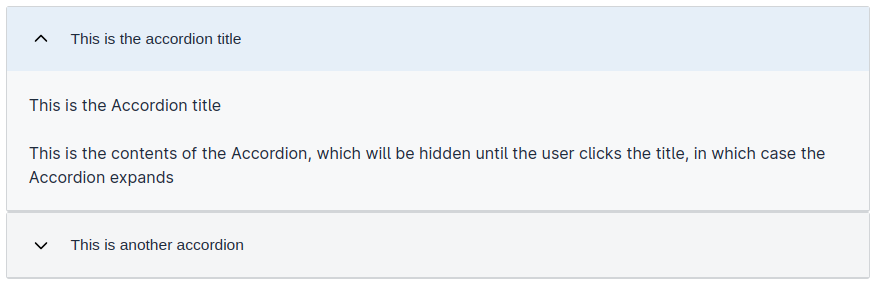
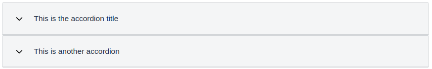

Denne komponenten brukes til å gruppere flere `Accordion`-komponenter sammen.
Den brukes til å opprette en sammenleggbar liste over innhold som kan utvides og lukkes individuelt.
`AccordionGroup` brukes for å sørge for at `Accordion`-ene føles som om de tilhører samme gruppe.





## Eksempel

```json
...
{
  "id": "accordion-group",
  "type": "AccordionGroup",
  "children": ["accordion", "accordion-2"]
},
{
  "id": "accordion",
  "type": "Accordion",
  "children": ["paragraph", "paragraph-2"]
},
{
  "id": "paragraph",
  "type": "Paragraph",
  "textResourceBindings": {
    "title": "accordion-paragraph-test"
  },
  "dataModelBindings": {}
},
{
  "id": "paragraph-2", 
  "type": "Paragraph",
  "textResourceBindings": {
    "title": "Dette er en tittel med litt mere tekst"
  },
  "dataModelBindings": {}
},
...
```

## Konfigurering

For å konfigurere en `AccordionGroup`, legger du ganske enkelt til en ny komponent med typen
`AccordionGroup` til layout-filen. Spesifiser deretter hvilke andre komponenter du vil
kunne ekspandere ved å legge til deres ID-er til `AccordionGroup`-komponenten sin `children`-egenskap.

Følgende typer kan legges til en `AccordionGroup`:
- `Accordion`
