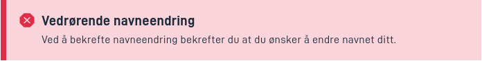

## Usage

Alerts are commonly used to display important information to users that should be highlighted.

* [Page layout JSON schema](https://altinncdn.no/schemas/json/layout/layout.schema.v1.json)

## Component properties

| **Property** | **Title**    | **Type**                                       | **Description**                                                                                |
|--------------|--------------|------------------------------------------------|------------------------------------------------------------------------------------------------|
| `severity`   | Severity     | `"success" \| "info" \| "danger" \| "warning"` | String value indicating the severity level of the alert. This affect the styling of the alert. |

### Properties Description

The component has these properties:

#### severity

The severity of the alert. This affects the styling of the alert.


#### textResourceBindings

`title` and `description` can be configured with `textResourceBindings` to display text from the resource file.

## Accessibility

The component does not get `role="alert"` by default. This means that screen readers will not treat this as an alert.
An `Alert` should only have `role="alert"` if it appears in the ui as a result of an action the user has taken.
We automatically add `role="alert"` if the `Alert` has a `hidden` property set to `false`. This means that the `Alert` 
became visible to the user based on an action the user has taken.

## Examples

### Info

En alert med `severity` `"info"`


`FormLayout.json` example:

```json
{
  "id": "alert-id",
  "type": "Alert",
  "textResourceBindings": {
    "title": "Vedrørende navneendring",
    "description": "Ved å bekrefte navneendring bekrefter du at du ønsker å endre navnet ditt."
  },
  "severity": "info"
}

```

### Success

En alert med `severity` `"success"`


`FormLayout.json` example:

```json
{
  "id": "alert-id",
  "type": "Alert",
  "textResourceBindings": {
    "title": "Vedrørende navneendring",
    "description": "Ved å bekrefte navneendring bekrefter du at du ønsker å endre navnet ditt."
  },
  "severity": "success"
}

```
### Warning

En alert med `severity` `"warning"`


`FormLayout.json` example:

```json
{
  "id": "alert-id",
  "type": "Alert",
  "textResourceBindings": {
    "title": "Vedrørende navneendring",
    "description": "Ved å bekrefte navneendring bekrefter du at du ønsker å endre navnet ditt."
  },
  "severity": "warning"
}

```
### Danger

En alert med `severity` `"danger"`



`FormLayout.json` example:

```json
{
  "id": "alert-id",
  "type": "Alert",
  "textResourceBindings": {
    "title": "Vedrørende navneendring",
    "description": "Ved å bekrefte navneendring bekrefter du at du ønsker å endre navnet ditt."
  },
  "severity": "danger"
}

```

