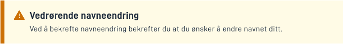

## Bruk

Alert brukes ofte til å vise viktig informasjon som skal fremheves for brukerne.

* [Sideoppsett JSON-skjema](https://altinncdn.no/schemas/json/layout/layout.schema.v1.json)

## Komponentegenskaper

| **Egenskap** | **Tittel**       | **Type**                                       | **Beskrivelse**                                                                               |
|--------------|------------------|------------------------------------------------|-----------------------------------------------------------------------------------------------|
| `severity`   | Alvorlighetsgrad | `"success" \| "info" \| "danger" \| "warning"` | Strengverdi som angir alvorlighetsgraden til varselet. Dette påvirker utseendet til varselet. |

### Beskrivelse av egenskaper

Komponenten har følgende egenskaper:

#### severity

Alvorlighetsgraden til varselet. Dette påvirker utseendet til varselet.


#### textResourceBindings

`title` og `body` kan konfigureres med `textResourceBindings` for å vise tekst fra ressursfilen.

## Tilgjengelighet

Komponenten får ikke automatisk `role="alert"`. Dette betyr at skjermlesere ikke vil behandle den som en varsel.
En Alert bør bare ha `role="alert"` hvis den vises i brukergrensesnittet som et resultat av en handling brukeren har tatt.
Vi legger automatisk til `role="alert"` hvis `Alert` har en `hidden`-egenskap satt til false. Dette betyr at `Alert`-en
ble synlig for brukeren basert på en handling brukeren tok.

## Eksempel

### Info

En alert med `severity` `"info"`


`FormLayout.json` eksempel:

```json
{
  "id": "alert-id",
  "type": "Alert",
  "textResourceBindings": {
    "title": "Vedrørende navneendring",
    "body": "Ved å bekrefte navneendring bekrefter du at du ønsker å endre navnet ditt."
  },
  "severity": "info"
}

```

### Success

En alert med `severity` `"success"`


`FormLayout.json` eksempel:

```json
{
  "id": "alert-id",
  "type": "Alert",
  "textResourceBindings": {
    "title": "Vedrørende navneendring",
    "body": "Ved å bekrefte navneendring bekrefter du at du ønsker å endre navnet ditt."
  },
  "severity": "success"
}
```

### Warning

En alert med `severity` `"warning"`



`FormLayout.json` eksempel:

```json
{
  "id": "alert-id",
  "type": "Alert",
  "textResourceBindings": {
    "title": "Vedrørende navneendring",
    "body": "Ved å bekrefte navneendring bekrefter du at du ønsker å endre navnet ditt."
  },
  "severity": "warning"
}
```

### Danger

En alert med `severity` `"danger"`


`FormLayout.json` eksempel:

```json
{
  "id": "alert-id",
  "type": "Alert",
  "textResourceBindings": {
    "title": "Vedrørende navneendring",
    "body": "Ved å bekrefte navneendring bekrefter du at du ønsker å endre navnet ditt."
  },
  "severity": "danger"
}
```
