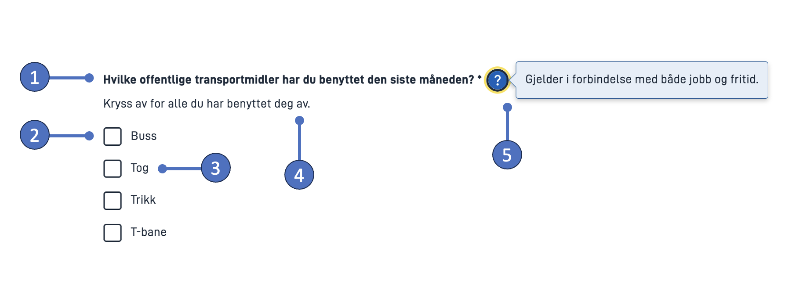

## Usage

Checkboxes are commonly utilized in forms to gather user input,
 enabling them to choose one or multiple options from a list.
 
 #### Use checkboxes when:
 * Users can select multiple options from a list.
 * An explicit action must be taken to apply settings (e.g. confirmation that the user has read a document).

### Anatomy

1\. *Heading* – Question or prompt.  
2\. *Checkbox* – The selection control.  
3\. *Checkbox label* – Text label associated with the checkbox.  
4\. *Description text* – Optional text field with further description.  
5\. *Tooltip* – Clicking questionmark will show text popup.

### Style

* Checkboxes should always have a connected label on the right side.

### Best Practices

* Deactivated choice boxes should be avoided.
 If an alternative is unavailable, it should be removed and an explenation should be given in text as to why the option is missing.

 ### Content guidelines

* Keep checkbox labels short and descriptive.
* Start all checkbox labels with a capital letter.
* Don't include punctuation after checkbox labels.

### Related

* If the user can only make a single selection from a list of options, use [radio buttons](../radiobuttons).
* For a more compact way of displaying multiple options with single selection, use a [dropdown menu](../dropdown).

## Add and configure component
{}

Add a checkbox component from the left-side panel and select it. This will bring up the configuration panel for the component on the right-hand side (below image).

Texts can be added directly by clicking the `+` sign next to the field
 (creates a new [text resource](/app/development/ux/texts/#add-and-change-texts-in-an-application)), or you can click the magnifying glass to choose a pre-made one.

#### 1. Component ID
Unique ID for each component. This comes pre-filled, but you can change the value as you like.

#### 2. Link to data model
If your app is connected to a [data model](/app/development/data/data-modeling#data-models),
 you can link the checkbox component to a data model field.
 The value(s) (see number 8) must then correspond with the data type (e.g. boolean, string, number) specified in the model.

#### 3. Header
Question, prompt, or short description positioned above checkboxes.

#### 4. Description text
Text field that allows for more elaborate description of options. Displayed directly beneath component label.

#### 5. Tooltip
When filled in, a questionmark will be displayed next to the compoent label. Clicking the questionmark will display the text as a popup.
Can be used for clarification, examples, use cases, etc.

#### 6. Read-only
When checked: disables the checkbox (not recommended, see [best practices](#best-practices)).

#### 7. Required
When checked: Requires the user to make a selection.

#### 8. Adding checkboxes
There are two ways of adding checkboxes: manually and by using [code (options) lists](/app/development/data/options/).

***Manually adding checkboxes***: Choose "Manuelt", add a new checkbox (1), and add a label (2).

The checkbox comes with a pre-filled value (3) which is the data that is stored when the user makes a selection.
 The value can be changed as you like.
 If the compoent is connected to a data model, the value(s) must correspond with the data type (e.g. boolean, string, number) specified in the model.

1\. *Add checkbox* – Add a new checkbox.  
2\. *Label* – Descriptive label associated with the checkbox.   
3\. *Value* – The value (data) that will be sent when the user makes a selection.

***Adding checkboxes with code lists (options)***: Choose 'Kodeliste' and provide a code list (options) ID.

For options retrieved from files, the options ID is the filename (without the extension).
For more info about code lists/options, see [Connect the component to options](/app/development/data/options/#connect-the-component-to-options-code-list).

1\. *Codelist (options) ID* – ID identifying the code list.

#### 9. Pre-select
Pre-select one of the checkboxes by typing its index.
Type '0' to pre-select checkbox 1, type '1' for checkbox 2, etc.

{}

## Properties

{}

The following is an autogenerated list of the properties available for {} based on the component's JSON schema file:

*Coming soon*
<!-- Insert shortcode `component-props` that automatically generates a list of component properties from the component's json schema.
The component name can be explicitly given as argument (e.g. `component-props "Grid"`).
If no argument is given, the shortcode pulls the component name from 'schemaname' in the frontmatter. -->

{}

{}

*Coming soon*
<!-- More detailed description of properties -->

{}

{}

*Coming soon*
<!-- Examples of component configurations.
Use screenshots of json config and/or link to repo if appropriate. -->

{}
