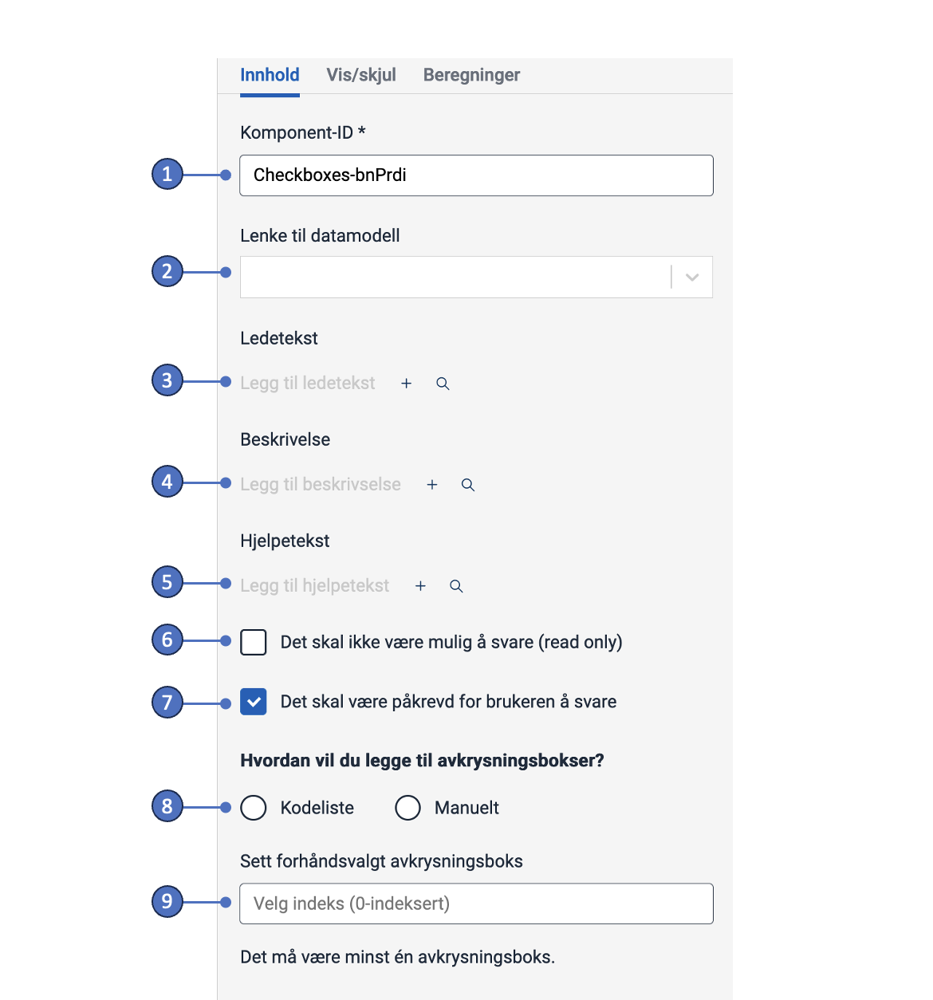
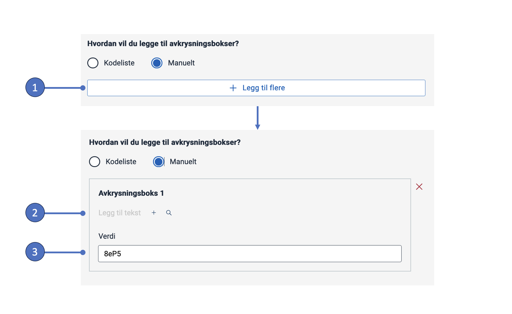
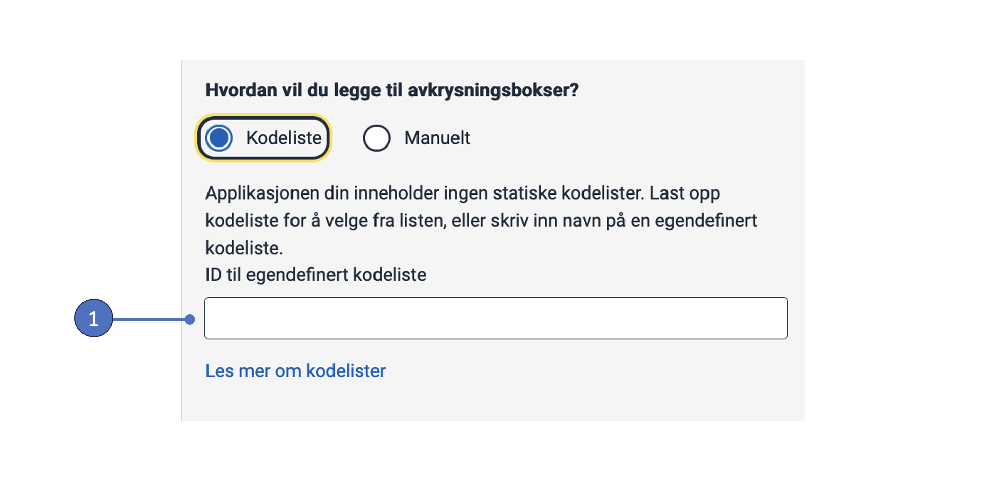

## Bruk

Avkrysningsbokser brukes ofte i skjemaer for å samle input fra brukeren,
 slik at de kan velge ett eller flere alternativer fra en liste.
 
 #### Bruk avkrysningsbokser når:
 * Brukere kan velge flere alternativer fra en liste.
 * Det må gjøres et eksplisitt valg for å bruke innstillingene (f.eks. bekrefte at brukeren har lest et dokument).

### Anatomi

1\. *Overskrift* - Spørsmål eller instruksjon.  
2\. *Avkrysningsboks* - Valgkontrollen.  
3\. *Etikett* - Tekstetikett knyttet til avkrysningsboksen.  
4\. *Beskrivelsestekst* - Valgfritt tekstfelt for ytterligere beskrivelse.  
5\. *Hjelpetekst* - Klikk på spørsmålstegnet for vise en pop-up med hjelpetekst.

### Stil

* Avkrysningsbokser bør alltid ha en tilknyttet etikett på høyre side.

### Beste praksis

* Avkrysningsbokser med deaktivert valg bør unngås.
    Hvis et alternativ er utilgjengelig bør det fjernes og en forklaring gitt for hvorfor alternativet mangler.

 ### Veiledning for innhold

* Hold etikettene korte og beskrivende.
* Begynn alle etiketter med stor bokstav.
* Ikke inkluder tegnsetting etter etikettene.

### Relatert

* Hvis brukeren bare kan velge ett alternativ fra en liste, bruk [radioknapper](../radiobuttons).
* For en mer kompakt måte å vise flere alternativer med enkeltvalg, bruk en [rullegardinmeny](../dropdown).

## Legg til og konfigurer komponent

Den enkleste måten å legge til en komponent på er via Altinn Studios [UI editor](/nb/app/getting-started/ui-editor/).
<!-- Short description of how to (screenshot?) -->
<!-- If not available in UI editor, describe how to add it with local development. -->

{}

Legg til en avkrysningsboks-komponent fra venstre sidepanel og klikk på den.
 Dette vil åpne konfigurasjonspanelet for komponenten på høyre side (se bildet nedenfor).

Tekster kan legges til direkte ved å klikke på `+`-tegnet ved siden av feltet
(oppretter en ny [tekstressurs](/nb/app/development/ux/texts/#legge-til-og-endre-tekster-i-en-app)),
 eller du kan klikke på forstørrelsesglasset for å velge en eksisterende tekstressurs.

#### 1. Komponent-ID
Unik ID for hver komponent. Denne er forhåndsutfylt, men du kan endre verdien etter ønske.

#### 2. Lenke til datamodell
Hvis appen din er tilkoblet en [datamodell](/nb/app/development/data/data-modeling#datamodeller) kan du koble avkrysningsboks-komponenten til et felt i datamodellen.
 Verdien(e) (punkt 8) må da tilsvare datatypen (for eksempel boolsk, string, tall) som er angitt i modellen.

#### 3. Overskrift
Spørsmål, instruksjon eller kort beskrivelse plassert over avkrysningsboksene.

#### 4. Beskrivelsestekst
Tekstfelt for mer detaljerte beskrivelser av alternativene. Vises rett under komponentetiketten.

#### 5. Hjelpetekst
Når denne er fylt ut vil et spørsmålstegn vises ved siden av komponentetiketten. Klikk på spørsmålstegnet for å vise teksten som en popup.
Kan brukes til forklaring, eksempler, brukssituasjoner osv.

#### 6. Skrivebeskyttet
Når huket av: deaktiverer avkrysningsboksen (ikke anbefalt, se [beste praksis](#beste-praksis)).

#### 7. Obligatorisk
Når huket av: Krever at brukeren gjør et valg.

#### 8. Legge til avkrysningsbokser
Det finnes to måter å legge til avkrysningsbokser på: manuelt og ved å bruke [kodelister](/nb/app/development/data/options/).

***Legg til avkrysningsbokser manuelt***: Velg "Manuelt", legg til en ny avkrysningsboks (1), og legg til en etikett (2).

Avkrysningsboksen kommer med en forhåndsutfylt verdi (3), som er dataen som lagres når brukeren gjør et valg.
 Verdien kan endres etter ønske.
  Hvis komponenten er tilknyttet en datamodell, må verdiene tilsvare datatypen (for eksempel boolsk, streng, tall) som er angitt i modellen.

1\. *Legg til avkrysningsboks* – Legg til en ny avkrysningsboks.
2\. *Etikett* – Beskrivende etikett knyttet til avkrysningsboksen.
3\. *Verdi* – Verdien (dataen) som sendes når brukeren gjør et valg.

***Legg til avkrysningsbokser med kodelister***: Velg 'Kodeliste' og angi en kodeliste ID.

En kodeliste er en forhåndsdefinert liste med alternativer.
For alternativer som hentes fra filer, er kodeliste ID-en filnavnet (uten filtypen).
For mer informasjon om kodelister/alternativer, se [Koble en komponent til kodeliste](/nb/app/development/data/options/#koble-en-komponent-til-kodeliste).

1\. *Kodeliste ID* – ID som identifiserer kodelisten.

#### 9. Forhåndsvalg
Forhåndsvelg en av avkrysningsboksene ved å angi dens indeks.
Angi '0' for å forhåndsvelge avkrysningsboks 1, '1' for avkrysningsboks 2, osv.

{}

## Egenskaper

{}

Følgende er en automatisk generert liste over egenskapene som er tilgjengelige for {} basert på komponentens JSON-skjemafil:

*Kommer snart*
<!-- Insert shortcode `component-props` that automatically generates a list of component properties from the component's json schema.
The component name can be explicitly given as argument (e.g. `component-props "Grid"`).
If no argument is given, the shortcode pulls the component name from 'schemaname' in the frontmatter. -->

{}

{}

*Kommer snart*
<!-- More detailed description of properties -->

{}

{}

*Kommer snart*
<!-- Examples of component configurations.
Use screenshots of json config and/or link to repo if appropriate. -->

{}
