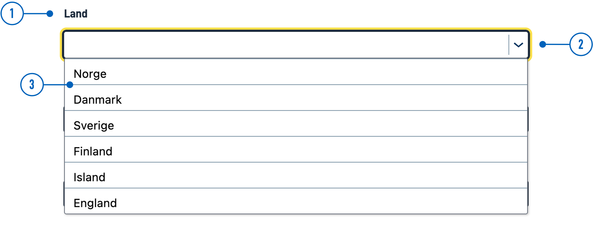
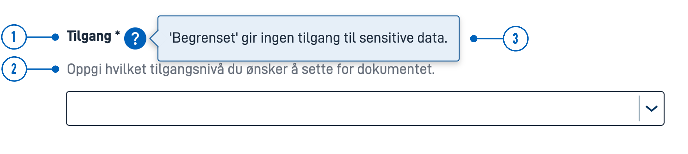
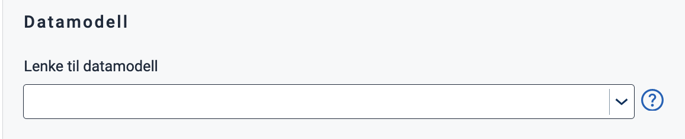
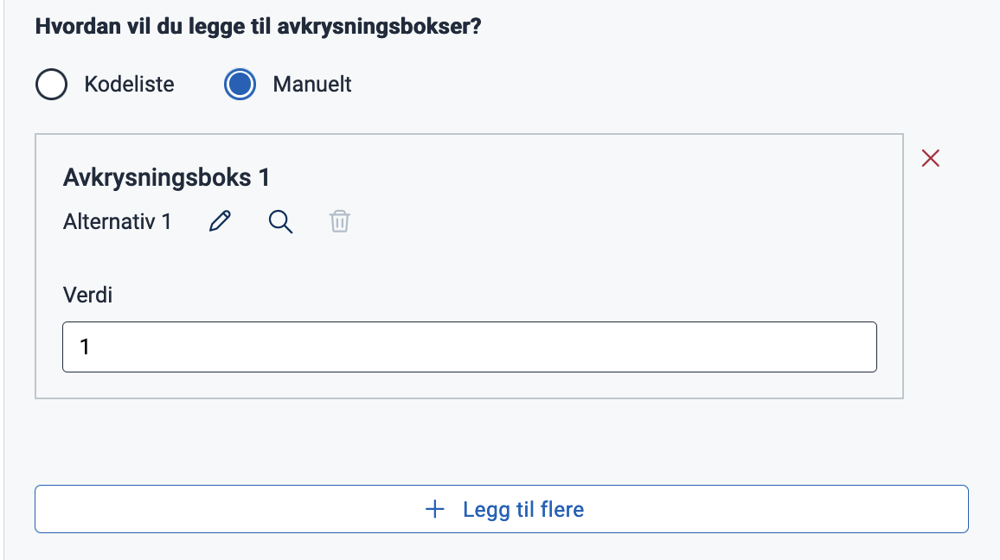
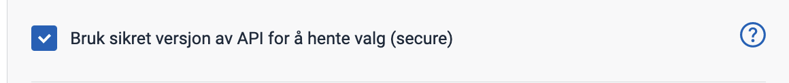
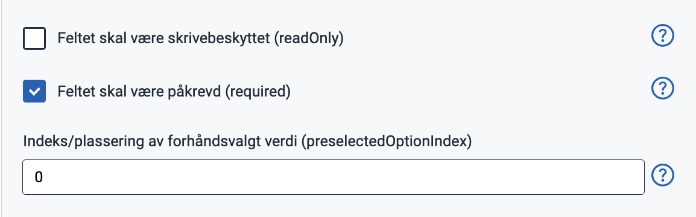
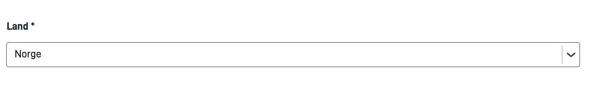
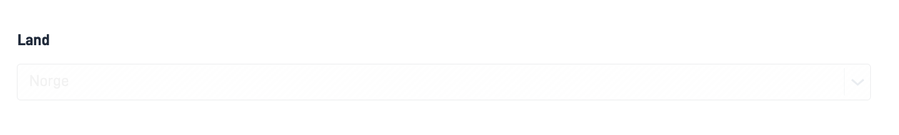

{}
🚧 This documentation is a work in progress.
{}

---

## Usage

Dropdown lists are often used in forms to collect input from users where they need to choose only one of several options from a list.

**Use Cases:**

* When the user can choose only one of several options.
* When the list of options is too long to display as radio buttons (see [Related](#related)).
* For navigation menus.

### Anatomy



{}
1. **Heading** - Question or instruction.
2. **Trigger** - Click to open the menu.
3. **Menu** - List of options.
{}

### Best Practices

- List options in a logical order:
  - most likely to least likely to be selected
  - simplest to most complex operation
  - least to most risk
- Preselect one option. Choose the safest, most secure, and private option first. If safety and security are not important, choose the most likely or convenient option.
- If users should have the option to avoid making a selection, add a "None" (or equivalent) option.
- If you cannot have a list of all possible options, add an "Other" option.
- Avoid alphabetical sorting as it is language-dependent and not localizable.
- Avoid overlapping options. For example, Select age: 0-20, 20-40 — What do you choose if your age is 20?
- Include all relevant options. For example, Select age: Below 20, Above 20 — What do you choose if you are 20?

### Content Guidance

* Keep labels short and descriptive.
* Start all labels with a capital letter.
* Do not include punctuation after labels.

### Related

* For single selection with few options, use [RadioButtons](../radiobuttons/).
* If users can choose multiple options from a list, use [Checkboxes](../checkboxes/).
* For a more compact way to display multiple options with multiple selections, use [MultipleSelect](../multipleselect/).

## Properties

The following is an autogenerated list of the properties available for {} based on the component's JSON schema file (linked below).

{}
We are currently updating how we implement components, and the list of properties may not be entirely accurate.
{}

<!-- The `component-props` shortcode automatically generates a list of component properties from the component's json schema.
The component name can be explicitly given as argument (e.g. `component-props "Grid"`).
If no argument is given, the shortcode pulls the component name from 'schemaname' in the frontmatter. 
If the component does not have a JSON schema, comment out the text and shortcode in this section and, if necessary, create a table manually with the most important properties (columns: Property, Type, Description).
-->

{}

## Configuration

{}
We are currently updating Altinn Studio Designer with more configuration options!
 The documentation is continuously updated, and there may be more settings available than what is described here, and some settings may be in beta version.
{}

### Add component




You can add a component in [Altinn Studio Designer](/app/getting-started/ui-editor/) by dragging it from the list of components to the page area.
Selecting the component brings up its configuration panel.




Basic component:


App/ui/layouts/{page}.json


```json{hl_lines="6-12"}
{
  "$schema": "https://altinncdn.no/schemas/json/layout/layout.schema.v1.json",
  {
    "data": {
      "layout": [
        {
            "id": "Dropdown-id",
            "type": "Dropdown",
            "dataModelBindings": {
                "simpleBinding": ""
            }
        }
      ]
    }
  }
}
```




### Text (`textResourceBindings`)




You can create a new text by clicking on the plus sign or select an existing one by clicking on the magnifying glass. See [Adding and Editing Texts in an App](/app/development/ux/texts/#add-and-change-texts-in-an-application) for more information.





Text can be added directly as a text string or by providing the key to a [text resource](/app/development/ux/texts/#add-and-change-texts-in-an-application).


App/ui/layouts/{page}.json


```json{hl_lines="4-10"}
{
  "id": "komponent-id",
  "type": "Dropdown",
  "textResourceBindings": {
          "title": "",
          "description": "",
          "help": "",
          "shortName": "",
          "tableTitle": ""
        }
}
```




**Text anatomy**



{}
1. **Ledetekst** (`textResourceBindings.title`): A heading with a question or instruction.
2. **Beskrivelse** (`textResourceBindings.description`): Description. Text for further description or elaboration.
3. **Hjelpetekst** (`textResourceBindings.help`): Help text. When help text is filled out, a question mark will appear next to the heading. Click on the question mark to display the text as a popup. Can be used for explanations, examples, use cases, etc.

- **Kortnavn** (`textResourceBindings.shortName`): Short name. Overrides the title of the component used in the default `required` validation message.
- **Tittel i tabell** (`textResourceBindings.tableTitle`): Table title. Overrides the title of the component used in column headers when the component is within repeating groups.
{}

### Data Model

To store and manipulate the data collected by the component, the component must be linked to a field in a [data model](/app/development/data/data-modeling/#data-models).




Select the field you want to link the component to from the dropdown menu.
 If there are no fields available, you must first [upload a data model](/app/development/data/data-modeling/#upload-and-display-data-model).







Insert the name of the field you want to link the component to within curly braces under `dataModelBindings`.


App/ui/layouts/{page}.json


```json{hl_lines="4-6"}
{
  "id": "komponent-id",
  ...
  "dataModelBindings": {
    "simpleBinding": "MyDataModel.SomeField"
    }
}
```



### Adding options

Options can be added manually or by using [code lists](/app/development/data/options).

#### Manually (`options`)



Select "Manuelt" and click "Legg til flere" to add a new option. Choose or create a new text to add a label (`label`).

The option comes with a pre-filled value (`value`), which is the data that is stored when the user makes a selection.
 The value is stored as a string and can be changed as you wish.







App/ui/layouts/{page}.json


```json{hl_lines="5-10"}
{
  "id": "komponent-id",
  "type": "Dropdown",
  ...
  "options": [
          {
            "label": "Alternativ 1",
            "value": "1"
          }
        ]
}
```




#### Code List (`optionsId`)

A [code list](/app/development/data/options) is a predefined list of options.




To add options from a code list, select "Kodeliste" and enter a code list ID.
 To use a custom (dynamic) code list, click "Bytt til egendefinert kodeliste" (switch to custom code list).


If you wish to [secure dynamic code lists](/app/development/data/options/dynamic-codelists/#secured-dynamic-options), you can check this option:







App/ui/layouts/{page}.json


```json{hl_lines="4-5"}
{
  "id": "komponent-id",
  ...
  "optionsId": "land",
  "secure": true
}
```



#### Kilde (`source`)

Another way to add options is by linking the component to a code list based on form data stored within the app itself.
 You can do this by adding a source (`source`); please refer to the [documentation](/app/development/data/options/repeating-group-codelists/) for instructions on how to configure this.









App/ui/layouts/{page}.json


```json{hl_lines="4-9"}
{
  "id": "komponent-id",
  ...
  "source": {
    "group": "some.group",
    "label": "someOption.label",
    "value": "some.group[{0}].someField",
    "description": "Some description",
    "helpText": "Some help text"
  }
}
...
```



**Documentation for code lists**
- [Link a Component to a Code List](/app/development/data/options/#connect-the-component-to-options-code-list)
- [Static Code Lists](/app/development/data/options/static-codelists/)
- [Dynamic Code Lists](/app/development/data/options/dynamic-codelists/)
- [Code lists based on repeating groups from the data model](/app/development/data/options/repeating-group-codelists/)

### Dropdown settings










App/ui/layouts/{page}.json


```json{hl_lines="4-6"}
{
  "id": "komponent-id",
  ...
  "readOnly": false,
  "required": true,
  "preselectedOptionsIndex": 0
}
```


 
- **Feltet skal være skrivebeskyttet** (`readOnly`): Field is read-only. Disables the component when checked (`true`). The component is dimmed and it's not possible to select an option.
- **Feltet skal være påkrevd** (`required`): Field is required when checked (`true`). Indicated by a star next to the title.
- **Forhåndsvalgt verdi** (`preselectedOptionsIndex`): Sets a preselected value. Options are zero-indexed, so the first option is `0`, the second is `1`, and so on.

**Examples**





### General settings









App/ui/layouts/{page}.json


```json{hl_lines="4-9"}
{
  "id": "komponent-id",
  ...
  "renderAsSummary": false,
  "hidden": false,
  "pageBreak": {
    "breakBefore": "auto",
    "breakAfter": "auto"
  }
}
```



- **Oppsummering** (`renderAsSummary`): Indicates whether the field should be included in a summary or not (default: `false`).
- **Feltet skal skjules** (`hidden`): Indicates whether the field should be hidden or not (default: `false`).
- **PDF-innstillinger** (`pageBreak`): Indicates whether a page break should be added before or after the component. Can be either: `auto` (default), `always`, or `avoid`.

---

{}
The following settings are not yet supported in the form editor but can be configured manually.
{}

### Horizontal alignment with `grid`

The `grid` property controls horizontal alignment based on a 12-column layout.
 Items are allocated fractions of 12 which sets their width relative to the screen width.
  In the example below, we set the component's width to 2/12 of the screen width for all screen sizes (from `xs` and up).





App/ui/layouts/{page}.json


```json{hl_lines=["4-6"]}
{
  "id": "komponent-id",
  ...
  "grid": {
      "xs": 2,
    }
}
```



You can also use `grid` to place items side by side.

See [Components placed side by side (grid)](/app/development/ux/styling/#components-placed-side-by-side-grid) for details and examples.

<!-- ## Examples -->