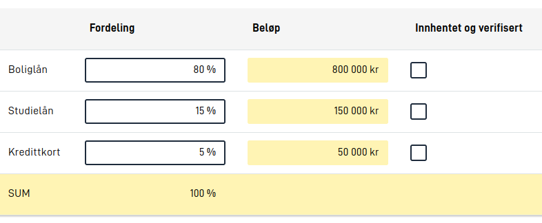

## Configuration

The Grid component is configured like any other, but it requires a configuration for rows and cells. To start with a 
2x2 Grid having two columns and two rows, we can use the following configuration:

```json
{
  "id": "myGrid",
  "type": "Grid",
  "rows": [
    {
      "cells": [
        { "text": "Cell 1" },
        { "text": "Cell 2" }
      ]
    },
    {
      "cells": [
        { "text": "Cell 3" },
        { "text": "Cell 4" }
      ]
    }
  ]
}
``` 

Each cell should either be an object with a `text` property (for text cells), an object with a `component` property
(referencing other components), or `null` (for an empty cell). Each row must have the same amount of cell objects as
every other row.

### Rows
On some rows, usually the first, you might want to configure a header row. To do this, add a `header` property to the row
and set it to `true`. This will make the row have a different background color and make the text bold.

```json {hl_lines=[2]}
{
  "header": true,
  "cells": [
    { "text": "Cell 1" },
    { "text": "Cell 2" }
  ]
}
```

Similarly, a row can also be configured to be read-only. This will make the row have a yellow background color. To
configure a row as read-only, add a `readOnly` property to the row and set it to `true`.

```json {hl_lines=[2]}
{
  "readOnly": true,
  "cells": [
    { "text": "Cell 3" },
    { "text": "Cell 4" }
  ]
}
```

Note that components inside a `readOnly` are not automatically set to `readOnly` as well. If you want to make a component
inside a `readOnly` row read-only, you need to configure it manually for that component.

Rows can also be hidden, and a whole row will automatically be hidden if the following rules are met:
1. The row has at least one component reference (not just empty cells and text cells)
2. All component references in the row points to components that are currently hidden

In other words, rows that only have text cells will never be hidden, and even if the row has text cells, these cells
will not be taken into account when the Grid component decides whether to hide the row or not.

### Cells
Cells can be configured to be either a text cell or a component cell. To configure a cell as a text cell, add a `text`
property to the cell and set it to the text you want to display. You can also specify a text resource key as the text
to display in the cell. To configure a cell as a component cell, add a `component` property to the cell and set it to
the id of the component you want to display in the cell.

```json {hl_lines=[5]}
{
  "cells": [
    { "text": "Cell 1" },
    { "component": "myComponent" }
  ]
}
```

In the above configuration, the `myComponent` is assumed to be a component that is configured elsewhere in the layout.
Currently, a selection of components are supported in the Grid component. These are:

- Button
- Checkboxes
- Custom (subject to the custom implementation)
- Datepicker
- Dropdown
- Header
- Image
- Input
- InstantiationButton
- MultipleSelect
- Paragraph
- PrintButton
- RadioButtons
- TextArea

For RadioButtons and Checkboxes, the option label will not be displayed if there is only one option to choose from
when being displayed inside a Grid.

When displayed in a table, components will not render their `title` and `description` text resources. However, these
text resources should still be set on the component, as they will be used for accessibility purposes, and will still
be displayed when the component is displayed outside of a Grid - such as on [smaller screens](#mobile-support) and in
[a Summary](../../pages/summary). 

### Widths, text and alignment

{}
```json
[
  {
    "id": "gjeld-grid",
    "type": "Grid",
    "textResourceBindings": {
      "title": "Totalfordeling av gjeld",
      "description": "Her skal du fylle ut fordelingen av all din gjeld, og hvilke typer den gjelder."
    },
    "rows": [
      {
        "header": true,
        "cells": [
          {},
          { "text": "Fordeling" },
          { "text": "Beløp" },
          { "text": "Innhentet og verifisert" }
        ]
      },
      {
        "cells": [
          { "text": "laan-bolig" },
          { "component": "fordeling-bolig" },
          { "component": "belop-bolig" },
          { "component": "innhentet-bolig" }
        ]
      },
      {
        "cells": [
          { "text": "laan-studie" },
          { "component": "fordeling-studie" },
          { "component": "belop-studie" },
          { "component": "innhentet-studie" }
        ]
      },
      {
        "cells": [
          { "text": "laan-kredittkort" },
          { "component": "fordeling-kredittkort" },
          { "component": "belop-kredittkort" },
          { "component": "innhentet-kredittkort" }
        ]
      },
      {
        "readOnly": true,
        "cells": [
          { "text": "SUM" },
          { "component": "fordeling-total" },
          null,
          null
        ]
      }
    ]
  },
  {
    "id": "fordeling-bolig",
    "type": "Input",
    ...
  },
  {
    "id": "fordeling-studie",
    "type": "Input",
    ...
  },
  {
    "id": "fordeling-kredittkort",
    "type": "Input",
    ...
  },
  {
    "id": "belop-bolig",
    "type": "Input",
    "readOnly": true,
    ...
  },
  {
    "id": "belop-studie",
    "type": "Input",
    "readOnly": true,
    ...
  },
  {
    "id": "belop-kredittkort",
    "type": "Input",
    "readOnly": true,
    ...
  },
  {
    "id": "innhentet-bolig",
    "type": "Checkboxes",
    ...
  },
  {
    "id": "innhentet-studie",
    "type": "Checkboxes",
    ...
  },
  {
    "id": "innhentet-kredittkort",
    "type": "Checkboxes",
    ...
  },
  {
    "id": "fordeling-total",
    "type": "Input",
    "readOnly": true,
    ...
  }
]
```
{}

## Mobile support


Grid arrangement of components is useful to give the user a better overview of the content of a page and related
fields when the screen is large enough. However, such a table view is not optimal for smaller screens, so the Grid
component will automatically display the components (as if they were not part of a Grid) on smaller screens. The order
of the components will be the same as the order of the rows and cells in the Grid configuration (one row at a time),
and the order of the components as they are defined in the layout configuration has no significance.

The same applies to displaying a Grid component in [a Summary](../../pages/summary), where the same components
referenced in the Grid will be displayed as a summary of single components.