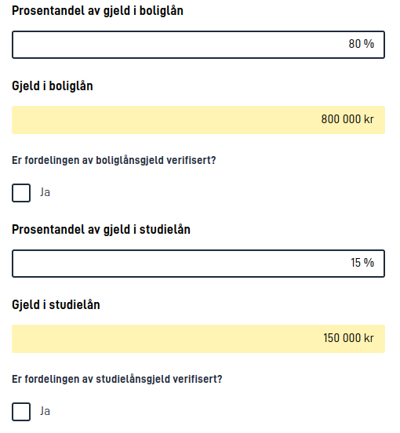

{}
```json
[
  {
    "id": "gjeld-grid",
    "type": "Grid",
    "textResourceBindings": {
      "title": "Totalfordeling av gjeld",
      "description": "Her skal du fylle ut fordelingen av all din gjeld, og hvilke typer den gjelder."
    },
    "rows": [
      {
        "header": true,
        "cells": [
          {
            "width": "25%",
            "columnOptions": {
              "alignText": "left",
              "textOverflow": {
                "lineWrap": true,
                "maxHeight": 1
              }
            }
          },
          { "text": "Fordeling" },
          { 
            "text": "Beløp",
            "columnOptions": {
              "width": "25%"
            }
          },
          { "text": "Innhentet og verifisert" }
        ]
      },
      {
        "cells": [
          { "text": "laan-bolig" },
          { "component": "fordeling-bolig" },
          { "component": "belop-bolig" },
          { "component": "innhentet-bolig" }
        ]
      },
      {
        "cells": [
          { "text": "laan-studie" },
          { "component": "fordeling-studie" },
          { "component": "belop-studie" },
          { "component": "innhentet-studie" }
        ]
      },
      {
        "cells": [
          { "text": "laan-kredittkort" },
          { "component": "fordeling-kredittkort" },
          { "component": "belop-kredittkort" },
          { "component": "innhentet-kredittkort" }
        ]
      },
      {
        "readOnly": true,
        "cells": [
          { 
            "text": "SUM",
            "alignText": "right"
          },
          { "component": "fordeling-total" },
          null,
          null
        ]
      }
    ]
  },
  {
    "id": "fordeling-bolig",
    "type": "Input",
    ...
  },
  {
    "id": "fordeling-studie",
    "type": "Input",
    ...
  },
  {
    "id": "fordeling-kredittkort",
    "type": "Input",
    ...
  },
  {
    "id": "belop-bolig",
    "type": "Input",
    "readOnly": true,
    ...
  },
  {
    "id": "belop-studie",
    "type": "Input",
    "readOnly": true,
    ...
  },
  {
    "id": "belop-kredittkort",
    "type": "Input",
    "readOnly": true,
    ...
  },
  {
    "id": "innhentet-bolig",
    "type": "Checkboxes",
    ...
  },
  {
    "id": "innhentet-studie",
    "type": "Checkboxes",
    ...
  },
  {
    "id": "innhentet-kredittkort",
    "type": "Checkboxes",
    ...
  },
  {
    "id": "fordeling-total",
    "type": "Input",
    "readOnly": true,
    ...
  }
]
```
{}

## Konfigurasjon

Grid-komponenten konfigureres som alle andre, men krever en konfigurasjon for rader og celler. For å starte med en
2x2 Grid med to kolonner og to rader, kan vi bruke følgende konfigurasjon:

```json
{
  "id": "myGrid",
  "type": "Grid",
  "rows": [
    {
      "cells": [
        { "text": "Celle 1" },
        { "text": "Celle 2" }
      ]
    },
    {
      "cells": [
        { "text": "Celle 3" },
        { "text": "Celle 4" }
      ]
    }
  ]
}
```

Hver celle må være enten et objekt med en `text`-egenskap (for tekstceller), et objekt med en `component`-egenskap
(refererer til andre komponenter), et objekt med en `labelFrom`-egenskap (tekstcelle som refererer til andre komponenter) eller `null` (for en tom celle). Hver rad må ha samme antall celler som alle andre
rader.

### Rader
For noen rader, vanligvis den første, kan du konfigurere en overskriftsrad. For å gjøre dette, legg til
en `header`-egenskap til raden og sett den til `true`. Dette vil gjøre raden har en annen bakgrunnsfarge og gjøre
teksten uthevet. 

```json {hl_lines=[2]}
{
  "header": true,
  "cells": [
    { "text": "Celle 1" },
    { "text": "Celle 2" }
  ]
}
```

En rad kan også bli konfigurert som skrivebeskyttet. Dette vil gjøre raden har en gul bakgrunnsfarge. For å
konfigurere en rad som skrivebeskyttet, legg til en `readOnly`-egenskap til raden og sett den til `true`.

```json {hl_lines=[2]}
{
  "readOnly": true,
  "cells": [
    { "text": "Celle 3" },
    { "text": "Celle 4" }
  ]
}
```

Merk at komponenter inni en `readOnly`-rad ikke blir automatisk satt til `readOnly`. Hvis du vil gjøre en
komponent skrivebeskyttet inni en `readOnly`-rad, må du konfigurere den slik manuelt.

Rader kan også skjules, og en hel rad vil automatisk skjules dersom følgende regler oppfylles:
1. Raden har minst en komponent-referanse (ikke bare tomme celler og tekst-celler)
2. Alle komponent-referansene i raden peker på komponenter som for tiden er skjult

Rader som bare har tekst-celler vil med andre ord aldri bli skjult, og selv om raden har tekst-celler blir ikke disse
cellene regnet med når Grid-komponenten skal velge om raden skal skjules eller ikke.

### Celler
Celler kan konfigureres til å vise tekst eller en annen komponent. For å konfigurere en celle som viser tekst,
legg til en `text`-egenskap til cellen og sett den til teksten du vil vise. Du kan også angi en tekstressursnøkkel
som teksten som skal vises i cellen. I tillegg er det mulig å inkludere `help`-egenskap som vil vise en hjelpetekst i tekstcellen.
Alternativt kan du hente teksten fra en komponents tekstressurser ved å bruke `labelFrom`-egenskapen istedenfor `text`. Kan hente tekstressurser
som `title`, `description` og `help`.  
For å konfigurere en celle som viser en annen komponent, legg til en
`component`-egenskap til cellen og sett den til id-en til komponenten du vil vise i cellen.

```json
{
  "cells": [
    { "text": "Tekst i celle 1" },
    { "text": "tekstressurs.nokkel.celle2" },
    { "text": "Tekst in celle 3", "help": "Hjelpetekst i celle 3" },
    { "labelFrom": "minKomponent" },
    { "component": "minKomponent" }
  ]
}
```

I konfigurasjonen over er det en forutsetning at `minKomponent` er en komponent som er konfigurert et annet sted i
layout-konfigurasjonen. Foreløpig er det støtte for følgende komponenter i Grid-komponenten:

- Button
- Checkboxes
- Custom (subject to the custom implementation)
- Datepicker
- Dropdown
- Header
- Image
- Input
- InstantiationButton
- MultipleSelect
- Paragraph
- PrintButton
- RadioButtons
- TextArea

Spesielt for `RadioButtons` og `Checkboxes` er at merkelappen som indikerer valget ikke blir vist dersom det bare
finnes et valgalternativ å velge mellom.

Når komponenter vises i en tabell, vil de ikke vise `title`- og `description`-tekstressurser. Disse tekstressursene
bør likevel settes på komponenten, da de vil bli brukt for tilgjengelighet og vil fortsatt bli vist når komponenten
vises utenfor en Grid - som på [mindre skjermer](#mobilvisning) og i [et sammendrag](../../pages/summary).

### Bredder, tekst og justering

Det finnes flere opsjoner på en celle for å konfigurere bredde, tekst plassering, og
anntall linjer som kan vises før resten av teksten skjules. Følgende opsjoner finnes:

- `width` - Bredden til kolonnen. Verdien kan inneholde en prosent, for eks.: `"25%"`, eller `"auto"` (standardverdi).
  Bør settes på den første kolonnen, og vil da gjelde for alle celler i den kolonnen.
- `alignText` - Velg mellom `"left"`, `"center"` eller `"right"` for å plassere teksten i cellen tilsvarende.
  Dette har ingen effekt for celler med komponenter, kun celler med tekst.
- `textOverflow` - Brukes for å kontrollere oppførsel når tekstinnhold er for stort til å vises i en celle.
  Har ingen effekt for celler med komponenter, kun celler med tekst.
  - `lineWrap` - Sett til `false` for å skru av skjuling av overflødig tekst. Standardverdi er `true`.
  - `maxHeight` - Setter et maks antall tillatte linjer før tekst skjules med utellatelsestegn (...). `"maxHeight": 0`
    resulterer i å skru av skjuling av overflødig tekst.

Du can overstyre en kollonnes valg for `alignText` og `textOverflow` for en spesifikk text-celle, ved å legge
attributtene til direkte i den valgte text-cellen.

Eksempel: 
```json
{
  "cells": [
    {
      "text": "Celle 1",
      "width": "25%",
      "alignText": "left",
      "textOverflow": {
        "lineWrap": false,
        "maxHeight": 0
      }
    },
    {
      "component": "minKomponent",
      "width": "75%"
    }
  ]
}
```

## Mobilvisning



Grid-visningen av enkeltkomponenter er nyttig for å gi brukeren bedre oversikt over innholdet i en side og relaterte
felter når skjermen er stor nok. En slik tabellvisning er derimot ikke optimal for mindre skjermer, derfor vil
Grid-komponenten automatisk vise enkeltkomponentene (som om de ikke var del av en Grid) på mindre skjermer. Rekkefølgen
til komponentene blir den samme som rekkefølgen til radene og cellene i Grid-konfigurasjonen (en og en rad av gangen),
og rekkefølgen til enkeltkomponentene slik de er definert i layout-konfigurasjonen har ingen betydning.

Det samme gjelder også for visning av en Grid-komponent i [et sammendrag](../../pages/summary), hvor de samme
komponentene referert til i Grid vil vises som sammendrag av enkeltkomponenter.