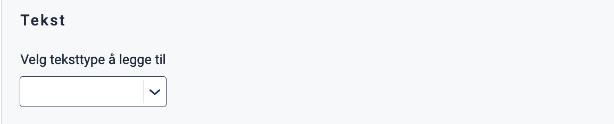
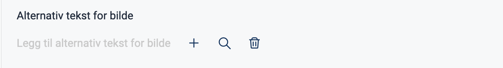
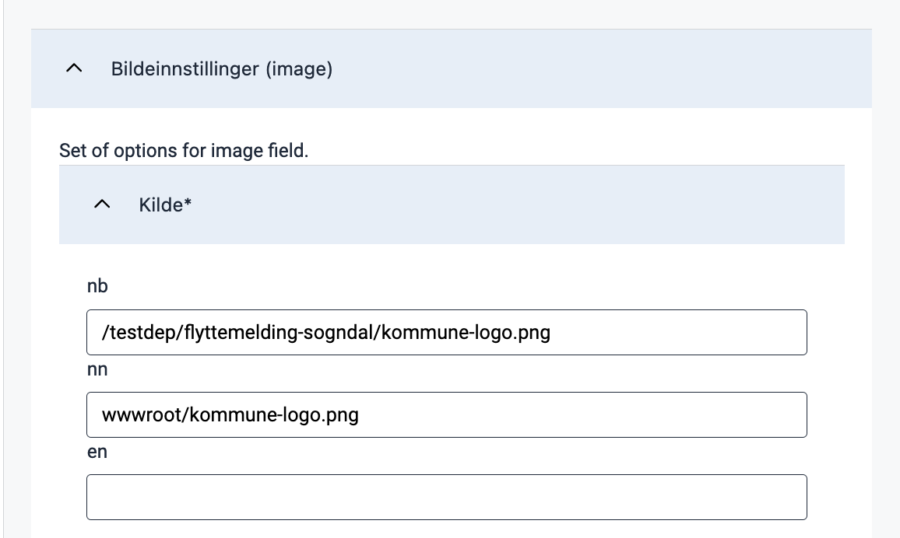
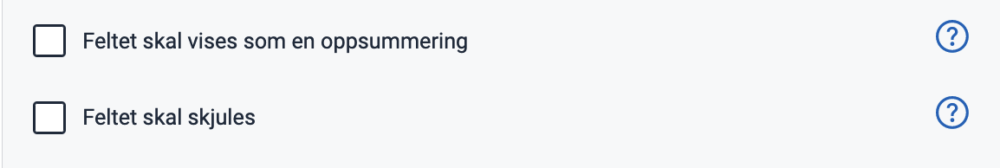
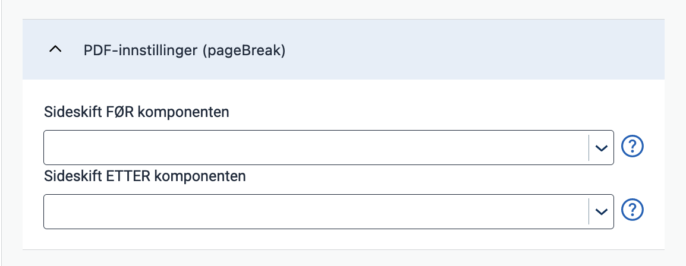
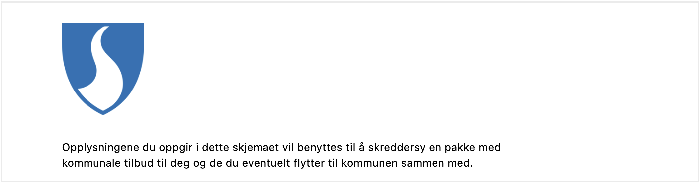

---
## Usage

Use images and illustrations to emphasize points or illustrate concepts that are difficult to explain using text.

### Anatomy


{}
1. **Image**: Photo, screenshot, illustration, or graphic.
2. **Alternative text**: Used by screen readers and displayed if the image can not be rendered.
{}

### Best practices
We recommend following the guidelines by [UUtilsynet](https://www.uutilsynet.no/regelverk/bilder-og-grafikk/205).

- Add an alternative text which explains the image. The alt. text will be displayed if the image is unavailable and is used by screen readers.
- If an image is purely decorative, it's best not to include an alternative text.
- Don't use images for image's sake. Ask yourself if the image illustrates a point or increases the understanding of what you are trying to tell.
- Check if the image scales well on devices like mobile or tablet. An image which looks good on a PC can quickly fill a smaller screen.
- Avoid using images instead of text, as screen readers cannot read it.

### Content guidelines

Keep alternative texts consistent:
- Never start with "Image of ..."
- Write short and start with the most essential part of the image.
- End by saying if the photo is an illustration or graphic.

<br>

**Example** 


Alt text: "Old wooden trolley. Photograph."

<br>

For more guidelines and examples, see [UUtilsynet](https://www.uutilsynet.no/regelverk/bilder-og-grafikk/205).

## Properties

The following is an autogenerated list of the properties available for {} based on the component's JSON schema file (linked below).

{}
We are currently updating how we implement components, and the list of properties may not be entirely accurate.
{}

{}

## Configuration

### Add component

You can add a component in [Altinn Studio Designer](/app/getting-started/ui-editor/) by dragging it from the left-side panel to the middle page area.
Selecting the component brings up its configuration panel on the right-hand side.

{}
We are currently updating Altinn Studio Designer with more configuration options!
 We'll update the documentation to reflect the new changes once they are stable.
  In the meantime, there may be more options available in beta mode.
{}

### Alternative text (`textResourceBindings.altTextImg`)




Choose 'Alternativ tekst for bilde' in the drop-down menu.



Click the plus sign to create a new text or the magnifying glass to pick an existing [text resource](/app/development/ux/texts/#add-and-change-texts-in-an-application).






Corresponding settings in the page's JSON file.


App/ui/layouts/{page}.json


```json{hl_lines="7-9"}
{
  "data": {
    "layout": [
      {
        "id": "kommune-logo",
        "type": "Image",
        "textResourceBindings": {
          "altTextImg": ""
        },
        ...
      }
    ]
  }
}
```




### Image settings (`image`)

### Configure image source (`image.src`)

The default source is `nb`; any language that does not define a separate image source will use this source.
  List another language code and image source to add a source, as in the example below.

Available language sources are `en` (English), `nb` (Norwegian Bokmål), and `nn` (Norwegian Nynorsk).











App/ui/layouts/{page}.json


```json{hl_lines=["5-8"]}
{
  "id": "kommune-logo",
  "type": "Image",
  "image": {
    "src": {
      "nb": "/testdep/flyttemelding-sogndal/kommune-logo.png",
      "nn": "wwwroot/kommune-logo.png"
    },
    ...
  }
}
```



The image source may be external or local to the app.

For external images, the source is the *image URL* (e.g. `https://examples.com/myImage.png`).

To host an image in the application, place it in the folder `App/wwwroot` (if the folder does not exist, you can create it).
 Static hosting must be [configured manually](#configure-static-hosting) for apps created before December 2021.

An image placed in `App/wwwroot` can be referenced in the following ways:
- Using its *relative URL*: `/<org or username>/<app-name>/image.png` or
- Using the *image path*: `wwwroot/image.png`. The path will resolve to the image's relative URL before the image is loaded.

#### Configure static hosting
For apps created *before December 2021*, static hosting must be configured manually by adding the line
 `app.UseStaticFiles('/' + applicationId);` in the `Configure` method in `App/Program.cs` as shown below:


App/Program.cs


```C# {hl_lines="5"}
void Configure()
  {
    ...
    app.UseRouting();
    app.UseStaticFiles('/' + applicationId);
    app.UseAuthentication();
    ...
  }
```

`applicationId` is the same as `id`  in `App/configApplicationmetadata.json`.

### Width and alignment (`image.width`, `image.align`)

By using `width`, you can adjust the image size by specifying the width of the image in percentage.
 The height is automatically set to maintain proportions. The default setting is 100% (original width).

The property `align` controls the horizontal position of the image relative to the container.









App/ui/layouts/{page}.json


```json{hl_lines="14-15"}
{
  "data": {
    "layout": [
      {
        "id": "kommune-logo",
        "type": "Image",
        "textResourceBindings": {
          "altTextImg": "kommune-logo.altTextImg"
        },
        "image": {
          "src": {
            "nb": "wwwroot/kommune-logo.png",
          },
          "width": "100%",
          "align": "center"
        }
      }
    ]
  }
}
```



The following options are available for positioning:

- `flex-start`: Left-aligned
- `center`: Centered
- `flex-end`: Right-aligned
- `space-between`: The elements are evenly distributed horizontally, with equal spacing between each element and no spacing at the start and end.
- `space-around`: The elements are evenly distributed horizontally with equal spacing between each element, including spacing at the start and end, which is half the spacing between the elements.
- `space-evenly`: The elements are evenly distributed horizontally with equal spacing between each element, including at the start and end, so that the total spacing is evenly distributed.

### Other settings












App/ui/layouts/{page}.json


```json{hl_lines="17-22"}
{
  "data": {
    "layout": [
      {
        "id": "kommune-logo",
        "type": "Image",
        "textResourceBindings": {
          "altTextImg": "kommune-logo.altTextImg"
        },
        "image": {
          "src": {
            "nb": "wwwroot/kommune-logo.png",
          },
          "width": "100%",
          "align": "center"
        },
        "renderAsSummary": false,
        "hidden": false,
        "pageBreak": {
          "breakBefore": "auto",
          "breakAfter": "auto"
        }
      }
    ]
  }
}
```



- **Oppsummering** (`renderAsSummary`): Indicates whether the field should be included in a summary or not (default: `false`).
- **Feltet skal skjules** (`hidden`): Indicates whether the field should be hidden or not (default: `false`).
- **PDF-innstillinger** (`pageBreak`): Indicates whether a page break should be added before or after the component. Can be either: `auto` (default), `always`, or `avoid`.

---

{}
The following settings are not yet supported in the form editor but can be configured manually.
{}

### Horizontal alignment with `grid`

The `grid` property controls horizontal alignment based on a 12-column layout.
 Items are allocated fractions of 12 which sets their width relative to the screen width.
  In the example below, we set the image component's width to 2/12 of the screen width for all screen sizes (from `xs` and up).





App/ui/layouts/{page}.json


```json{hl_lines=["13-15"]}
{
  "data": {
    "layout": [
      {
        "id": "kommune-logo",
        "type": "Image",
        "image": {
          "src": {
            "nb": "wwwroot/kommune-logo.png",
          },
          "width": "100%",
          "align": "center",
          "grid": {
            "xs": 2,
          }
        }
      },
      ...
    ]
  }
}
```






You can also use `grid` to place items side by side.

See [Components placed side by side (grid)](/app/development/ux/styling/#components-placed-side-by-side-grid) for details and more examples.

<!-- ## Examples -->