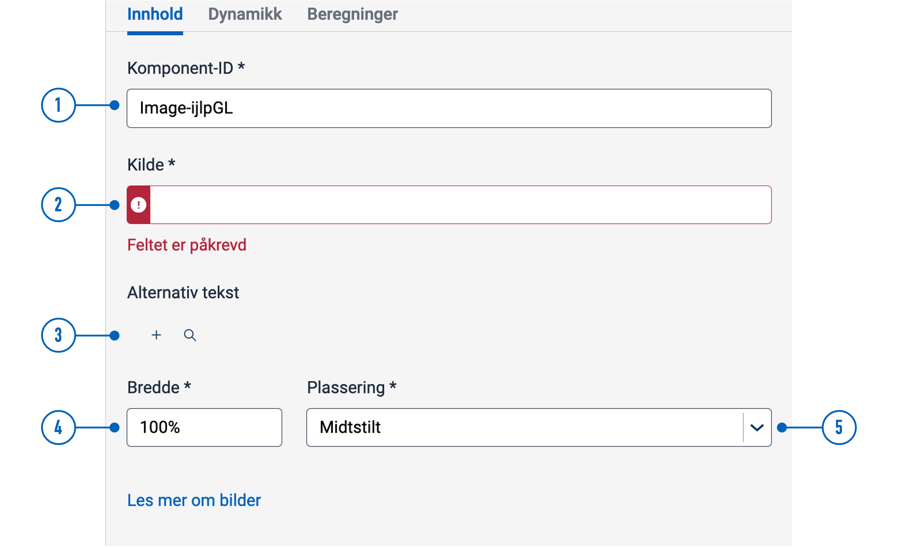
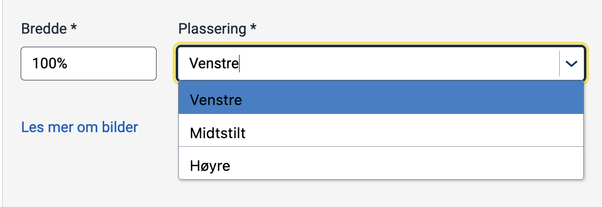

---
## Usage

Use images and illustrations to emphasize points or illustrate concepts that are difficult to explain using text.

### Anatomy


{}
1. **Image**: Photo, screenshot, illustration, or graphic.  
2. **Alternative text**: Used by screen readers and displayed if the image can not be rendered.
{}

### Best practices
We recommend following the guidelines by [UUtilsynet](https://www.uutilsynet.no/regelverk/bilder-og-grafikk/205).

- Add an alternative text which explains the image. The alt. text will be displayed if the image is unavailable and is used by screen readers.
- If an image is purely decorative, it's best not to include an alternative text.
- Don't use images for image's sake. Ask yourself if the image illustrates a point or increases the understanding of what you are trying to tell.
- Check if the image scales well on devices like mobile or tablet. An image which looks good on a PC can quickly fill a smaller screen.
- Avoid using images instead of text, as screen readers cannot read it.

### Content guidelines

Keep alternative texts consistent:
- Never start with "Image of ..."
- Write short and start with the most essential part of the image.
- End by saying if the photo is an illustration or graphic.

<br>

**Example** 


Alt text: "Old wooden trolly. Photograph."

<br>

For more guidelines and examples, see [UUtilsynet](https://www.uutilsynet.no/regelverk/bilder-og-grafikk/205).

## Properties

{}
We are currently updating Altinn Studio Designer with more configuration options!
 We'll update the documentation to reflect the new changes once they are stable.
  In the meantime, there may be more options available in beta mode.
{}




Property settings available in Altinn Studio Designer.



<br>

{}
1. **Component ID** (`id`): Unique ID for the component. Can be changed.  
2. **Source** (`src`): Image source  
  See [Hosting images in the app](#hosting-images-in-the-app) and [Multiple sources based on language](#multiple-sources-based-on-language).  
1. **Alternative text** (`textResourceBindings.altTextImg`): The alt text is stored as a [text resource](/app/development/ux/texts/#add-and-change-texts-in-an-application).  
2. **Width** (`width`): Image width as a percentage, with 100% as the original image size.  
3. **Alignment** (`align`): See [Horizontal alignment with `align`](#horizontal-alignment-with-align).
{}





```json{linenos=false,hl_lines=["4-14"]}
// File: /App/ui/layouts/<page>.json

{
  "data": {
    "layout": [
      {
        "id": "Image-ijlpGL",
        "type": "Image",
        "image": {
          "src": {
            "nb": ""
          },
          "width": "100%",
          "align": "center"
        }
      }
    ]
  }
}
```




### List of properties

The following is an autogenerated list of the properties available for {} based on the component's JSON schema file:

{}

## Configuration

### Add component

You can add a component in [Altinn Studio Designer](/app/getting-started/ui-editor/) by dragging it from the left-side panel to the middle page area.
Selecting the component brings up its configuration panel on the right-hand side.
### Hosting images in the app

All files placed inside the folder `/App/wwwroot` will be hosted in the application.
 If this folder does not exist, you can create it.
 Static hosting must be [configured](#configure-static-hosting) for apps created before December 2021.

An image placed in `/App/wwwroot` can be referenced in the following ways:
- Using its relative URL: `/<org or username>/<app-name>/image.png` or
- Using the image path: `wwwroot/image.png` (will resolve to relative URL before the image is loaded).



Using relative URL as the source:


Using image path as the source:




Using relative URL as the source:
```json{linenos=false,hl_lines="9"}
// File: /App/ui/layouts/<page>.json

...
      {
        "id": "kommune-logo-2",
        "type": "Image",
        "image": {
          "src": {
            "nb": "/testdep/flyttemelding-sogndal/kommune-logo.png"
          },
          ...
        }
      }
...
```
Using image path as the source:
```json{linenos=false,hl_lines="9"}
// File: /App/ui/layouts/<page>.json

...
      {
        "id": "kommune-logo",
        "type": "Image",
        "image": {
          "src": {
            "nb": "wwwroot/kommune-logo.png"
          },
          ...
        }
      }
...
```
(Part of the code is omitted for brevity)



#### Configure static hosting
For apps created *before December 2021*, static hosting must be configured manually by adding the line
 `app.UseStaticFiles('/' + applicationId);` in the `Configure` method in `App/Program.cs` as shown below:

```C# {linenos=false,hl_lines=[7]}
// File: /App/Program.cs

void Configure()
  {
    ...
    app.UseRouting();
    app.UseStaticFiles('/' + applicationId);
    app.UseAuthentication();
    ...
  }
```

`applicationId` is the same as `id`  in `/App/config/applicationmetadata.json`.

### Multiple sources based on language

The default source is `nb`; any language that does not define a separate image source will use this source.
  List another language code and image source to add a source, as in the example below.

Available language sources are `en` (English), `nb` (Norwegian Bokmål), and `nn` (Norwegian Nynorsk).



```json{hl_lines=["10-13"]}
// File: /App/ui/layouts/<page>.json

{
  "data": {
    "layout": [
      {
        "id": "example-image",
        "type": "Image",
        "image": {
          "src": {
            "nb": "https://example.com/image_nb.png",
            "en": "https://example.com/image_en.png"
          },
          "width": "100%",
          "align": "center"
        }
      }
    ]
  }
}
```



### Horizontal alignment with `align`

The `align` property controls the horizontal position of the image relative to its container.
In Designer, the options are "Venstre" (left), "Midtstilt" (centred), and "Høyre" (right).
 These settings correspond to the property values `flex-start`, `center`, and `flex-end` in the code.
  In addition, `align` accepts the values `space-between`, `space-around`, and `space-evenly`.






 <!-- Hack to reveal image caption -->



```json{hl_lines="17"}
// File: /App/ui/layouts/<page>.json

{
  "data": {
    "layout": [
      {
        "id": "kommune-logo",
        "type": "Image",
        "textResourceBindings": {
          "altTextImg": "kommune-logo.altTextImg"
        },
        "image": {
          "src": {
            "nb": "wwwroot/kommune-logo.png",
          },
          "width": "100%",
          "align": "flex-start"
        }
      }
    ]
  }
}
```



### Horizontal alignment with `grid`

The `grid` property controls horizontal alignment based on a 12-column layout.
 Items are allocated fractions of 12 which sets their width relative to the screen width.
  In the example below, we set the image component's width to 2/12 of the screen width for all screen sizes.



```json{hl_lines=["15-17"]}
// File: /App/ui/layouts/<page>.json

{
  "data": {
    "layout": [
      {
        "id": "kommune-logo",
        "type": "Image",
        "image": {
          "src": {
            "nb": "wwwroot/kommune-logo.png",
          },
          "width": "100%",
          "align": "center",
          "grid": {
            "xs": 2,
          }
        }
      },
      ...
    ]
  }
}
```




You can also use `grid` to place items side by side.

See [Components placed side by side (grid)](/app/development/ux/styling/#components-placed-side-by-side-grid) for details and more examples.