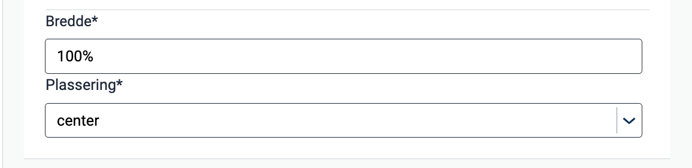

{}
🚧 Denne dokumentasjonen er under oppdatering.
{}

---

## Bruk

Bruk bilder og illustrasjoner for å fremheve poeng eller illustrere begreper som er vanskelige å forklare med tekst.

### Anatomi


{}
1. **Bilde**: Foto, skjermbilde, illustrasjon eller grafikk.
2. **Alternativ tekst**: Brukes av skjermlesere og vises dersom bildet ikke er tilgjengelig.
{}

### Beste praksis

Vi anbefaler å følge retningslinjene fra [UUtilsynet](https://www.uutilsynet.no/regelverk/bilder-og-grafikk/205).

- Legg til en alternativ tekst som forklarer bildet. Alt. tekst vil vises hvis bildet ikke er tilgjengelig og brukes av skjermlesere.
- Hvis et bilde er rent dekorativt, er det best å ikke inkludere en alternativ tekst.
- Ikke bruk bilder for bildets skyld. Spør deg selv om bildet illustrerer et poeng eller øker forståelsen av det du prøver å fortelle.
- Sjekk om bildet skalerer godt på enheter som mobil eller nettbrett. Et bilde som ser bra ut på en PC kan raskt fylle en mindre skjerm.
– Unngå å bruke bilder i stedet for tekst, da skjermlesere ikke kan lese det.

### Veiledning for innhold

Hold alternative tekster konsekvente:
- Begynn aldri med "Bilde av ..."
- Skriv kort og start med den mest essensielle delen av bildet.
– Avslutt med å si om bildet er en illustrasjon eller grafikk.

<br>

**Eksempel** 


Alt text: "Gammel trevogn. Fotografi."

<br>

For flere retningslinjer og eksempler, se [UUtilsynet](https://www.uutilsynet.no/regelverk/bilder-og-grafikk/205).

## Egenskaper

Følgende er en liste over tilgjengelige egenskaper for {}. Listen er automatisk generert basert på komponentens JSON schema (se link).

{}
Vi oppdaterer for øyeblikket hvordan vi implementerer komponenter. Listen over egenskaper kan derfor være noe unøyaktig.
{}

{}

## Konfigurering

{}
Vi oppdaterer for øyeblikket Altinn Studio med flere muligheter for innstillinger!
 Dokumentasjonen oppdateres fortløpende, men det kan være flere innstillinger tilgjengelig enn det som beskrives her og noen innstillinger kan være i betaversjon.
{}

### Legg til komponent




Du kan legge til en komponent i [Altinn Studio Designer](/nb/app/getting-started/ui-editor/) ved å dra den fra komponent-listen til sideområdet.
Når du velger komponenten, vises innstillingspanelet for den.




Grunnleggende bildekomponent:


App/ui/layouts/{page}.json


```json{hl_lines="6-14"}
{
  "$schema": "https://altinncdn.no/schemas/json/layout/layout.schema.v1.json",
  {
    "data": {
      "layout": [
        {
          "id": "komponent-id",
          "type": "Image",
          "image": {
            "src": {},
             "width": "100%",
             "align": "center"
            }
        }
      ]
    }
  }
}
```




### Alternativ tekst (`textResourceBindings.altTextImg`)




Velg 'Alternativ tekst for bilde' i nedtrekksmenyen.


Klikk plusstegnet for å opprette en ny tekst eller forstørrelsesglasset for å velge en eksisterende [tekstressurs](/nb/app/development/ux/texts/#legge-til-og-endre-tekster-i-en-app).





Korresponderende innstillinger i sidens JSON-fil.


App/ui/layouts/{page}.json


```json{hl_lines="7-9"}
{
  "data": {
    "layout": [
      {
        "id": "kommune-logo",
        "type": "Image",
        "textResourceBindings": {
          "altTextImg": ""
        },
        ...
      }
    ]
  }
}
```




### Bildeinnstillinger (`image`)

#### Kilde (`image.src`)

Standardkilden er `nb`; ethvert språk som ikke definerer en separat bildekilde vil bruke denne kilden.
  Oppgi en annen språkkode og bildekilde for å legge til en kilde, som i eksemplet nedenfor.

Tilgjengelige språkkilder er `en` (engelsk), `nb` (norsk bokmål) og `nn` (norsk nynorsk).









App/ui/layouts/{page}.json


```json{hl_lines="5-8"}
{
  "id": "kommune-logo",
  "type": "Image",
  "image": {
    "src": {
      "nb": "/testdep/flyttemelding-sogndal/kommune-logo.png",
      "nn": "wwwroot/kommune-logo.png"
    },
    ...
  }
}
```



Bildekilden kan være ekstern eller lokal for appen.

For eksterne bilder er kilden *bilde-URL* (f.eks. `https://examples.com/myImage.png`).

For å hoste et bilde i applikasjonen, plasser det i mappen `App/wwwroot` (hvis mappen ikke eksisterer, kan du opprette den).
 Statisk hosting må [konfigureres manuelt](#konfigurer-statisk-hosting) for apper opprettet før desember 2021.

Et bilde plassert i `App/wwwroot` kan refereres til på følgende måter:
- Ved å bruke dens *relative URL*: `/<org eller brukernavn>/<app-navn>/image.png` eller
- Bruk av *filstien*: `wwwroot/image.png`. Filstien vil konverteres til bildets relative URL før bildet lastes inn.

#### Konfigurer statisk hosting
For apper opprettet *før desember 2021* må statisk hosting konfigureres manuelt ved å legge til linjen
 `app.UseStaticFiles('/' + applicationId);` i metoden `Configure` i `App/Program.cs` som vist her:


App/Program.cs


```C# {hl_lines="5"}
void Configure()
  {
    ...
    app.UseRouting();
    app.UseStaticFiles('/' + applicationId);
    app.UseAuthentication();
    ...
  }
```

`applicationId` tilsvarer `id`  i `App/configApplicationmetadata.json`.

#### Bredde og plassering (`image.width`, `image.align`)

Med `width` kan du justere bildestørrelsen ved å angi bredde på bildet i prosent.
 Høyden settes automatisk for å bevare proporsjoner. Standard innstilling er 100% (opprinnelig bredde).

Egenskapen `align` kontrollerer den horisontale posisjonen til bildet i forhold til beholderen.










App/ui/layouts/{page}.json


```json{hl_lines="14-15"}
{
  "data": {
    "layout": [
      {
        "id": "kommune-logo",
        "type": "Image",
        "textResourceBindings": {
          "altTextImg": "kommune-logo.altTextImg"
        },
        "image": {
          "src": {
            "nb": "wwwroot/kommune-logo.png",
          },
          "width": "100%",
          "align": "center"
        }
      }
    ]
  }
}
```



 Følgende alternativer er tilgjengelig for plassering:

- `flex-start`: Venstrejustert
- `center`: Midtstilt
- `flex-end`: Høyrejustert
- `space-between`: Elementene er jevnt fordelt langs hovedaksen, med like mye mellomrom mellom hvert element og ingen mellomrom ved start og slutt.
- `space-around`: Elementene er jevnt fordelt langs hovedaksen med like mye mellomrom mellom hvert element, inkludert mellomrom ved start og slutt, som er halvparten av mellomrommet mellom elementene.
- `space-evenly`: Elementene er jevnt fordelt langs hovedaksen med like mye mellomrom mellom hvert element, inkludert start og slutt, slik at det totale mellomrommet er jevnt fordelt.










<!-- ## Eksempler -->