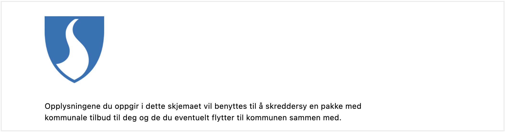

---
## Usage
Use images and illustrations to emphasize points or illustrate concepts which are difficult to explain using text.

{}
**NOTE:** the image component is not yet supported in PDF-generation and will be ignored.
{}

### Anatomy


1\. *Image* – Photo, screenshot, illustration, or graphic.  
2\. *Alternative text* – Used by screen readers and displayed if image can not be rendered.

### Best practices
We recommend following the guidelines by [UUtilsynet](https://www.uutilsynet.no/regelverk/bilder-og-grafikk/205).

- Add an alternative text which explains the image. This is used by screen readers and will be displayed if the image is unavailable.
- If an image is purely decorative, it's best to not include an alternative text.
- Don't use images for images sake. Ask yourself if the image illustrates a point or increases the understanding of what you are trying to tell.
- Check if the image scales well on different devices, like on mobile or a tablet. An image which looks good on a PC can quickly fill a smaller screen.
- Avoid using images in place of text, as it cannot be read by screen readers.

### Content guidelines

Keep alternative texts consistent:
- Never start with "Image of ..."
- Write short and start with the most important part of the image.
- End by saying if the photo is a photo, illustration or graphic.

**Example** 


Alt text: "Old wooden trolly. Photograph."

<br>

For more guidelines and examples, see [UUtilsynet](https://www.uutilsynet.no/regelverk/bilder-og-grafikk/205).

---
## Add and configure component




```json{linenos=false,hl_lines=["4-14"]}
// File: /App/ui/layouts/<page>.json

{
  "data": {
    "layout": [
      {
        "id": "Image-ijlpGL",
        "type": "Image",
        "image": {
          "src": {
            "nb": ""
          },
          "width": "100%",
          "align": "center"
        }
      }
    ]
  }
}
```




In [Altinn Studio Designer](/app/getting-started/ui-editor/) (ASD), drag the component from the left-side panel to the page area in the middle.
Select the component you want to configure by clicking it. This will bring up the following configuration panel for the component on the right-hand side:





### 1. Component ID
Property: `id`  
Unique ID for each component. This comes pre-filled, but you can change the value as you like.

### 2. Source
Property: `src`  
The image source can be external or hosted in the app.

For external images, the source is simply the image URL (e.g. `https://example.com/image.png`).

All files placed inside the folder `/App/wwwroot` will be hosted in the application.
 If this folder does not exist, it needs to be created.
 Static hosting must be [configured](#configure-static-hosting) for apps created before december 2021.

An image placed in `/App/wwwroot` can be referenced in one of two ways:
1. Using its relative URL: `/<org or username>/<app-name>/image.png` or
2. Using the image path: `wwwroot/image.png` (will resolve to relative URL before image is loaded).



Using relative URL as source:
```json{linenos=false,hl_lines="9"}
// File: /App/ui/layouts/<page>.json

...
      {
        "id": "kommune-logo-2",
        "type": "Image",
        "image": {
          "src": {
            "nb": "/testdep/flyttemelding-sogndal/kommune-logo.png"
          },
          ...
        }
      }
...
```
Using image path as source:
```json{linenos=false,hl_lines="9"}
// File: /App/ui/layouts/<page>.json

...
      {
        "id": "kommune-logo",
        "type": "Image",
        "image": {
          "src": {
            "nb": "wwwroot/kommune-logo.png"
          },
          ...
        }
      }
...
```
(Part of the code is omitted for brevity)


Using relative URL as source:


Using image path as source:




<br>

Also see [Multiple sources based on language](#multiple-sources-based-on-language).

#### Configure static hosting
For apps created *before December 2021*, static hosting must be configured manually by adding the line
 `app.UseStaticFiles('/' + applicationId);`in in the `Configure` method in `App/Program.cs` as shown below:

```C# {linenos=false,hl_lines=[7]}
// File: /App/Program.cs

void Configure()
  {
    ...
    app.UseRouting();
    app.UseStaticFiles('/' + applicationId);
    app.UseAuthentication();
    ...
  }
```

`applicationId` is the same as `id`  in `/App/config/applicationmetadata.json`.

### 3. Alternative text
Property: `textResourceBindings.altTextImg`  
An alternative text is used by screen readers and will be displayed if the image is unavailable.
 The alt text is stored as a [text resource](/app/development/ux/texts/#add-and-change-texts-in-an-application) defined in `/App/config/texts/resource.<language>.json`.

**Example 1**: Add text resource using the id `kommune-logo.altTextImg`


Add a text resource by specifying the text resource id for the property `textResourceBindings.altTextImg`:
```json{hl_lines=["9-11"]}
// File: /App/ui/layouts/<page>.json

{
  "data": {
    "layout": [
      {
        "id": "kommune-logo",
        "type": "Image",
        "textResourceBindings": {
          "altTextImg": "kommune-logo.altTextImg"
        },
        "image": {
          "src": {
            "nb": "wwwroot/kommune-logo.png",
          },
          "width": "100%",
          "align": "center"
        }
      }
    ]
  }
}
```


Click the magnifying glass next to the property field to reveal a dropdown where you can select an existing text resource:





<br>

**Example 2**: Create or edit text resource


Add or edit the text resource id and/or value in the appropriate language resource file.
 If the file does not exist, you can create it.
```json{hl_lines=["6-9"]}
// File: /App/config/texts/resource.en.json

{
  "language": "en",
  "resources": [
    {
      "id": "kommune-logo.altTextImg",
      "value": "Sogndal municipality coats of arms. Image"
    },
    ...
  ]
}
```
```json{hl_lines=["6-9"]}
// File: /App/config/texts/resource.nb.json

{
  "language": "nb",
  "resources": [
    {
      "id": "kommune-logo.altTextImg",
      "value": "Sogndal kommunevåpen. Bilde"
    },
    ...
  ]
}
```


Click the `+` sign next to the field to add a new text resource (or the pencil icon to edit if one is already selected).
 You get the option to add/edit texts in English and Norwegian bokmål. Other languages are available from the text editor (click _Tekst_ in the top-level menu).




### 4. Width
Property: `width`  
Image width given as percentage of original width.

### 5. Alignment
Property: `align`  
Controls the horizontal alignment of the image.
In ASD, the options are "Venstre" (left), "Midtstilt" (centered), and "Høyre" (right).
 These settings correspond to the property values `flex-start`, `center`, and `flex-end`, respectively.
  In addition, `align` accept the values `space-between`, `space-around`, and `space-evenly`.



```json{hl_lines="17"}
// File: /App/ui/layouts/<page>.json

{
  "data": {
    "layout": [
      {
        "id": "kommune-logo",
        "type": "Image",
        "textResourceBindings": {
          "altTextImg": "kommune-logo.altTextImg"
        },
        "image": {
          "src": {
            "nb": "wwwroot/kommune-logo.png",
          },
          "width": "100%",
          "align": "flex-start"
        }
      }
    ]
  }
}
```




 <!-- Hack to reveal image caption -->



---
## Properties

The following is an autogenerated list of the properties available for {} based on the component's JSON schema file:

{}
<!-- {} -->
<!-- {} -->

## Examples

The following configuration is currently not available in Altinn Studio Designer and must be done with [local development](/app/getting-started/local-dev/).
### Multiple sources based on language

The default source is `nb`, and this source will be used for any language that does not define a separate source for the image.
  To add a source, list another language code and image source as in the example below.

Available language sources are `en` (English), `nb` (Norwegian bokmål),and `nn` (Norwegian nynorsk).

```json{hl_lines=["10-13"]}
// File: /App/ui/layouts/<page>.json

{
  "data": {
    "layout": [
      {
        "id": "example-image",
        "type": "Image",
        "image": {
          "src": {
            "nb": "https://example.com/image_nb.png",
            "en": "https://example.com/image_en.png"
          },
          "width": "100%",
          "align": "center"
        }
      }
    ]
  }
}
```

### Horizontal alignment with `grid`

The `grid` property controls horizontal alignment based on a 12-column layout.
 Items are allocated fractions of 12 which sets their width relative to the screen width.
  In the example below, the image component's width will be set to 2/12 of the screen width for all screen sizes.
 
`grid` may also be used to place items next to each other.

See [Components placed side by side (grid)](/app/development/ux/styling/#components-placed-side-by-side-grid) for details and more examples.

```json{hl_lines=["15-17"]}
// File: /App/ui/layouts/<page>.json

{
  "data": {
    "layout": [
      {
        "id": "kommune-logo",
        "type": "Image",
        "image": {
          "src": {
            "nb": "wwwroot/kommune-logo.png",
          },
          "width": "100%",
          "align": "center",
          "grid": {
            "xs": 2,
          }
        }
      },
      ...
    ]
  }
}
```

