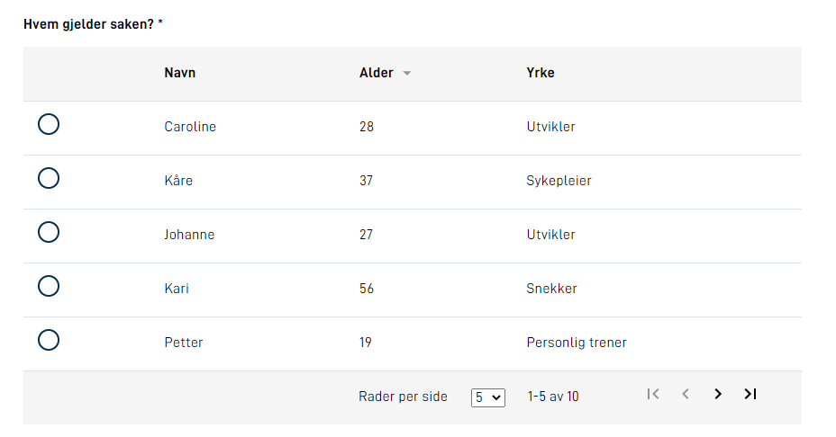
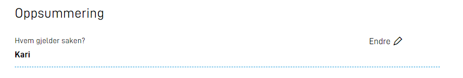

{}
Dette er helt ny funksjonalitet. Oppsett må gjøres manuelt inntil videre. Støtte for oppsett via Altinn Studio kommer 
senere.
{}



## Hvordan definere komponenten i skjema 
Komponenten er av typen `List`. Eksempel på hvordan man kan definere kompoenten i layout.json:
```json
{
    "id": "list-component",
    "type": "List",
    "textResourceBindings": {
        "title": "Hvem gjelder saken?"
    },
    "dataModelBindings": {
        "name": "SelectedItem",
        "profession": "SelectedItemProfession"
    },
    "bindingToShowInSummary": "SelectedItem",
    "dataListId": "people",
    "tableHeaders": {
        "name": "Navn",
        "age": "Alder",
        "profession": "Yrke"
    },
    "sortableColumns": [ "age" ],
    "pagination": {
        "alternatives": [ 5, 10 ],
        "default": 5
    },
    "required": true,
    "tableHeadersMobile": [ "name", "age" ]
},
```

## Populering av tabell
Listekomponenten populeres med dynamiske data. Dataene defineres i en egen fil som implementerer interfacet `IDataListProvider`. 
Dette fungerer tilsvarende kodelister/options. Feltet `dataListId` må legges til på komponenten som definerer hvilken dataliste komponenten referer til. 
Dynamiske datalister kan enten være åpen eller sikret. 
Etter at du er laget ferdig din implementasjon reigstreres denne som en service i metoden `RegisterCustomAppServices` i filen `Program.cs`
Eksempel på en klasse som implementerer interfacet `IDataListProvider`

```csharp
public class ListCases : IDataListProvider
{
    public string Id { get; set; } = "people";

    public async Task<DataList> GetDataListAsync(string language, Dictionary<string, string> keyValuePairs)
    {
        int start = 0;
        int count = 10;

        if (keyValuePairs.ContainsKey("size") && keyValuePairs.ContainsKey("page"))
        {
            string size = keyValuePairs["size"];
            string page = keyValuePairs["page"];

            start = int.Parse(size) * int.Parse(page);
            count = int.Parse(size);
        }

        List<ListItem> items = new List<ListItem>();

        items.Add(new ListItem { Name = "Caroline", Age = 28, Profession = "Utvikler" });
        items.Add(new ListItem { Name = "Kåre", Age = 37, Profession = "Sykepleier" });
        items.Add(new ListItem { Name = "Johanne", Age = 27, Profession = "Utvikler" });
        items.Add(new ListItem { Name = "Kari", Age = 56, Profession = "Snekker" });
        items.Add(new ListItem { Name = "Petter", Age = 19, Profession = "Personlig trener" });
        items.Add(new ListItem { Name = "Hans", Age = 80, Profession = "Pensjonist" });
        items.Add(new ListItem { Name = "Siri", Age = 28, Profession = "UX designer" });
        items.Add(new ListItem { Name = "Tiril", Age = 40, Profession = "Arkitekt" });
        items.Add(new ListItem { Name = "Karl", Age = 49, Profession = "Skuespiller" });
        items.Add(new ListItem { Name = "Mette", Age = 33, Profession = "Artist" });

        if (keyValuePairs.ContainsKey("sortDirection"))
        {
            string sortDirection = keyValuePairs["sortDirection"];
            if (sortDirection == "asc")
            {
                items = items.OrderBy(o => o.Age).ToList();
            }
            else if (sortDirection == "desc") 
            {
                items = items.OrderBy(o => o.Age).ToList();
                items.Reverse();
            }
        }

        DataListMetadata appListsMetaData = new DataListMetadata() { TotaltItemsCount = items.Count };

        List<object> objectList = new List<object>();
        items.ForEach(o => objectList.Add(o));

        return new DataList { ListItems = objectList.GetRange(start, count), _metaData = appListsMetaData };
    }
}
```
For å registrere eksemplet over som en service legger man til `services.AddTransient<IDataListProvider, ListCases>();` i metoden `RegisterCustomAppServices` i filen `Program.cs`
Her blir listen laget i koden, men her kan man istedet kalle på et annet API som returnerer data man vil vise i tabellen.
Hvis dette APIet støtter sortering og paginering kan man videresende disse verdiene til APIet slik at man ikke henter unødvendig data. 

## Kolonner
Hvilke kolonner tabellen skal bestå av defineres med feltet `tableHeaders`. Dette feltet er et objekt. 
Nøkler i objektet skal tilsvare felter i modellen du har som representerer en rad.
I eksempelet over er det ListItem med name, age og profession. Verdiene knyttet til hver nøkkel er teksten som vises i header. For å støtte 
flere språk kan man bruke referanser til nøkler i språkfilene her. Det er innholdet her som vil stå i header av tabellen. 
Du må selv sørge for at dataene i tabellen populeres i samme rekkefølge, slik at innholdet i cellene stemmer med header.

## Sortering
I layout.json definerer du hvilke kolonner som skal være sorterbare gjennom feltet `sortableColumns`. 
Dette er en array av strings, og strings du bruker her må også være en nøkkel i feltet `tableHeaders`. Dette gjør 
at de valgte kolonnene får en pil som viser hvilken retning kolonnen er sortert, og kolonnen som styrer sortering nå blir markert. 
Selve sorteringslogikken må man selv implementere. Metoden `GetDataListAsync` tar inn parameteren keyValuePairs som
inneholder sortDirection og sortColumn til dette formålet.
For eksempel direkte i metoden GetDataListAsync slik som gjort i eksempelet over, eller ved å videresende sortDirection. 

## Paginering
For å definere paginering bruker du feltet `pagination` som har et objekt som verdi. I dette objektet defineres `alternatives` 
som er en array med number som representerer hvilke valg brukeren har for antall rader i listen. I tillegg definerer du 
`default` som er default på hvor mange rader som vises i listen. 
På samme måte som med sortering må pagineringslogikken implementeres slik at riktige data vises, dette gjennom verdiene size og page fra keuValuePairs.

## Søk
For at en bruker skal kunne søke i listen/tabellen må man legge til et tekstfelt av typen søk. Dette tekstfeltet knyttes til et felt i datamodellen, 
og videre bruker man denne verdien i datamodellen til søk. I listekomponenten må man legge til feltet `mapping`. 
Den kan se sånn her ut, hvor `soknad.navn` er et felt i datamodellen: 
```json
"mapping": {
    "soknad.navn": "search"
}
```
Verdien på `soknad.navn` vil da bli sendt i keyValuePairs med key `search`. OBS! Dette kan selvfølgelig brukes til andre ting enn søk.

## Data lagret i datamodellen
Valgt rad må lagres i datamodellen, hver kolonne/celle må lagres i eget felt i datamodellen. Dette defineres gjennom `dataModelBindings`: 
```json
"dataModelBindings": {
    "name": "SelectedItem",
    "profession": "SelectedItemProfession"
},
```
Her er SelectedItem og SelectedItemProfession felter i datamodellen, og name og profession er properties i modellen som brukes for å beskrive en rad. 
I eksempelet som er vist her er det laget en datamodell som representerer en rad, og den ser slik ut:
```csharp
public class ListItem
{
    public string Name { get; set; }
    public int Age { get; set; }
    public string Profession { get; set; }
}
```

## Komponenten i oppsummering
Dersom man ønsker å vise listekomponenten i oppsummering av skjema vil det vises enkelt med kun en verdi fra valgt rad.
Dette defineres med property `bindingToShowInSummary`, og vil se slik ut:




## Sikrede datalister
På samme måte som med kodelister kan man for datalister også sikre listene dersom de inneholder sensitive data. Da benytter
man interfacet `IInstanceDataListProvider`, og tillegg må man legge til en `secure` boolean på komponenten.

## Mobilvisning
Tabell i mobilvisning er ganske komprimert, og man kan derfor velge hvilke felter per rad man vil vise på mobil. Det gjør man 
med feltet `tableHeadersMobile` som er en array med strings som representerer de headerverdiene man vil vise på mobil. 