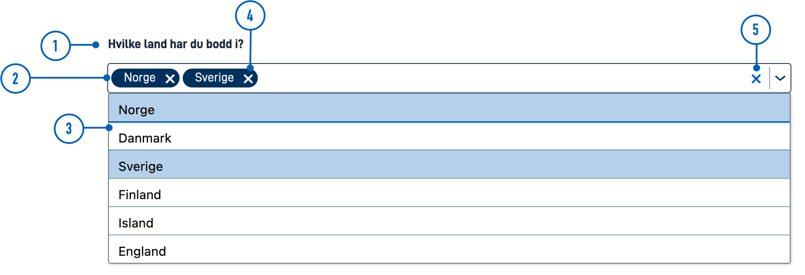

{}
🚧 This documentation is a work in progress.
{}

---

## Usage

MultipleSelect is often used in forms to collect input from users,
 allowing them to choose one or more options from a long list of alternatives.
  MultipleSelect also provides support for local search/filtering.
 Like the `Checkbox` component, MultipleSelect stores the selections as a comma-separated list.

### Anatomy



{}
1. **Field Label**: Field labels should indicate what type of information the field requires.
2. **Text Field**: The field users click to open the list of options. Selected options are displayed in the text input field.
3. **Menu**: Contains the list of all selectable items.
4. **Selected Item**: Displays which options have been selected. Users can remove individual selections by clicking the **x** next to the item.
5. **Clear All**: The **x** clears everything in the text input field. This is active only when at least one option is selected.
{}

<!-- 
Add the following sections if relevant:

### Behavior

(How the component behaves in different contexts)

### Style

(Visual styling (e.g. alignment, padding, dos and don'ts))

### Best Practices

(Industry standards, dos and don'ts)

### Content guidelines

(E.g. punctuation rules, standard labels, etc.)

### Accessibility

(Component-specific best practices for accessibility.)

### Mobile

(How to apply component in mobile environments.)


-->

### Related

* For multiple choices with few options, use [Checkboxes](../checkboxes/).
* For single selection with few options, use [RadioButtons](../radiobuttons/).
* For single selection with many options, use [Dropdown](../dropdown/).


## Properties

The following is an autogenerated list of the properties available for {} based on the component's JSON schema file (linked below).

{}
We are currently updating how we implement components, and the list of properties may not be entirely accurate.
{}

{}

## Configuration

{}
We are currently updating Altinn Studio Designer with more configuration options!
 The documentation is continuously updated, and there may be more settings available than what is described here, and some settings may be in beta version.
{}

### Add component




You can add a component in [Altinn Studio Designer](/app/getting-started/ui-editor/) by dragging it from the list of components to the page area.
Selecting the component brings up its configuration panel.




Basic component:


App/ui/layouts/{page}.json


```json{hl_lines="6-12"}
{
  "$schema": "https://altinncdn.no/schemas/json/layout/layout.schema.v1.json",
  {
    "data": {
      "layout": [
        {
          "id": "MultipleSelect-id",
          "type": "MultipleSelect",
          "dataModelBindings": {
            "simpleBinding": ""
          }
        }
      ]
    }
  }
}
```


























<!-- ## Examples -->

<!-- One or more examples of configuration (if relevant) -->