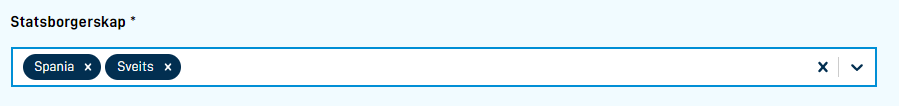

MultipleSelect kan benyttes når brukeren kan velge blant flere valg. Tilbyr filtrering ut av boksen.



`FormLayout.json` eksempel

```json
      {
        "id": "multiple-select-component-id",
        "type": "MultipleSelect",
        "textResourceBindings": {
          "title": "some.title"
        },
        "dataModelBindings": {
          "simpleBinding": "some.field"
        },
        "required": true,
        "optionsId": "someOptionId",
      },
```

Som `Checkbox`-komponenten vil MultipleSelect lagre valgene som en komma-separert liste.

MultipleSelect komponenten kan bli konfigurert med kodelister direkte ved bruk at `options` parameteret:

```json
      {
        "id": "multiple-select-component-id",
        "type": "MultipleSelect",
        ...
        "options": [
            { "label": "Label 1", "value": "value1" },
            { "label": "Label 2", "value": "value2" },
        ],
      },
```

 eller ved bruk av api-baserte kodelister som beskrevet [her.](../../../data/options/)
 