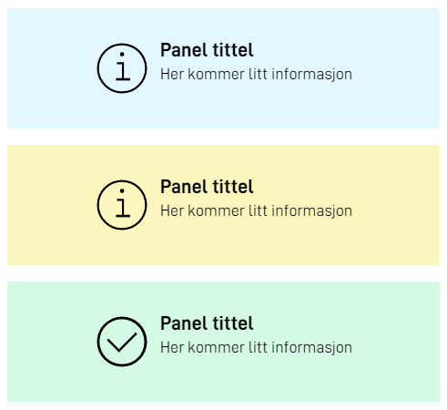

`FormLayout.json` example
```json
{
  "id": "panelinfo",
  "type": "Panel",
  "textResourceBindings": {
    "title": "Info text",
    "body": "Some important information here"
  },
  "variant": "info",
  "showIcon": false
}
```

`variant` can be one of the following:
- `info`
- `success`
- `warning`

`showIcon` can be used to hide/show the icon. By default the icon will be shown.