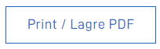
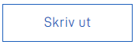

PrintButton-komponenten kan legges til i form layout der du vil gi en mulighet til å åpne utskriftsdialogen til nettleseren.
I det knappen blir klikket på vil utskriftsdialogen åpne seg. Vanligvis er det en mulighet til å "Skrive ut som PDF" om ønskelig.



`FormLayout.json` eksempel:

```json
{
  "id": "printButtonInfo",
  "type": "PrintButton"
}
```
Standardteksten på PrintButton er "Print / Lagre PDF".
Teksten kan bli overstyrt ved å endre tekstresurs-nøkkelen:
```json
{
  "id": "general.print_button_text",
  "value": "Skriv ut"
}
```



PrintButton-komponenten støtter også grid-tilpassning om ønskelig.
