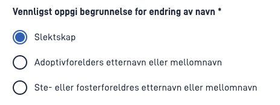
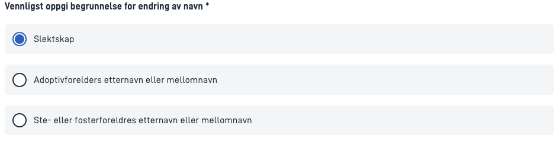

`FormLayout.json` example:

```json
      {
        "id": "radio-buttons-component-id",
        "type": "RadioButtons",
        "textResourceBindings": {
          "title": "some.title"
        },
        "dataModelBindings": {
          "simpleBinding": "some.field"
        },
        "required": true,
        "optionsId": "someOptionId",
      },
```

The RadioButtons component saves values as a string.

The RadioButtons component can be configured by adding options directly to the component using the `options` param:

```json
      {
        "id": "multiple-select-component-id",
        "type": "RadioButtons",
        ...
        "options": [
            { "label": "Label 1", "value": "value1" },
            { "label": "Label 2", "value": "value2" },
        ],
      },
```

 or by using api based options as described [here.](../../../data/options/)

## Styling options

The RadioButtons component can show radiobuttons as cards by setting the parameter `showAsCard` to `true`:

```json
      {
        "id": "multiple-select-component-id"
        "type": "RadioButtons",
        ...
        "showAsCard": true,
      },
```


