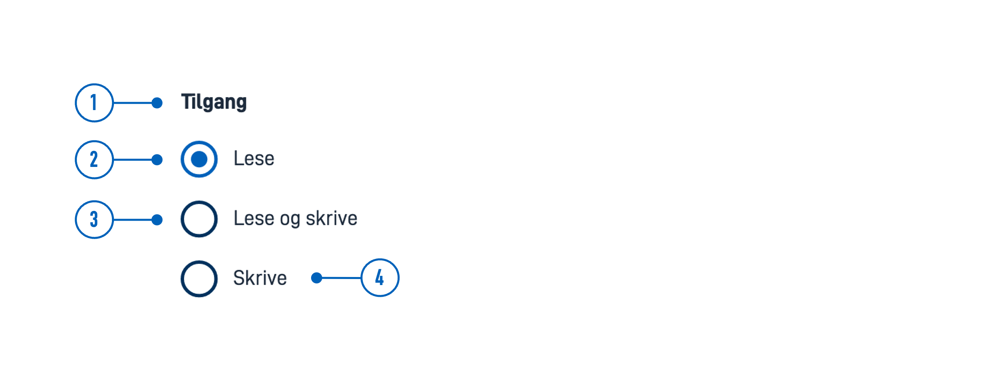
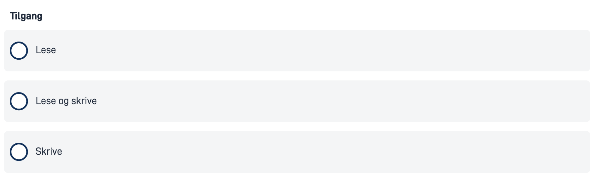

{}
🚧 Denne dokumentasjonen er under oppdatering.
{}

---

## Bruk

Radioknapper brukes ofte i skjemaer for å samle input fra brukeren der de må velge kun ett av flere alternativer fra en liste.

### Anatomi



{}
1. **Overskrift** - Spørsmål eller instruksjon.
2. **Nåværende valg** - Indikerer det valgte alternativet
3. **Alternativ** - Aktiverer dette alternativet og deaktiverer det nåværende valget.
4. **Etikett** - Tekstetikett knyttet til radioknappen.
{} 

### Stil

* Radioknapper bør alltid ha en tilknyttet etikett på høyre side.

### Beste praksis

- List alternativer i en logisk rekkefølge:
  - mest sannsynlig til minst sannsynlig å bli valgt
  - enklest til mest kompleks operasjon
  - minst til mest risiko
- Forhåndsvelg ett alternativ. Velg det tryggeste, mest sikre og private alternativet først. Hvis sikkerhet og personvern ikke er viktig, velg det mest sannsynlige eller praktiske alternativet.
- Hvis brukeren skal kunne unngå å velge, legg til et "Ingen" (eller tilsvarende) alternativ.
- Hvis du ikke kan ha en liste over alle mulige alternativer, legg til et "Annet" alternativ.
- Unngå alfabetisk sortering ettersom det er avhengig av språket og ikke kan lokaliseres.
- Unngå overlappende alternativer. For eksempel, Velg alder: 0-20, 20-40 — Hva velger du hvis alderen din er 20?
- Inkluder alle relevante alternativer. For eksempel, Velg alder: Under 20, Over 20 — Hva velger du hvis du er 20?

### Veiledning for innhold

* Hold etikettene korte og beskrivende.
* Begynn alle etiketter med stor bokstav.
* Ikke inkluder tegnsetting etter etikettene.

### Relatert

* For en mer kompakt måte å vise flere alternativer med enkeltvalg, bruk en [rullegardinmeny](../dropdown).
* Hvis brukeren kan velge flere alternativ fra en liste, bruk [Avkrysningsbokser](../checkboxes/).
* For en mer kompakt måte å vise flere alternativer med flervalg, bruk [MultipleSelect](../multipleselect/).

## Egenskaper

Følgende er en liste over tilgjengelige egenskaper for {}. Listen er automatisk generert basert på komponentens JSON schema (se link).

{}
Vi oppdaterer for øyeblikket hvordan vi implementerer komponenter. Listen over egenskaper kan derfor være noe unøyaktig.
{}

<!-- Shortkoden `component-props` genererer automatisk en liste over komponentegenskaper fra komponentens JSON schema.
Komponentnavnet kan gis eksplisitt som argument (f.eks. `component-props "Grid"`).
Hvis ingen argument gis, henter shortkoden komponentnavnet fra 'schemaname' i frontmatter. -->

{}

## Konfigurering

{}
Vi oppdaterer for øyeblikket Altinn Studio med flere muligheter for innstillinger!
 Dokumentasjonen oppdateres fortløpende, men det kan være flere innstillinger tilgjengelig enn det som beskrives her og noen innstillinger kan være i betaversjon.
{}

### Legg til komponent




Du kan legge til en komponent i [Altinn Studio Designer](/nb/app/getting-started/) ved å dra den fra komponent-listen til sideområdet.
Når du velger komponenten, vises innstillingspanelet for den.




Grunnleggende komponent:


App/ui/layouts/{page}.json


```json{hl_lines="6-9"}
{
  "$schema": "https://altinncdn.no/toolkits/altinn-app-frontend/4/schemas/json/layout/layout.schema.v1.json",
  {
    "data": {
      "layout": [
        {
          "id": "radio-buttons",
          "type": "RadioButtons"
        }
      ]
    }
  }
}
```


















### Vis som kort (`showAsCards`)

Viser hver radioknapp på lys grå bakgrunn når huket av (`true`).









App/ui/layouts/{page}.json


```json{hl_lines="4"}
{
  "id": "komponent-id",
  ...
  "showAsCard": true
}
```
















<!-- ## Eksempler -->
