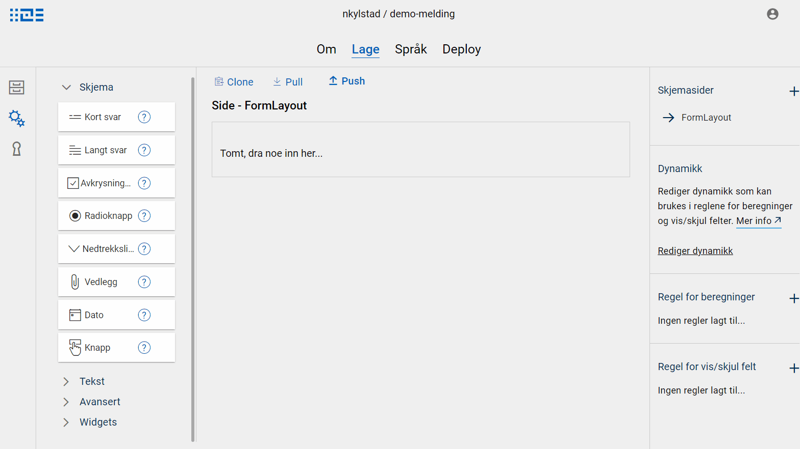
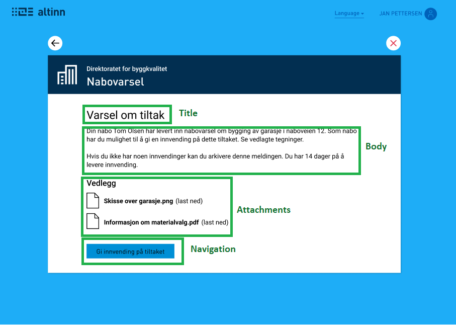

## What is a widget?
A widget is a complex component, consisting of one or more simple form components - the form components available to use in
Altinn Studio as of today. A widget is a tool in Altinn Studio that makes it easier to create and reuse layouts.

## How to use widgets
Widgets are available in the menu to the left in the form editor in Altinn Studio. It can be dragged into the form page in the same way as other form components.
When a widget is dragged into the form in Altinn Studio, the form components that are defined as part of the widget are added to the layout, together with
default setup such as connection to data model, texts, etc. When a widget is dragged into the form, you will be able to see the form components it consists of.
These can be edited normally in the form editor.
If there are texts defined for the widget, these are added to the resource files automatically.

### Example: Message widget

## Available widgets

### Default widgets
Eventually we will offer a collection of various widgets, these will appear automatically in the menu to the left in the form editor in Altinn Studio.
The list is updated as new widgets are added. As of today the following widgets are available:

| Name | Description | Screenshot  | 
| ---- | ----------- | ----------- | 
| Message | Contains the components that make up a standard message: <ul> <li>title <li>message text <li>file attachment <li>navigation button</ul>  The texts are set up with reference to fields in the standard message data model. See [here](../../../configuration/process/message) for more info on messages. |  | 

### Custom widgets
In addition to default widgets that automatically appear in Altinn Studio, it is also possible to define custom widgets. A widget consists of three parts:

- Components: This is a list of all the components that should be included, including the definition of these components. This is set up in the same way as in the layout files, you can for example copy components directly from a layout file.
- Display name: This is the text that is displayed in Altinn Studio, in the menu where the widget is placed.
- Text resources: This is optional, and is a list of text resources of the languages you want to incorporate. This is useful if the components e.g. should have some default texts to use.

See [setup for message widget](https://altinncdn.no/altinn-apps/widgets/message.json) for a concrete example. There is also a [widget template](https://altinncdn.no/altinn-apps/widgets/widget-template.json) that can be downloaded to get started.
