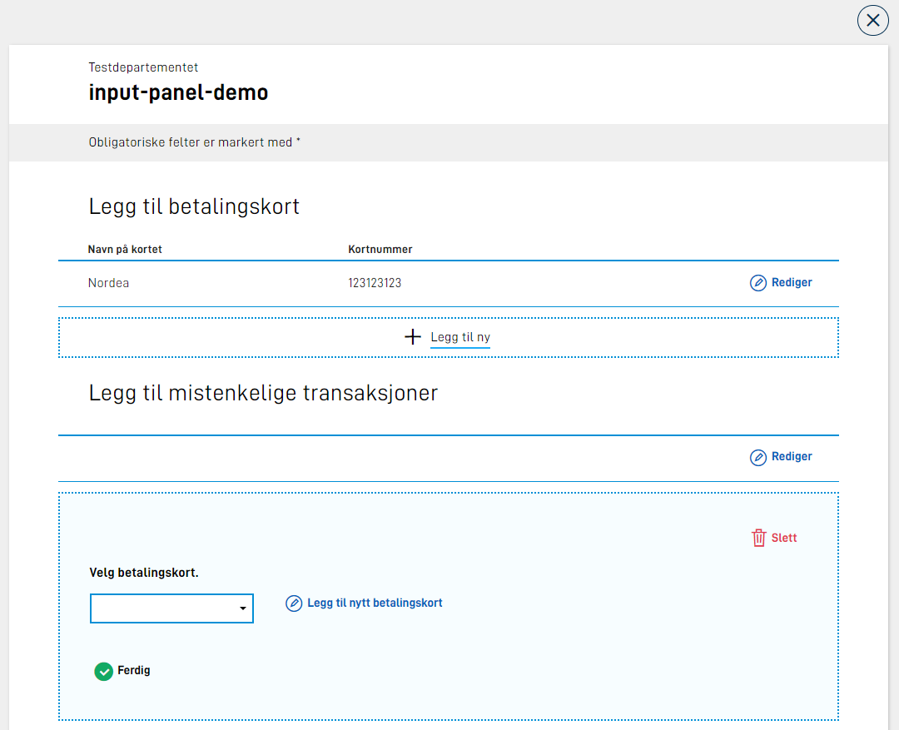
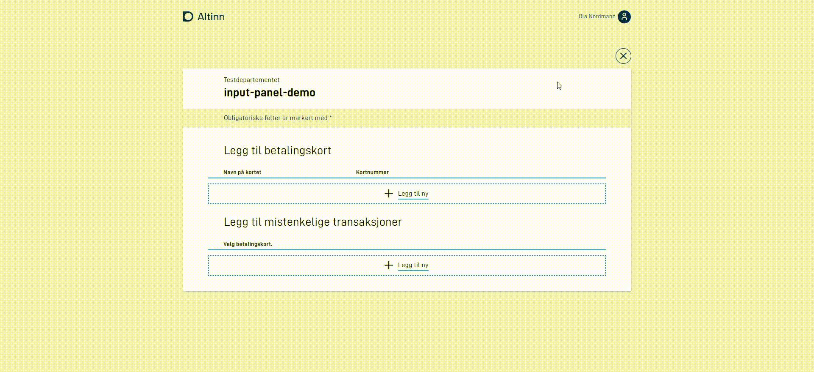

A new (optional) parameter has been implemented, that can be added to the definition of a repeating group in the layout-file, which allows you to control
some of the display and behaviour of the group on the page. In addition, support for multiple "pages" has been added within the editing area of the group.

## Control display

A new parameter, `edit`, has been added, which can be set up on a group component (repeating group). This allows us to define various settings
in regards to displaying a group element when editing/filling out. The following settings can be set:

### mode

Defines whether the table (that displays all elements in the group) should be displayed when an element is open in editing-mode.
The following values are allowed:

| Value       | Description                                                                                                  |
| ----------- | ------------------------------------------------------------------------------------------------------------ |
| "showTable" | Default behaviour if nothing else has been specified. Displays the table for editing of group-element.       |
| "hideTable" | Hides the table when a group-element is open for editing.                                                    |
| "showAll"   | Hides the table. Shows all elements in the group in editing mode below each other. The save button is hidden.|
| "likert"    | Likert display.                                                                                              |

### filter

Support to filter elements in group, so that only the elements matching the defined criteria are displayed.
E.g. in a group displaying work experience, only display the elements where the workplace was Oslo.
List of criteria is based on values of one or more fields in the group, on the format:

```json
"edit": {
  "filter": [
    { "key": "<felt i datamodell>", "value": "<ønsket verdi>" }
  ]
}
```

If there are multiple criteria, all must match for the element to be displayed.

If there is only one result, this is displayed automatically in editing-mode. If there are multiple elements in the group that match the filter, these will be displayed.
Other elements in the group will be hidden. `filter` can be combined with the `mode`-parameter.

{}
If you combine `"mode": "showAll"` with `"filter"`, it will not be possible to add more elements to the group. This is because with "showAll" only the editing area is displayed, 
and as long as the filter does not match, the element will not be displayed.
{}

### addButton

Determines whether the "Add new" button is displayed below the table. It is useful to hide this if you only wish to display data.

### saveButton

Determines whether the "Save" button is displayed when a group element is in editing mode. The default behaviour if the parameter is not set is for the "Save" button to be displayed.
If you have set `"mode": "showAll"`, the "Save" button is always hidden, since in this mode you do not have the opportunity to close the editing area for
the group-element. The data is still saved.

### deleteButton

Determines whether the "Delete" button is displayed when a group element is in editing mode. The default behaviour if the parameter is not set is for the "Delete" button to be displayed.

### multiPage

Editing/filling out pages can be performed over multiple "pages"/displays. Requires more setup to work, see below for more information.

### openByDefault

If there are no elements in the group already, the group should be opened in editing mode. Note that this cannot be used with `"mode": "showAll"`.

Example:

```json
{
  ...
  "edit": {
    "openByDefault": true
  }
}
```

## Display group as part of Panel

A new parameter, `panel`, has been added which can be set up on a group component. This says that the group should be displayed as part of the [Panel component](../../../components/panel/).

Here, you will recognize the appearance and settings that can be set on the panel component. Example configuration:

```json
      {
        "id": "input-panel-group",
        "type": "Group",
        "children": [
          "panel-1",
          "panel-2"
        ],
        "dataModelBindings": {},
        "textResourceBindings": {
          "title": "Dette er bare en demo av input panel utenfor repeterende gruppe.",
          "body": "Her ser jeg bare at ting fungerer som forventet."
        },
        "panel": {
          "variant": "info"
        }
      },
```

Here the group has been set up to be displayed as a panel with the variant "info". The setup is otherwise exactely the same as a regular group.

This will give the following output:


It is possible to configure the following settings in the `panel` field of a group:

| Parameter             | Required | Description                                                                                                                               |
| --------------------- | -------- | ----------------------------------------------------------------------------------------------------------------------------------------- |
| variant               | Yes      | Which variant of panel the group should be placed in. Available values are "info", "success" and "warning"                                |
| iconUrl               | No       | If you want your own icon as part of a panel, this can be set. Relative or full path, e.g. "awesomeIcon.png" or "http://cdn.example.com/awesomeIcon.png" |                                                                                           |
| iconAlt | No | Alternate text for the custom icon. Can only be set if iconUrl has been set. Can be plain text or a reference to a text resource. |
| groupReference | No | Reference to a different group. Can be used if you wish to add elements to a repeating group from some other context. [Read more.](#add-element-from-separate-repeating-group) | |

Example:

```json
        "panel": {
          "variant": "info",
          "iconUrl": "kort.svg",
          "iconAlt": "Betalingskort ikon"
        }
```

### Add element from separate repeating group

A use case one can imagine is that the user is asked to choose from an already filled out repeating group. One possible case is that the user is registering a set of suspicious transactions.
Here, the user first enters a set of separate payment cards as a repeating group. Later on in the form, the user will choose elements from this group when adding a suspicious transaction.
While filling out the suspicious transaction, the user remembers that they forgot to add a payment card, but do not wish to navigate all the way back to the original payment card group.

This is where the `groupReference` parameter comes in handy. This will open up for the possibility to add an element to a repeating group from the context from which you are using this list.

A picture to illustrate the usecase:



In this fictitious case the groups are placed directly above each other, but imagine that these are filled out on different pages in the form.
To achieve this setup, a group of elements are added to the repeating group that is set up with transactions (group-2) with a reference to the first group with payment cards (group-1).
The following group component is one of the children of group-2:

```json
      {
        "id": "input-panel-group",
        "type": "Group",
        "dataModelBindings": {},
        "textResourceBindings": {
          "title": "Legg til nytt betalingskort",
          "body": "Kortet du registrer vil bli lagret og tilgjengelig i resten av tjenesten.",
          "add_label": "Legg til nytt betalingskort"
        },
        "panel": {
          "showIcon": true,
          "iconUrl": "kort.svg",
          "variant": "success",
          "groupReference": {
            "group": "first-group"
          }
        }
      },
```

The text resources that can be set are:

- `title` - panel title
- `body` - panel body. Placed above the group elements.
- `add_label` - text for the "add new"-button.

If `children` is not set on the group, the children of the referenced group will be rendered. By adding to `children` you can freely define that only a subset of all children of the referenced group should be displayed.

Demonstration:



See [example app](https://altinn.studio/repos/ttd/input-panel-demo) for complete setup in form layout.

## Multiple pages within group-display

{} This functionality is as of today only available for repeating groups. Displayment of groups over 
multiple pages inside the editing area of the group is only supported for groups at the top level, and is not supported
for nested groups. {}

When entering data in a group, there may be incidents where each element in the group contains multiple fields, which may result in a lot of scrolling 
and confusion for the user. To solve this, there has been implemented a possibility to split the fillout over multiple pages, which the user can navigate
through while filling out the group element. The navigation takes place within a layout, and updates 
only the display within the editing area of the group.

To make use of this functionality, you will have to _prefix_ the components in the `children` list with a number indicating which "page" of the fillout
the component should be displayed on, followed by `:`. We start the count on `0`, that is to say components to be displayed on the first "page" must be prefixed with
`0:`. Components to be displayed on the second page must be prefixed with `1:`, and so on. In addition, you must set `"multiPage": true` on the new [`edit`-parameter](#control-display) (see above).
See example below:

```json {hl_lines=["5-8", "14-16"]} {linenos=inline}
{
  "id": "Some-group-id",
  "type": "Group",
  "children": [
    "0:fnr",
    "1:fornavn",
    "1:mellomnavn",
    "1:etternavn"
  ],
  "maxCount": 10,
  "dataModelBindings": {
    "group": "familie.barn"
  },
  "edit": {
    "multiPage": true,
    "mode": "hideTable",
  }
}
```

Here a [mode](#mode) that hides the table when editing has also been added.
The result will be as displayed below.


