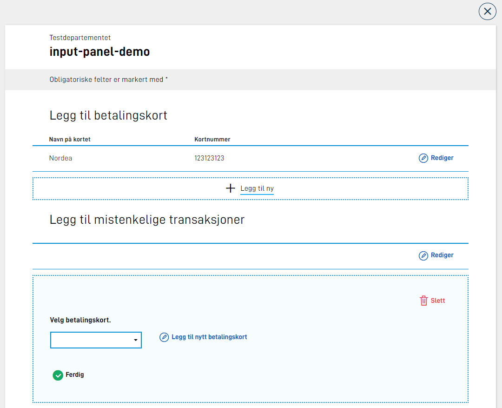
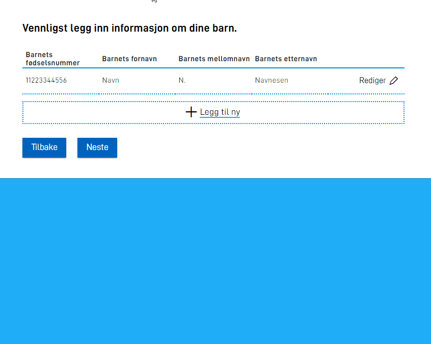

Det er implementert en ny (valgfri) parameter som kan legges inn på definisjonen av en repeterende gruppe i layout-filen, som gjør at man kan styre litt
rundt visningen og oppførselen til gruppen på siden. I tillegg er det lagt til støtte for flere "sider" inne i redigerings-flaten til gruppen.

## Styre visning

Det er lagt til en ny parameter, `edit`, som kan settes på en gruppe-komponent (repeterende gruppe). Denne lar oss definere forskjellige innstillinger
mtp visning av et gruppe-element under redigering/utfylling. Følgende innstillinger kan settes.

### mode

Definerer om tabellen (som viser alle elementene i gruppen) skal vises når et element er åpent i redigerings-modus.
Følgende verdier godtas:

| Verdi       | Beskrivelse                                                                                                  |
| ----------- | ------------------------------------------------------------------------------------------------------------ |
| "showTable" | Standard oppførsel om ingenting er satt. Viser tabellen over flaten for redigering av gruppe-element.        |
| "hideTable" | Skjuler tabellen når et gruppe-element er åpent for redigering.                                              |
| "showAll"   | Skjuler tabellen. Viser alle elementene i gruppen i redigerings-modus, under hverandre. Lagre-knapp skjules. |
| "likert"    | Likert visning.                                                                                              |

### filter

Støtte for å filtrere elementene i gruppen, slik at kun de elementene som matcher de definerte kriteriene vises.
F.eks. i en gruppe som viser arbeidserfaring, vis kun de elementene der arbeidssted var Oslo.
Liste med kriterier er basert på verdi av ett eller flere felter i gruppen, på formen

```json
"edit": {
  "filter": [
    { "key": "<felt i datamodell>", "value": "<ønsket verdi>" }
  ]
}
```

Dersom det er flere kriterier, må alle matche for at elementet skal vises.

Om det kun er ett resultat, vises dette automatsk i redigerings-modus. Om det er flere elementer i gruppen som matcher filteret, vil disse vises.
Andre elementer i gruppen skjules. `filter` kan kombineres med `mode`-parameter.

{}
Om man kombinerer `"mode": "showAll"` med `"filter"`, vil det ikke fungere å legge til nye elementer i gruppen. Dette er fordi man med "showAll" kun
viser redigerings-flaten, og så lenge filteret ikke matcher, vil ikke elementet vises.
{}

### addButton

Bestemmer om "Legg til ny"-knappen vises under tabellen. Nyttig å skjule denne om man kun ønsker å presentere data.

### alwaysShowAddButton

Bestemmer om "Legg til ny"-knappen vises under tabellen når selv om en rad er åpen. Dersom man har satt ``"alwaysShowAddButton": true`` vises knappen under tabellen så lenge man ikke overskrider [maxCount.](http://localhost:1313/nb/app/development/ux/fields/grouping/setup/)
Kan for eksempel være nyttig i tilfeller der [openByDefault](http://localhost:1313/nb/app/development/ux/fields/grouping/alternatives/#openbydefault) er satt til noe annet enn "false".
### saveButton

Bestemmer om "Lagre"-knappen vises når et gruppeelement er i redigeringsmodus. Standard oppførsel om parameteren ikke er satt er at "Lagre"-knapp vises.
Dersom man har satt `"mode": "showAll"` skjules Lagre-knappen alltid, da man i denne modusen ikke har mulighet til å lukke redigerings-flaten for
gruppe-elementet. Dataene lagres uansett.

### deleteButton

Bestemmer om "Slett"-knappen vises når et gruppeelement er i redigeringsmodus. Standard oppførsel om parameteren ikke er satt er at "Slett"-knapp vises.

### multiPage

Sier at redigering/utfylling av gruppe kan gjøres over flere "sider"/visninger. Krever mer oppsett for å fungere, se under for mer informasjon.

### openByDefault

Sier at gruppen skal åpnes i redigeringsmodus til å begynne med. Følgende verdier godtas:

| Value   | Description                                                                                                                                                                                                                                                           |
| ------- | --------------------------------------------------------------------------------------------------------------------------------------------------------------------------------------------------------------------------------------------------------------------- |
| "first" | Dersom det finnes preutfylte elementer eller eksisterende data i gruppen vil det første elementet åpnes i redigeringsmodus til å begynne med. Dersom det ikke finnes noen elementer i gruppen fra før av, vil et nytt element legges til og åpnes i redigeringsmodus. |
| "last"  | Dersom det finnes preutfylte elementer eller eksisterende data i gruppen vil det siste elementet åpnes i redigeringsmodus til å begynne med. Dersom det ikke finnes noen elementer i gruppen fra før av, vil et nytt element legges til og åpnes i redigeringsmodus.  |
| true    | Dersom det ikke finnes noen preutfylte elementer eller eksisterende data i gruppen fra før av, vil et nytt element legges til og åpnes i redigeringsmodus.                                                                                                            |
| false   | Ingen elementer åpnes til å begynne med.                                                                                                                                                                                                                              |

Merk at denne ikke har noen effekt om den brukes sammen med `"mode": "showAll"`.

Eksempel:

```json
{
  ...
  "edit": {
    "openByDefault": "first"
  }
}
```

### saveAndNextButton

Bestemmer om "Lagre og åpne neste"-knappen skal vises når et gruppeelement er i redigeringsmodus. Standard oppførsel dersom parameteren ikke er satt er at knappen ikke vises.

Merk at denne ikke har noen effekt om den brukes sammen med `"mode": "showAll"`.

### alertOnDelete

Bestemmer om det skal vises et varslingspanel når brukeren trykker på "Slett" knappen. En potensiell situasjon hvor dette kan være ønskelig er hvis en rad inneholder store mengder data.
Standard oppførsel om parameteren ikke er satt er at varslingspanelet ikke vises.

Eksempel:

```json
{
  ...
  "edit": {
    "alertOnDelete": true
  }
}
```

## Vise gruppen som del av Panel

Det er lagt til en ny parameter, `panel`, som kan settes på en gruppe-komponent. Denne sier at gruppen skal vises som en del av [Panel-komponenten](../../../components/panel/).

Her vil du kjenne igjen utseende og innstillinger som kan settes på panel-komponenten. Eksempeloppsett:

```json
      {
        "id": "input-panel-group",
        "type": "Group",
        "children": [
          "panel-1",
          "panel-2"
        ],
        "dataModelBindings": {},
        "textResourceBindings": {
          "title": "Dette er bare en demo av input panel utenfor repeterende gruppe.",
          "body": "Her ser jeg bare at ting fungerer som forventet."
        },
        "panel": {
          "variant": "info"
        }
      },
```

Her har man satt opp gruppen til å vises som panel med variant "info". Oppsettet er ellers helt likt som en vanlig gruppe.

Dette vil gi følgende output:


Det er mulig å konfigurere følgende settings i `panel` feltet på en gruppe:

| Parameter             | Påkrevd | Beskrivelse                                                                                                                               |
| --------------------- | ------- | ----------------------------------------------------------------------------------------------------------------------------------------- |
| variant               | Ja      | Hvilken variant av panel gruppen skal ligge i. Tilgjengelige verdier er "info", "success" og "warning"                                    |
| iconUrl               | Nei     | Om man ønsker eget ikon som del av panel kan dette settes. Relativ eller full path, f.eks "awesomeIcon.png" eller "http://cdn.example.com/awesomeIcon.png" |                                                                                           |
| iconAlt               | Nei     | Alternativ tekst til custom icon. Kan kun settes om iconUrl er satt. Kan være ren tekst eller en refereanse til en tekstressurs.|
| groupReference        | Nei     | Referanse til en annen gruppe. Kan benyttes om man ønsker legge til elementer i en repeterende gruppe fra en annen kontest. [Les mer.](#legge-til-element-fra-en-annen-repeterende-gruppe) |                                                       |

Eksempel:

```json
        "panel": {
          "variant": "info",
          "iconUrl": "kort.svg",
          "iconAlt": "Betalingskort ikon"
        }
```

### Legge til element fra en annen repeterende gruppe

Et use case man kan se for seg er at brukeren bes om å velge fra en tidligere utfylt gruppe. Et tenkt eksempel kan være at brukeren skal registrere et sett med mistenksomme transaksjoner.
Her legger først brukeren inn et sett med ulike betalingskort som en repeterende gruppe. Senere i skjema skal brukeren velge elementer fra denne gruppen når man skal legge til en mistenkelig transaksjon.
Ved utfylling av den mistenkelige transaksjonen kommer sluttbruker på at man har glemt å legge til et betalingskort, men ønsker ikke da å navigere seg helt tilbake til den opprinnelige betalingskort gruppen.

Her kommer `groupReference` parameteren inn i bildet på panel. Dette vil åpne opp for å kunne legge til et element i en repeterende gruppe fra konteksen hvor man benytter denne listen fra.

Et bilde for å illustrere usecasen:



I dette fiktive caset ligger gruppene rett over hverandre, men se for deg at disse fylles ut på ulike sider i skjema.
For å få til dette oppsettet legges en gruppe element til i den repeterende gruppen som er satt opp med transaksjoner (gruppe-2) med en referanse til den første gruppen med betalingskort (gruppe-1).
Følgende gruppe-komponent ligger som et barn av gruppe-2:

```json
      {
        "id": "input-panel-group",
        "type": "Group",
        "dataModelBindings": {},
        "textResourceBindings": {
          "title": "Legg til nytt betalingskort",
          "body": "Kortet du registrer vil bli lagret og tilgjengelig i resten av tjenesten.",
          "add_label": "Legg til nytt betalingskort"
        },
        "panel": {
          "showIcon": true,
          "iconUrl": "kort.svg",
          "variant": "success",
          "groupReference": {
            "group": "first-group"
          }
        }
      },
```

Tekstressursene som kan settes er:

- `title` - panel tittel
- `body` - panel body. Plassert over gruppe elementene.
- `add_label` - tekst for "legg til"-knappen.

Om ikke `children` er satt på gruppen vil barna til den refererte gruppen bli rendret. Ved å legge til `children` kan man fritt definere at det kun skal vises et subset av alle barn av den refererte gruppen.

Demonstrasjon:


Se [eksempel app](https://altinn.studio/repos/ttd/input-panel-demo) for fullstendig oppsett i fom layout.

## Flere sider innad i gruppe-visning

{} Denne funksjonaliteten er p.t. kun tilgjengelig for repeterende grupper. Visning av gruppe over
flere sider inne i redigerings-flaten til gruppen støttes KUN for grupper på øverste nivå, og støttes ikke
for grupper i grupper. {}

Når man skal legge inn data i en gruppe, kan det være tilfeller der hvert element i gruppen inneholder mange felter, og at det dermed blir mye scrolling
og uoversiktlig for sluttbruker. For å løse dette er det innført en mulighet til å dele opp utfyllingen over flere visninger, som bruker kan navigere
frem/tilbake mellom mens de fyller ut gruppe-elementet. Navigeringen her skjer innad i en layout, og oppdaterer
kun visningen inne i redigeringsflaten for gruppen.

For å ta i bruk denne funksjonaliteten, må man _prefikse_ komponentene i `children` listen med et tall som tilsier hvilken "side" av utfyllingen
komponenten skal vises på, etterfulgt av `:`. Vi starter tellingen på `0`, dvs. at komponenter som skal vises på den første "siden" må prefikses med
`0:`. Komponenter som skal vises på den andre siden prefikses med `1:`. Osv. I tillegg må man sette `"multiPage": true` på den nye [`edit`-parameteren](#styre-visning) (se over).
Se eksempel under:

```json {hl_lines=["5-8", "14-16"]} {linenos=inline}
{
  "id": "Some-group-id",
  "type": "Group",
  "children": [
    "0:fnr",
    "1:fornavn",
    "1:mellomnavn",
    "1:etternavn"
  ],
  "maxCount": 10,
  "dataModelBindings": {
    "group": "familie.barn"
  },
  "edit": {
    "multiPage": true,
    "mode": "hideTable",
  }
}
```

Her har man også lagt inn en [mode](#mode) som skjuler tabellen under redigering.
Resultatet blir som vist under.


