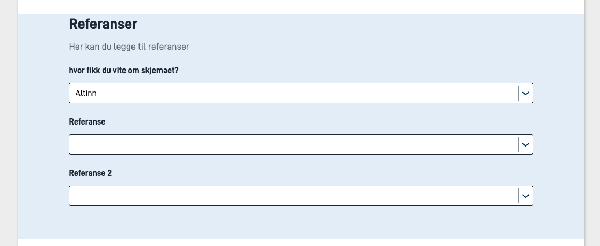
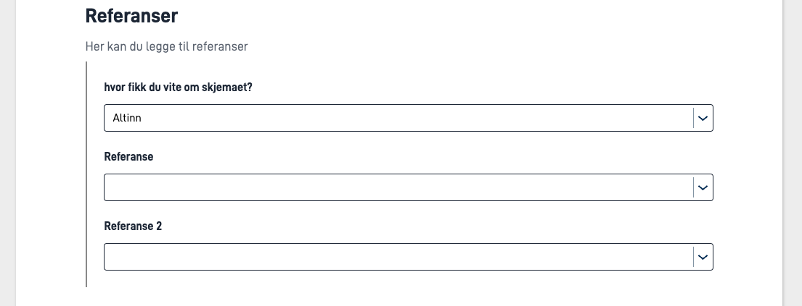

Felter i skjema kan settes opp til å bli del av en _gruppe_. Dette kan brukes til å f.eks. sette opp dynamikk på en enkelt gruppe av felter,
i stedet for på hvert enkelt felt. I tillegg må felter kunnne grupperes for å støtte [repeterende grupper](../repeating) i skjema.

En gruppe settes opp i `FormLayout.json`, sammen med de andre komponentene i skjemaet. Dette kan enten gjøres manuelt direkte i filen,
eller via skjemaeditor i Atinn Studio ved å bruke Gruppe-komponenten.

Noen punkter å notere seg ved manuelt oppsett:

- Gruppen må ligge _før_ ev. komponenter som skal inngå i gruppen i FormLayout.json.
- En gruppe _MÅ_ ha `type: "group"` satt for at den skal registreres som en gruppe

Eksempel på en (repeterende) gruppe definert i `FormLayout.json` som inneholder 4 felter som kan repetere 3 ganger:
En gruppe defineres på følgende måte i FormLayout.json:

```json {hl_lines=[3,"8-12"]}
{
  "id": "<unik-id>",
  "type": "group",
  "dataModelBindings": {
    "group": "<gruppen i datamodellen (kun repeterende grupper)>"
  },
  "maxCount": "<Antall ganger gruppen kan repetere>",
  "children": [
    "<felt-id>",
    "<felt-id>",
    "osv..."
  ],
  "tableHeaders": [
    "<felt-id>"
  ],
  "textResourceBindings": {
    "add_button": "tekstressurs.felt"
  }
}
```

## Parameters




## Parameters

| Parameter                                     | Påkrevd | Beskrivelse                                                                                                                                                       |
|-----------------------------------------------|---------|-------------------------------------------------------------------------------------------------------------------------------------------------------------------|
| id                                            | Ja      | Unik ID, tilsvarer ID på andre komponenter. Må være unik i layout-filen, og bør være unik på tvers av sider.                                                      |
| type                                          | Ja      | Må settes til `Group`                                                                                                                                             |
| [textResourceBindings](#textresourcebindings) | Nei     | Kan settes for grupper, se [nærmere beskrivelse under](#textresourcebindings).                                                                                    |
| children                                      | Ja      | Liste over komponent-IDer som inkluderes i gruppen.                                                                                                               |
| groupingIndicator                             | Nei     | Visuellt grupperer komponentene i gruppen. Kan være `"indented"` eller `"panel"`.                                       |

## textResourceBindings

Det er mulig å legge til ulike nøkler i textResourceBindings:

- `title` - Setter tittelen på gruppen. Om ikke satt, vil komponentene i gruppen vises som om de ikke var en del av en gruppe (uten tittel over)
- `description` - Setter en beskrivelsestekst. Denne vises under tittelen, og over komponentene i gruppen.

## Visuell gruppering av komponenter

Det er mulig å sette opp en gruppe slik at komponentene i gruppen vises visuelt som en gruppe. Dette gjøres ved å sette `groupingIndicator` til `indent` eller `panel` på gruppen.

### Panel



### Indented






## Parameters

| Parameter                                     | Påkrevd | Beskrivelse                                                                                                                                                       |
|-----------------------------------------------|---------|-------------------------------------------------------------------------------------------------------------------------------------------------------------------|
| id                                            | Ja      | Unik ID, tilsvarer ID på andre komponenter. Må være unik i layout-filen, og bør være unik på tvers av sider.                                                      |
| type                                          | Ja      | Må settes til `Group`                                                                                                                                             |
| [textResourceBindings](#textresourcebindings) | Nei     | Kan settes for grupper, se [nærmere beskrivelse under](#textresourcebindings).                                                                                    |
| maxCount                                      | Nei     | Antall ganger en gruppe kan repetere. Må enten unnlates eller settes til `0` for ikke-repeterende grupper, ellers blir det en [repeterende gruppe](../repeating). |
| children                                      | Ja      | Liste over komponent-IDer som inkluderes i gruppen.                                                                                                               |
| showGroupingIndicator                         | Nei     | Viser en vertikal linje til venstre for gruppen for å indikere at feltene har en sammenheng. Kan være `true` eller `false`.                                       |

## textResourceBindings

Det er mulig å legge til ulike nøkler i textResourceBindings:

- `title` - Setter tittelen på gruppen. Om ikke satt, vil komponentene i gruppen vises som om de ikke var en del av en gruppe (uten tittel over)
- `body` - Setter en beskrivelsestekst. Denne vises under tittelen, og over komponentene i gruppen.


