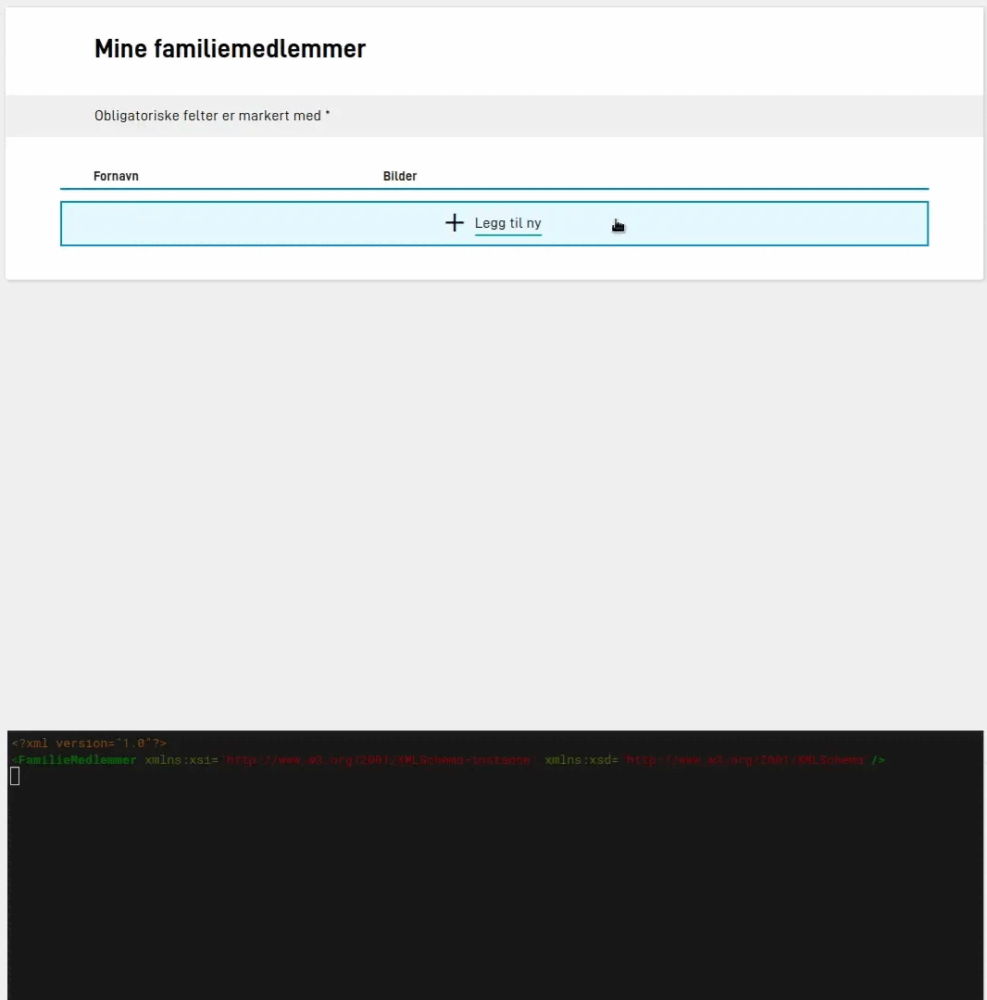

Grupper i datamodellen inneholder ett eller flere felter. Grupper er definert som _repeterende_ dersom de har `maxOccurs > 1` i xsd'en. 
En gruppe som er repeterende i datamodellen må også settes opp som repeterende i skjemaet, ellers vil lagring av data feile.  


## Eksempel 

Skjema med noen enkelt-felt, og en repeterende gruppe som:

- inneholder 3 felter
- kan repeteres opp til 3 ganger
- har lagt til egen streng på "legg til" knappen


Oppsett i `FormLayout.json` fra eksempelet over:

```json {linenos=inline}
{
  "data": {
    "layout": [
      {
        "id": "gruppe-1",
        "type": "Group",
        "children": [
          "ac555386-ac2b-47a0-bb1b-842f8612eddb",
          "5c079cd4-c80c-44ea-b8b8-18e323267a37"
        ],
        "maxCount": 3,
        "dataModelBindings": {
          "group": "spesifisering-grp-5836"
        },
        "textResourceBindings": {
          "header": "person"
        }
      },
      {
        "id": "ac555386-ac2b-47a0-bb1b-842f8612eddb",
        "type": "Checkboxes",
        "componentType": 5,
        "textResourceBindings": {
          "title": "Avkrysningsboks"
        },
        "dataModelBindings": {
          "simpleBinding": "klage-grp-5805.spesifisering-grp-5836.KlageSpesifisering-datadef-25457.value"
        },
        "options": [
          {
            "label": "25795.OppgavegiverNavnPreutfyltdatadef25795.Label",
            "value": "Verdi1"
          },
          {
            "label": "25796.OppgavegiverAdressePreutfyltdatadef25796.Label",
            "value": "Verdi2"
          }
        ],
        "required": true
      },
      {
        "id": "5c079cd4-c80c-44ea-b8b8-18e323267a37",
        "type": "AddressComponent",
        "componentType": 11,
        "textResourceBindings": {
          "title": "Adresse" 
        },
        "dataModelBindings": {
          "address": "klage-grp-5805.spesifisering-grp-5836.KlageSpesifiseringg-datadef-12345.value"
        },
        "simplified": true,
        "readOnly": false,
        "required": true
      }
    ]
  }
}
```

## Attachments in repeating groups

{}
This is brand new functionality. Setup is manual for now, support in Studio will arrive later.
{}

In order to set up the file upload component in repeating groups, some additional configration is required.

When uploading attachments it can be difficult to identify which attachment belongs to which row in the repeating group,
and in turn which part of the submitted data belongs to which attachment. For that reason, it is required to add data
model bindings to the `FileUpload` component when used inside repeating groups, so that Altinn can populate the data
model with a reference to the unique ID per attachment.

This option to have Altinn add references to attachments to the data model can also be used outside the context of
repeating groups, in case references to attachment(s) are desired in the data model on the receiving end.



Below is an example of showing a data model expecting a reference to an uploaded attachment:

```xsd {hl_lines=["12"]}
<xsd:schema xmlns:xsd="http://www.w3.org/2001/XMLSchema" elementFormDefault="qualified" attributeFormDefault="unqualified">
  <xsd:element name="FamilieMedlemmer" type="Skjema" />
  <xsd:complexType name="Skjema">
    <xsd:sequence>
      <xsd:element name="FamilyMember" type="FamilyMember" maxOccurs="99" />
    </xsd:sequence>
    <xsd:anyAttribute />
  </xsd:complexType>
  <xsd:complexType name="FamilyMember">
    <xsd:sequence>
      <xsd:element name="FirstName" type="xsd:string" />
      <xsd:element name="Picture" type="xsd:string" />
    </xsd:sequence>
  </xsd:complexType>
</xsd:schema>
```

This is bound to the file upload component inside a group:

```json {hl_lines=["8"]}
{
  "id": "picture",
  "type": "FileUpload",
  "textResourceBindings": {
    "title": "Picture"
  },
  "dataModelBindings": {
    "simpleBinding": "FamilyMember.Picture"
  },
  "maxFileSizeInMB": 25,
  "maxNumberOfAttachments": 1,
  "minNumberOfAttachments": 1,
  "displayMode": "simple",
  "required": true
}
```

In cases where multiple attachments are allowed for a single `FileUpload` component, use a `list` data model binding
instead:

```xsd {hl_lines=[4]}
  <xsd:complexType name="FamilyMember">
    <xsd:sequence>
      <xsd:element name="FirstName" type="xsd:string" />
      <xsd:element name="Pictures" type="xsd:string" maxOccurs="5" />
    </xsd:sequence>
  </xsd:complexType>
```

```json {hl_lines=[4]}
{
  [...]
  "dataModelBindings": {
    "list": "FamilyMember.Pictures"
  }
}
```

The receiving end will get a list of multiple unique IDs, one for each attachment. The same unique ID will be displayed
in the PDF receipt, but it is recommended to [hide this](/app/development/ux/pdf/#exclude-components), as attachments
are shown separately on the receipt page and unique IDs can appear confusing to end users.
