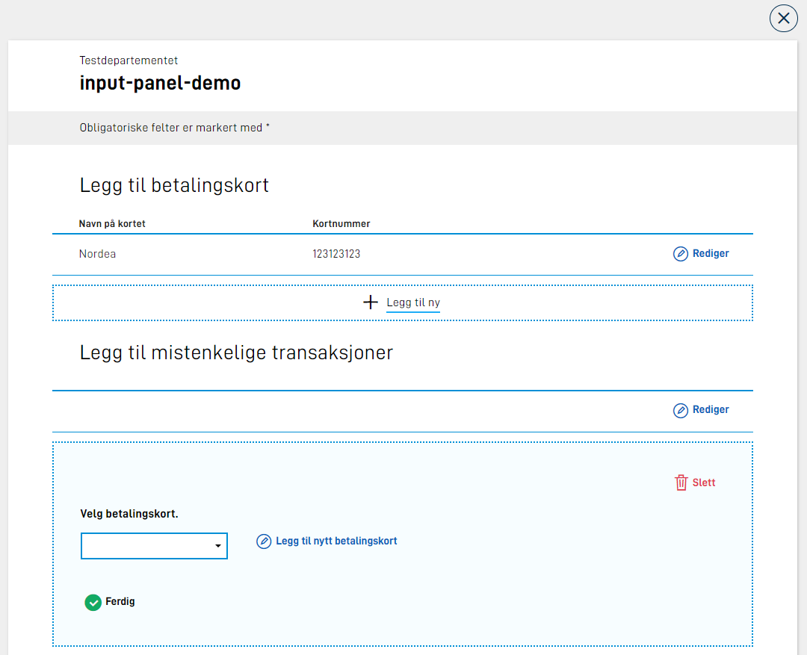

## Vise gruppen som del av Panel

Det er lagt til en ny parameter, `panel`, som kan settes på en gruppe-komponent. Denne sier at gruppen skal vises som en del av [Panel-komponenten](../../../../components/panel).

Her vil du kjenne igjen utseende og innstillinger som kan settes på panel-komponenten. Eksempeloppsett:

```json
{
  "id": "input-panel-group",
  "type": "Group",
  "children": [
    "panel1",
    "panel2"
  ],
  "dataModelBindings": {},
  "textResourceBindings": {
    "title": "Dette er bare en demo av input panel utenfor repeterende gruppe.",
    "body": "Her ser jeg bare at ting fungerer som forventet."
  },
  "panel": {
    "variant": "info"
  }
}
```

Her har man satt opp gruppen til å vises som panel med variant "info". Oppsettet er ellers helt likt som en vanlig gruppe.

Dette vil gi følgende output:


Det er mulig å konfigurere følgende settings i `panel` feltet på en gruppe:

| Parameter      | Påkrevd | Beskrivelse                                                                                                                                                                                |
|----------------|---------|--------------------------------------------------------------------------------------------------------------------------------------------------------------------------------------------|
| variant        | Ja      | Hvilken variant av panel gruppen skal ligge i. Tilgjengelige verdier er "info", "success" og "warning"                                                                                     |
| iconUrl        | Nei     | Om man ønsker eget ikon som del av panel kan dette settes. Relativ eller full path, f.eks "awesomeIcon.png" eller "http://cdn.example.com/awesomeIcon.png"                                 |                                                                                           |
| iconAlt        | Nei     | Alternativ tekst til custom icon. Kan kun settes om iconUrl er satt. Kan være ren tekst eller en refereanse til en tekstressurs.                                                           |
| groupReference | Nei     | Referanse til en annen gruppe. Kan benyttes om man ønsker legge til elementer i en repeterende gruppe fra en annen kontest. [Les mer.](#legge-til-element-fra-en-annen-repeterende-gruppe) |                                                       |

Eksempel:

```json
{
  "panel": {
    "variant": "info",
    "iconUrl": "kort.svg",
    "iconAlt": "Betalingskort ikon"
  }
}
```

### Legge til element fra en annen repeterende gruppe

Et use case man kan se for seg er at brukeren bes om å velge fra en tidligere utfylt gruppe. Et tenkt eksempel kan være at brukeren skal registrere et sett med mistenksomme transaksjoner.
Her legger først brukeren inn et sett med ulike betalingskort som en repeterende gruppe. Senere i skjema skal brukeren velge elementer fra denne gruppen når man skal legge til en mistenkelig transaksjon.
Ved utfylling av den mistenkelige transaksjonen kommer sluttbruker på at man har glemt å legge til et betalingskort, men ønsker ikke da å navigere seg helt tilbake til den opprinnelige betalingskort gruppen.

Her kommer `groupReference` parameteren inn i bildet på panel. Dette vil åpne opp for å kunne legge til et element i en repeterende gruppe fra konteksen hvor man benytter denne listen fra.

Et bilde for å illustrere usecasen:



I dette fiktive caset ligger gruppene rett over hverandre, men se for deg at disse fylles ut på ulike sider i skjema.
For å få til dette oppsettet legges en gruppe element til i den repeterende gruppen som er satt opp med transaksjoner (gruppe-2) med en referanse til den første gruppen med betalingskort (gruppe-1).
Følgende gruppe-komponent ligger som et barn av gruppe-2:

```json
{
  "id": "input-panel-group",
  "type": "Group",
  "dataModelBindings": {},
  "textResourceBindings": {
    "title": "Legg til nytt betalingskort",
    "body": "Kortet du registrer vil bli lagret og tilgjengelig i resten av tjenesten.",
    "add_label": "Legg til nytt betalingskort"
  },
  "panel": {
    "showIcon": true,
    "iconUrl": "kort.svg",
    "variant": "success",
    "groupReference": {
      "group": "first-group"
    }
  }
}
```

Tekstressursene som kan settes er:

- `title` - panel tittel
- `body` - panel body. Plassert over gruppe elementene.
- `add_label` - tekst for "legg til"-knappen.

Om ikke `children` er satt på gruppen vil barna til den refererte gruppen bli rendret. Ved å legge til `children` kan man fritt definere at det kun skal vises et subset av alle barn av den refererte gruppen.

Demonstrasjon:


Se [eksempel app](https://altinn.studio/repos/ttd/input-panel-demo) for fullstendig oppsett i fom layout.
