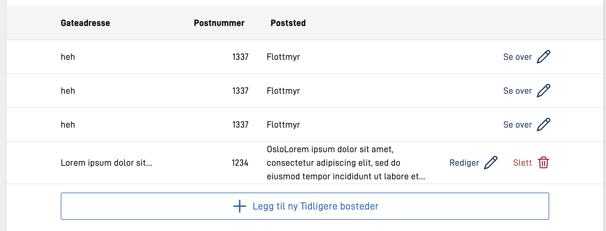

Fields in a form can be set up to be part of a _group_. This can be used to e.g. set up dynamic on a single group of fields,
instead of on each single field. In addition, fields must be able to be grouped to support [repeating groups](../repeating) in a form.

A group is set up in `FormLayout.json`, together with the other components in the form. This can be done manually directly in the file, 
or through form editor in Altinn Studio by using the group component.

Some things to note when manually setting up:

- The group must be placed _before_ any components that are to be included in the group in FormLayout.json
- A group _MUST_ have `type: "group"` set if it is to be recognized as a group

An example of a (repeating) group defined in `FormLayout.json` that contains four fields that can be repeated three times:
A group is defined as follows in FormLayout.json:

```json {hl_lines=[3,"8-12"]}
{
  "id": "<unik-id>",
  "type": "group",
  "dataModelBindings": {
    "group": "<gruppen i datamodellen (kun repeterende grupper)>"
  },
  "maxCount": "<Antall ganger gruppen kan repetere>",
  "children": [
    "<felt-id>",
    "<felt-id>",
    "osv..."
  ],
  "tableHeaders": [
    "<felt-id>"
  ],
  "textResourceBindings": {
    "add_button": "tekstressurs.felt"
  }
}
```

| Parameter             | Required | Description                                                                                                                                    |
| --------------------- | -------- |------------------------------------------------------------------------------------------------------------------------------------------------|
| id                    | Yes      | Unique ID, same as ID on other components. Must be unique in the FormLayout.json file.                                                         |
| type                  | Yes      | MUST be 'group'. Says that this is a group.                                                                                                    |
| dataModelBindings     | No       | MUST be set for repeating groups, with the `group`-parameter like in the example above. Should point to the repeating group in the data model. |
| textResourceBindings  | No       | Can be set for repeating groups, see [description](#textresourcebindings).                                                                     |
| maxCount              | Yes      | The number of times a group can repeat. Set to `1` if the group is not repeating.                                                              |
| children              | Yes      | List of the fields that are to be included in the group. Field-id from FormLayout.json is used here.                                           |
| tableHeaders          | No       | List of components that are to be included as part of the table header fields. If not specified, all components are displayed.                 |
| tableColumns          | No       | Object containing column options for specified headers. If not specified, all columns will use default display settings.                       |

## textResourceBindings
It is possible to add different keys in textResourceBindings to overrule default texts.
- `add_button` - is added at the end of the "Add new" text on the button, and can be used to e.g. get text that says "Add new person".
- `save_button` - is used as text on the "Save" button when the user is filling out data.
- `save_and_next_button` - is used as text on the "Save and open next" button if enabled.
- `edit_button_open` - is used as text on the "Edit" button on the table when the user is opening an element.
- `edit_button_close` - is used as text on the "Edit" button on the table when the user is closing an element.

### Separate prompt for table view

Items in repeating groups that are not in editing mode are shown as a table. This table view has limited space for long prompts. A shorter prompt for table views can be set by defining `tableTitle` in `textResourceBindings` for each component in the repeating group.

Example:

```json
{
  ...
  "type": "Input",
  "textResourceBindings": {
    "title": "Enter your full name",
    "tableTitle": "Name"
  },
  ...
},
```

## tableColumns

Using the `tableColumns` property makes it is possible to configure the width, text alignment, and number of lines to show in a cell for columns.
- `width` - set to a string value containing a percentage, ex: `"25%"`, or `"auto"` (default).
- `alignText` - choose between `"left"`, `"center"` or `"right"` to align text in table cell accordingly.
- `textOverflow` - is used to controll behaviour when text content is too large for a table cell.
  - `lineWrap` - set to `false` in order to turn of linebreaking. Default is `true`.
  - `maxHeight` - sets number of lines before overflowing text is hidden with an elipsis (...). `"maxHeight": 0` results in turning off linebreaking.

Example:

```json
{
  ...
  "tableHeaders": [
    "streetAdress",
    "postalNumber",
    "city"
  ],
  "tableColumns": {
    "streetAdress": {
      "width": "20%",
      "alignText": "left",
      "textOverflow": {
        "lineWrap": true, 
        "maxHeight": 1
      }
    },
    "postalNumber": {
      "alignText": "right"
    },
    "city": {
      "width": "auto",
      "alignText": "left",
      "textOverflow": {
        "lineWrap": true,
        "maxHeight": 3
      }
    }
  },
  ...
}
```

