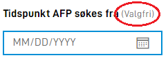

{}
This functionality must be set up manually directly in form layout for now.

**NOTE:** This functionality requires app-frontend v3 or newer. See [this link](/community/changelog/app-frontend/v3/breaking-changes/) 
for more information.

{}

## Mark a field as optional

It is possible to mark a field as optional. The default is that required fields are marked as required (with `*`), while
optional fields have no marking. 

.")

.")

Default behaviour can be overwritten by changing the settings of the field. This is done in the 
`labelSettings` property of a component in the form layout.

```json
{
  {
    "id": "input-felt-1",
    "type": "Input",
    ... 
    "labelSettings": {
      "optionalIndicator": true
    }
  }
}
```

By setting `optionalIndicator` to `true`, the text `(Optional)` will be shown after the field label.




*NOTE*: It is not possible to force the *Optional* marking on a field that is required. Changing the 
`optionalIndicator` property does not alter or overrule the other properties of the field.

## Configuring automatic save while typing

`Input` components, `TextArea` components and `AddressComponent` automatically save changes while the user
is typing. By default, this happens 400 milliseconds after the user last stopped typing. At this point
validation and triggers will execute as well. In cases where validations and triggers are resource intensive, it
might be neccesary to increase the delay before saving automatically - or disable it altogether.

This functionality can be controlled using the `saveWhileTyping` property of a component in the form layout. In the
example below, data is saved 2 seconds after the user stopped typing.

```json {hl_lines=[6]}
{
  {
    "id": "input-field-1",
    "type": "Input",
    ... 
    "saveWhileTyping": 2000
  }
}
```

If this property is set to `false`, typing is the field does not trigger auto-saving or validation at all,
and these processes will only run when the user changes focus out of the field.