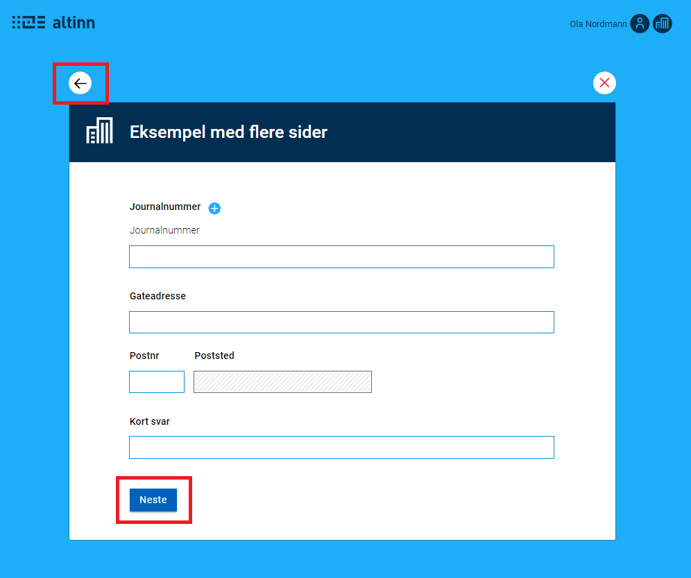
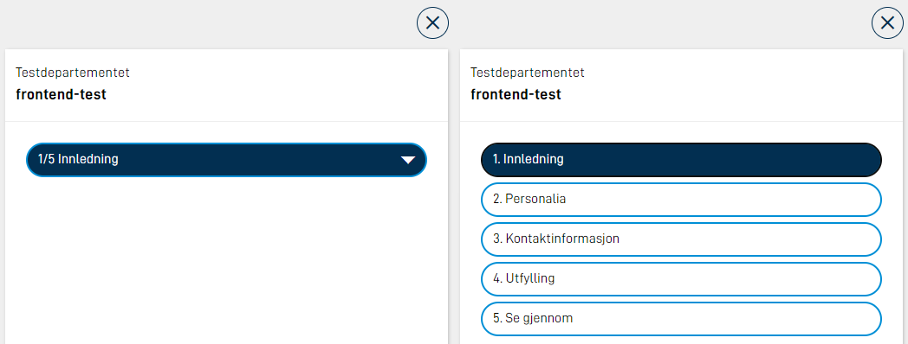

Navigation to the next page happens via a navigation button. This button has to be added manually in every layout file where you want to be able to navigate forward. Navigating back is done via a back arrow in the top left corner. This button will always be shown if there is something to navigate backwards to, and is not part of the layout file. See image below.



## Add button for navigation
Button for navigation is added to all layout files where it is needed. If you want the button to appear at the bottom of the page, it has to be added at the bottom in the layout file. Configuration example:

```json
{
  "id": "nav-page2",
  "type": "NavigationButtons",
  "textResourceBindings": {
    "next": "next",
    "back": "back"
  },
  "dataModelBindings": {}
}
```

It is also possible to show a `back` button together with the `next` button by adding the parameter `showBackButton: true` in the button configuration.


| Parameter | Description |
| ----------- | ----------- |
| id | Unique ID, the same as for all schema components.|
| type | Has to be `"NavigationButtons"` |
| textResourceBindings | By setting the parameters `next` (and `back`), you are able to override the default texts to be shown on the buttons.|
| showBackButton | Optional. Makes two buttons (back/next) appear instead of just one (next).|

## Navigation Bar

The Navigation Bar gives easy access to all pages in an application.

{}
The Navigaion Bar lists all pages in the application, and is not suited for use with the tracks feature.
{}


On big screens, all pages will be visible. If there is not enough space on one line, the list will break and the rest of the pages will go on the next line. On smaller screens, all pages will be hidden in a menu. The current page is shown in the menu, and when the menu is clicked, all pages will show.



The Navigation Bar is added to all layout files. Configuration example:

```json
{
  "id": "navbar-page-1",
  "type": "NavigationBar"
}
```

### Change texts on navigationbar buttons

The text in the navigation bar buttons will by default use the filename of the page without the extension. F.ex if you have `page1.json` and `page2.json`, the buttons will contain `page1` and `page2`. To override these texts, you can add texts in the `resources.XX.json`, where the `id` is the filename without extension. Example:

```json
{
  "id": "page1",
  "value": "First page"
},
{
  "id": "page2",
  "value": "Last page"
},

```

## Order
Default order for the pages is alphabetically. Besides this you can name each page as you wish, and the filename is what will be used. To ensure the pages appear in a specific order, you could prefix them with numbers, f.ex:

```
|- App/
  |- ui/
    |- layouts/
      |- 1.firstPage.json
      |- 2.secondPage.json
      |- 3.aFinalPage.json
```
It is also possible to override the order on the pages in the `Settings.json` file found under `App/ui/`, by setting the `pages.order` property. Example:

```json
{
  "pages": {
    "order": ["side2", "side1"]
  }
}
```

If you want to dynamically change the page order this can be done using [tracks.](../tracks/)

## Validation on page navigation
It is possible to trigger validation when the user tries to navigate to a different page. This can be done by adding the string `validatePage` to the `triggers` in the navigation button component. Example:

```json
{
  "id": "7cbc1c00-4c8c-42b6-bcef-12b3c4c45373",
  "type": "NavigationButtons",
  "componentType": "NavigationButtons",
  "textResourceBindings": {
    "next": "Neste",
    "back": "Tilbake"
  },
  "triggers": ["validatePage"],
  "dataModelBindings": {},
  "showBackButton": true
 }
```

If there are errors on the page, the user will be prevented from moving forward until this is fixed. If `validatePage` is added as a trigger, the ID of the element that triggers the validation will be sent as a header `LayoutId` to the backend. This makes it possible to customize the backend validtaions based on which page the user triggers the validation from.
It is also possible to trigger validation on all pages by adding `validateAllPages` in `triggers`.
