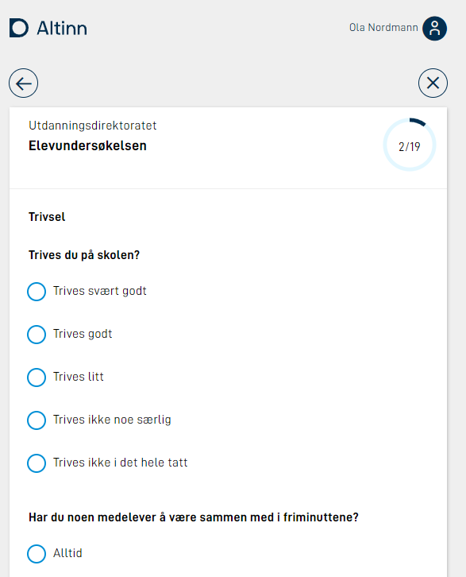
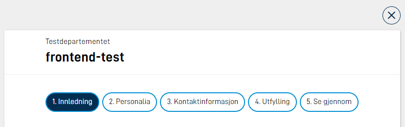

Navigation to the next page happens via a navigation button. This button has to be added manually in every layout file where you want to be able to navigate forward. Navigating back is done via a back arrow in the top left corner. This button will always be shown if there is something to navigate backwards to, and is not part of the layout file. See image below.


## Add button for navigation

Button for navigation is added to all layout files where it is needed. If you want the button to appear at the bottom of the page, it has to be added at the bottom in the layout file. Configuration example:

```json
{
  "id": "nav-page2",
  "type": "NavigationButtons",
  "textResourceBindings": {
    "next": "next",
    "back": "back"
  },
  "dataModelBindings": {}
}
```

It is also possible to show a `back` button together with the `next` button by adding the parameter `showBackButton: true` in the button configuration.


| Parameter            | Description                                                                                                           |
| -------------------- | --------------------------------------------------------------------------------------------------------------------- |
| id                   | Unique ID, the same as for all schema components.                                                                     |
| type                 | Has to be `"NavigationButtons"`                                                                                       |
| textResourceBindings | By setting the parameters `next` (and `back`), you are able to override the default texts to be shown on the buttons. |
| showBackButton       | Optional. Makes two buttons (back/next) appear instead of just one (next).                                            |

## Progress indicator

It is possible to enable a progress indicator that shows up in the top-right corner of the app, indicating
how far along the user is in filling out all the application pages.



{}
All known pages in the current [process task](../../../configuration/process) will count towards the total number of
pages shown in the progress indicator. If you have set up [tracks](../tracks) or
many [dynamically hidden pages](../../../logic/expressions#showhide-entire-pages), this number may fluctuate and appear
confusing to the user. Make sure the progress indicator is intuitive and provides value to the user before enabling it.
{}

### Configuring progress indicator

To set up this feature, add the following line to your `App/ui/Settings.json` file
(you may also have one file per [layout-set](../layout-sets)):

```json {hl_lines=9}
{
  "$schema": "https://altinncdn.no/schemas/json/layout/layoutSettings.schema.v1.json",
  "pages": {
    "order": ["student-info", "school-work", "well-being"],
    "showProgress": true
  }
}
```

## Navigation Bar

The Navigation Bar gives easy access to all pages in an application.

{}
The Navigation Bar lists all pages in the application, and is not suited for use with the tracks feature.
{}



On big screens, all pages will be visible. If there is not enough space on one line, the list will break and the rest of the pages will go on the next line. On smaller screens, all pages will be hidden in a menu. The current page is shown in the menu, and when the menu is clicked, all pages will show.


The Navigation Bar is added to all layout files. Configuration example:

```json
{
  "id": "navbar-page-1",
  "type": "NavigationBar"
}
```

It can also be configured to display Navigation Bar mobile also in desktop viewport. In this case, this has to be set for all layout files. Configuration example:

```json
{
  "id": "navbar-page-1",
  "type": "NavigationBar",
  "compact": true
}
```

### Change texts on navigation bar buttons

The text in the navigation bar buttons will by default use the filename of the page without the extension. F.ex if you have `page1.json` and `page2.json`, the buttons will contain `page1` and `page2`. To override these texts, you can add texts in the `resources.XX.json`, where the `id` is the filename without extension. Example:

```json
{
  "id": "page1",
  "value": "First page"
},
{
  "id": "page2",
  "value": "Last page"
},

```

## Order

Default order for the pages is alphabetically. Besides this you can name each page as you wish, and the filename is what will be used. To ensure the pages appear in a specific order, you could prefix them with numbers, f.ex:

```
|- App/
  |- ui/
    |- layouts/
      |- 1.firstPage.json
      |- 2.secondPage.json
      |- 3.aFinalPage.json
```

It is also possible to override the order on the pages in the `Settings.json` file found under `App/ui/`, by setting the `pages.order` property. Example:

```json
{
  "pages": {
    "order": ["side2", "side1"]
  }
}
```

If you want to dynamically change the page order this can be done using [tracks.](../tracks/)

## Validation on page navigation

It is possible to check validation when the user tries to navigate to a different page, if there are validation errors, the user will be prevented from proceeding.



In version 4 of app frontend, the `NavigationButtons` component have properties called `validateOnNext` and `validateOnPrevious` that can be configured. Example:

```json {linenos=false,hl_lines=[5,6,7,8]}
{
  "id": "nav-buttons-1",
  "type": "NavigationButtons",
  "textResourceBindings": {...},
  "validateOnNext": {
    "page": "current",
    "show": ["All"]
  }
}
```

Where `page` can be one of: `current | all | currentAndPrevious`, and `show` contains a set of validation types to check; this can be one or more of:

- `Schema`
- `Component`
- `Expression`
- `CustomBackend`
- `Required`
- `AllExceptRequired`
- `All`

Similarly, the `NavigationBar` component have the `validateOnForward` and `validateOnBackward` property:

```json {linenos=false,hl_lines=[4,5,6,7]}
{
  "id": "nav-1",
  "type": "NavigationBar",
  "validateOnForward": {
    "page": "current",
    "show": ["All"]
  }
}
```




In version 3 of app frontend, add a trigger to the navigation button component:

```json {linenos=false,hl_lines=[7]}
{
  "id": "nav-buttons-1",
  "type": "NavigationButtons",
  "textResourceBindings": {
    "next": "Neste",
  },
  "triggers": ["validatePage"],
}
```

There are three different triggers that can be used on page navigation:

| Trigger                           | Description                                                                                                                                                   |
| --------------------------------- | ------------------------------------------------------------------------------------------------------------------------------------------------------------- |
| `validatePage`                    | Runs validation on the components in the current page. The ID of the page that triggered the validation will be sent in the header `LayoutId` to the backend. |
| `validateAllPages`                | Runs validation on all components in all pages. Does not prevent the user from proceeding if there are no errors on the current or previous pages.            |
| `validateCurrentAndPreviousPages` | Runs validation on all components in the current page and all previous pages in the current order.                                                            |


