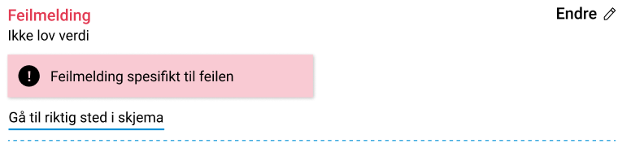
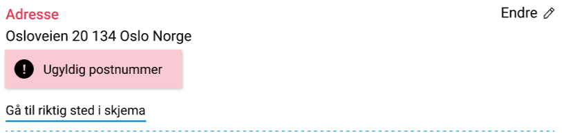
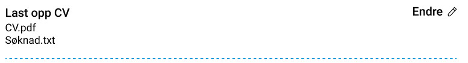
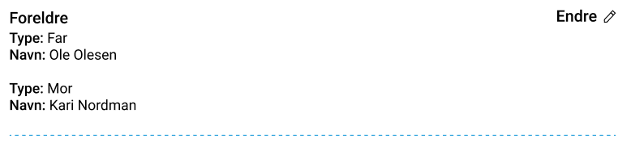
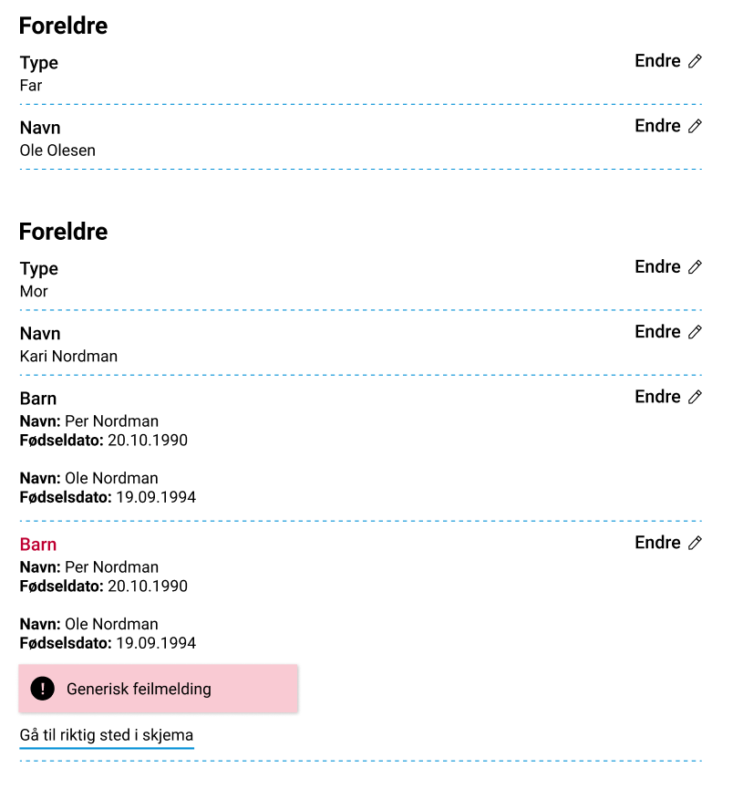
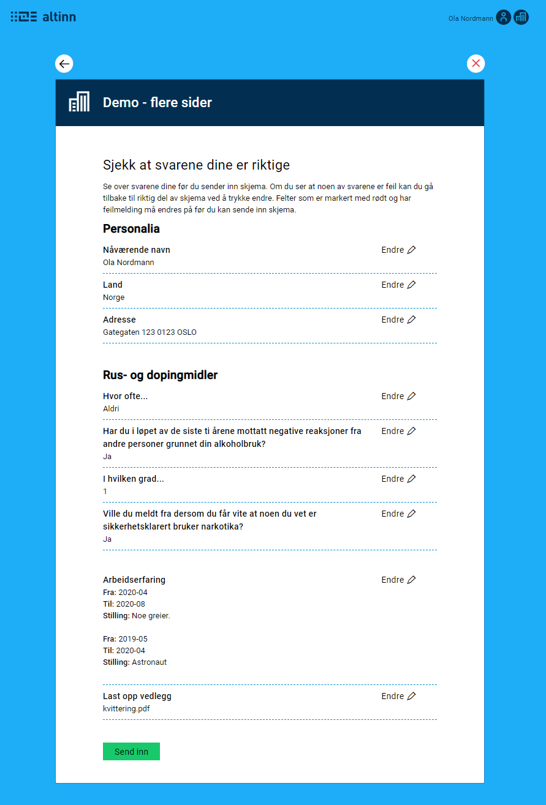

{}
This is new functionality. Setup must be done manually as of today. Support for setup through Altinn Studio will be available at a later point in time.

**NOTE**: The PDF generation, as of today, does not support the summary component. For PDF generating to work, either all the summary components or the whole summary-page(s) must be excluded from PDF. This is done in the `Settings.json`-file attached to the layout-files. 
{}

## Setup
Display of summary is set up in the same manner as the other form components in a form. 
You can choose to have the summary on it's own page, or on the same page as other form components.

The summary component is very simple, and refers to the _component_ that is to be summarized and the _page_ this is on. Example:

```json {hl_lines=[4]}
{
    "id": "summary-1",
    "type": "Summary",
    "componentRef": "<komponent-id>",
    "pageRef": "<side komponenten er definert på>"
},
```

The component displays a summary of data from the specified component. In addition, the user gets the opportunity to 
return to the relevant component/page to make changes.

The display differs depending on which form component the summary refers to.

Note: PDF-generating does not support a summary page, so it has to be excluded by changing `ui/Settings.json`
```json
"pages": 
      { 
        "excludeFromPdf": [ "name-of-summary-page" ]
      }
```
### Simple form component
These are components that are only connected to one field in the data model. E.g. Input, Dropdown, Checkbox/Radio, etc.


The summary displays the prompt for the form component and attached data. If there is an active error message
attached to the form component, this will also be displayed.



### Address component
This component includes multiple fields. The display is the same as that of a simple form component,
so the fields are merged into a simple text.



### File attachments
The summary display for file attachments displays a list of the attachments that are uploaded for 
the component in question.



### Repeating groups


### Nested groups
Summary is also supported for nested repeating groups. We only support one level of
nested groups. In this case, the summary of each element of the group at the top level is displayed
as its own [category](#categories), and the group at the lowest level is displayed in the same manner as a normal
repeating group.

To support summary display of nested groups, the following setup must be done in the layout-file:
- Refer to _the main group_ in `componentRef` in the summary component
- Set `"largeGroup": true` on the summary component

#### Example
With the following setup of a nested group in layout:

```json
{
  "id": "main-group",
  "type": "Group",
  "textResourceBindings": {
    "title": "Hovedgruppe"
  },
  "dataModelBindings": {
    "group": "model.mainGroup"
  },
  "children": [
    "nested-group-1"
  ],
  ... // remaining setup of component
},
{
  "id": "nested-group-1",
  "type": "Group",
  "textResourceBindings": {
    "title": "Undergruppe"
  },
  "dataModelBindings": {
    "group": "model.mainGroup.subGroup"
  },
  "children": [
    "input-field-1"
  ],
  ... // remaining setup of component
},
{
  "id": "input-field-1",
  "type": "Input",
  "textResourceBindings": {
    "title": "Skriv inn noe her"
  },
  "dataModelBindings": {
    "group": "model.mainGroup.subGroup.field1"
  },
  ... // remaining setup of component
}
```

Set up the summary in the following manner:
```json {hl_lines=[6]}
{
  "id": "summary-1",
  "type": "Summary",
  "componentRef": "main-group",
  "pageRef": "FormLayout",
  "largeGroup": true,
}
```



## Categories
It is possible to group the summaries in different categories to make a summary page
more clear. This is done by using the existing _group_ component, without setting it up
as a repeating group.

The fields in the summary are then displayed with a title, which is set in the `title` field for `textResourceBindings` for 
the group component. See the example below.


```json
{
  "id": "personalia-group",
  "type": "Group",
  "textResourceBindings": {
    "title": "Personalia"
  },
  "children": [
    "summary-1",
    "summary-2",
    "summary-3"
  ]
},
{
  "id": "summary-1",
  "type": "Summary",
  "componentRef": "d566c79c-3e3e-445b-be25-a404508f6607",
  "pageRef": "personalia"
},
{
  "id": "summary-2",
  "type": "Summary",
  "componentRef": "22a60bf0-d5b7-4b45-9ac9-c266b6ad3716",
  "pageRef": "personalia"
},
{
  "id": "summary-3",
  "type": "Summary",
  "componentRef": "d497737b-67b2-4e03-87a9-43f58579c938",
  "pageRef": "personalia"
},
```

## Example on summary page
Below is an example of a summary page, with setup in the layout file. Since the summary is set up 
in the layout files in the same way as other components, you can also include other form components as texts
when needed.



```json
{
  "$schema":  "https://altinncdn.no/schemas/json/layout/layout.schema.v1.json",
  "data": {
    "layout": [
      {
        "id": "send-in-text",
        "type": "Paragraph",
        "componentType": 1,
        "textResourceBindings": {
          "title": "finish"
        },
        "dataModelBindings": {}
      },
      {
        "id": "personalia-group",
        "type": "Group",
        "textResourceBindings": {
          "title": "Personalia"
        },
        "children": [
          "summary-1",
          "summary-2",
          "summary-3"
        ]
      },
      {
        "id": "summary-1",
        "type": "Summary",
        "componentRef": "d566c79c-3e3e-445b-be25-a404508f6607",
        "pageRef": "personalia"
      },
      {
        "id": "summary-2",
        "type": "Summary",
        "componentRef": "22a60bf0-d5b7-4b45-9ac9-c266b6ad3716",
        "pageRef": "personalia"
      },
      {
        "id": "summary-3",
        "type": "Summary",
        "componentRef": "d497737b-67b2-4e03-87a9-43f58579c938",
        "pageRef": "personalia"
      },
      {
        "id": "drugs-group",
        "type": "Group",
        "textResourceBindings": {
          "title": "Rus- og dopingmidler"
        },
        "children": [
          "summary-4",
          "summary-5",
          "summary-6",
          "summary-7"
        ]
      },
      {
        "id": "summary-4",
        "type": "Summary",
        "componentRef": "064c0033-8996-4825-85fc-2a19fe654400",
        "pageRef": "drugs"
      },
      {
        "id": "summary-5",
        "type": "Summary",
        "componentRef": "7f22e523-3f6d-4371-a5dd-233dc41af824",
        "pageRef": "drugs"
      },
      {
        "id": "summary-6",
        "type": "Summary",
        "componentRef": "18a7c709-ae2f-48b3-b6f6-bd631f5d8d56",
        "pageRef": "drugs"
      },
      {
        "id": "summary-7",
        "type": "Summary",
        "componentRef": "b7417cf9-f806-4835-a3d1-424c8d094d5f",
        "pageRef": "drugs"
      },
      {
        "id": "summary-group-1",
        "type": "Summary",
        "componentRef": "arbeidserfaring-group",
        "pageRef": "work"
      },
      {
        "id": "summary-8",
        "type": "Summary",
        "componentRef": "25f720db-5784-4c95-a530-43f0bf523466",
        "pageRef": "attachment"
      },
      {
        "id": "312afa87-c2a9-4ef1-a681-26cc47462878",
        "type": "Button",
        "componentType": 9,
        "textResourceBindings": {
          "title": "Send inn"
        },
        "dataModelBindings": {},
        "textResourceId": "Standard.Button.Button",
        "customType": "Standard"
      }
    ]
  }
}
```