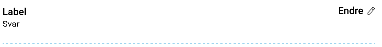
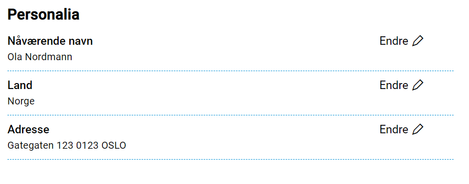

{}
Oppsett må gjøres manuelt inntil videre. Støtte for oppsett via Altinn Studio kommer på et senere tidspunkt.

**MERK**: PDF-genereringen har per nå ikke støtte for oppsummerings-komponenten. For at PDF-generering skal fungere må enten alle oppsummerings-komponentene, eller hele oppsummerings-siden(e) ekskluderes fra PDF. Dette gjøres i `Settings.json`-filen knyttet til layout-filene. 
{}

## Oppsett
Visning av oppsummering settes opp på samme måte som øvrige skjema-komponenter i et skjema.
Man kan velge å ha oppsummeringen på en egen side, eller på samme side som andre skjema-komponenter.

Oppsummerings-komponenten er meget enkel, og refererer til _komponent_ som skal oppsummeres. Eksempel:

```json {hl_lines=[8]}
{
  "$schema": "https://altinncdn.no/toolkits/altinn-app-frontend/4/schemas/json/layout/layout.schema.v1.json",
  "data": {
    "layout": [
      {
        "id": "summary1",
        "type": "Summary",
        "componentRef": "<komponent-id>"
      }
    ]
  }
}
```

Komponenten viser oppsummering av data fra den spesifiserte komponenten. I tillegg får sluttbruker mulighet
til å gå tilbake til den aktuelle komponenten/siden for å gjøre endringer. 

Visningen er litt forskjellig avhengig av hva slags skjemakomponent oppsummeringen refererer til.

### Tekstressurser
Som nevnt tidligere, gir oppsummeringskomponenten et sammendrag over data fra en annen komponent.
Men følgende tekstressurser som er satt i referansekomponenten er kun ment for oppsummeringskomponenten:
- Feltet `summaryTitle` kan brukes til å angi en egen label/tittel i oppsummeringen. Hvis dette feltet er satt, vil det overstyre `title`-feltet.
- Feltet `summaryAccessibleTitle` kan brukes til å egendefinere `aria-label` for redigeringsknappen i oppsummeringen. Hvis dette feltet er satt, vil det overstyre `summaryTitle`- og `title`-feltet.

```json {hl_lines=[15,16]}
{
  "$schema": "https://altinncdn.no/toolkits/altinn-app-frontend/4/schemas/json/layout/layout.schema.v1.json",
  "data": {
    "layout": [
      {
        "id": "summary1",
        "type": "Summary",
        "componentRef": "<komponent-id>"
      },
      {
        "id": "<komponent-id>",
        "type": "Input",
        "textResourceBindings": {
          "title": "",
          "summaryTitle": "Tittel i sammendrag",
          "summaryAccessibleTitle": "Aria-label på redigerknapp i sammendrag"
        },
        ...
      }
    ]
  }
}
```


### Enkel skjemakomponent
Dette er skjemakomponenter som kun er knyttet til 1 felt i datamodellen. F.eks. Input, Dropdown, Checkbox/Radio, osv.



Oppsummeringen viser ledeteksten til skjemakomponenten, og tilknyttet data. Dersom det er en aktiv feilmelding
knyttet til skjemakomponenten, vil dette også vises.


### Adressekomponent
Denne komponenten har flere felter som inngår. Visningen er lik som for en enkel skjemakomponent, 
slik at feltene blir slått sammen til en enkel tekst. 


### Filvedlegg
Oppsummeringsvisningen for filvedlegg viser en liste over de vedleggene som er lastet opp for den aktuelle
komponenten.


### Grupper
Peker man på en `Group`-komponent vil en oppsummering vises for alle under-komponentene i gruppa.


Det er også mulig å ekskludere enkelte under-komponenter fra å vise i uppsummeringen ved å bruke
`excludedChildren`-egenskapen. Denne egenskapen skal innholde en liste over komponent-IDer man ikke ønsker vist.

```json {hl_lines=[14, 22]}
{
  "$schema": "https://altinncdn.no/toolkits/altinn-app-frontend/4/schemas/json/layout/layout.schema.v1.json",
  "data": {
    "layout": [
      {
        "id": "main-group",
        "type": "Group",
        "textResourceBindings": {
          "title": "Hovedgruppe"
        },
        "children": [
          "child1",
          "child2",
          "child3"
        ]
      },
      {
        "id": "summary-of-group",
        "type": "Summary",
        "componentRef": "main-group",
        "excludedChildren": [
          "child3"
        ]
      }
    ]
  }
}
```

### Grupper i grupper
Oppsummering støttes også for repeterende grupper _inne i_ repeterende grupper. Vi støtter kun ett nivå av 
grupper i grupper. I dette tilfellet vises oppsummeringen av hvert innslag av gruppen på øverst nivå som en
egen [kategori](#kategorier), og gruppen på nederste nivå vises på samme måte som vanlige repeterende
grupper.

For å støtte oppsummeringsvisning av gruppe i gruppe må gjøre følgende oppsett i layout-filen:
- Referere til _hovedgruppen_ i `componentRef` i Summary-komponenten
- Sette `"largeGroup": true` på Summary-komponenten 

#### Eksempel
Med følgende oppsett av gruppe i gruppe i layout:

```json
{
  "$schema": "https://altinncdn.no/toolkits/altinn-app-frontend/4/schemas/json/layout/layout.schema.v1.json",
  "data": {
    "layout": [
      {
        "id": "main-group",
        "type": "RepeatingGroup",
        "textResourceBindings": {
          "title": "Hovedgruppe"
        },
        "dataModelBindings": {
          "group": "model.mainGroup"
        },
        "children": [
          "nested-group1"
        ]
      },
      {
        "id": "nested-group1",
        "type": "RepeatingGroup",
        "textResourceBindings": {
          "title": "Undergruppe"
        },
        "dataModelBindings": {
          "group": "model.mainGroup.subGroup"
        },
        "children": [
          "input-field1"
        ]
      },
      {
        "id": "input-field1",
        "type": "Input",
        "textResourceBindings": {
          "title": "Skriv inn noe her"
        },
        "dataModelBindings": {
          "group": "model.mainGroup.subGroup.field1"
        }
      }
    ]
  }
}
```

Setter man opp oppsummering på følgende måte:
```json {hl_lines=[9]}
{
  "$schema": "https://altinncdn.no/toolkits/altinn-app-frontend/4/schemas/json/layout/layout.schema.v1.json",
  "data": {
    "layout": [
      {
        "id": "summary1",
        "type": "Summary",
        "componentRef": "main-group",
        "largeGroup": true
      }
    ]
  }
}
```


## Kategorier
Det er mulig å gruppere oppsummeringene i forskjellige kategorier, for å gjøre en ev. oppsummeringsside
mer oversiktlig. Dette gjøres ved å bruke den eksisterende _gruppe_-komponenten, uten å sette den opp
som en repeterende gruppe. 

Feltene i oppsummeringen vises da med en tittel, som settes i `title`-feltet for `textResourceBindings` for 
gruppe-komponenten. Se eksempel under.



```json
{
  "$schema": "https://altinncdn.no/toolkits/altinn-app-frontend/4/schemas/json/layout/layout.schema.v1.json",
  "data": {
    "layout": [
      {
        "id": "personalia-group",
        "type": "Group",
        "textResourceBindings": {
          "title": "Personalia"
        },
        "children": [
          "summary1",
          "summary2",
          "summary3"
        ]
      },
      {
        "id": "summary1",
        "type": "Summary",
        "componentRef": "d566c79c-3e3e-445b-be25-a404508f6607"
      },
      {
        "id": "summary2",
        "type": "Summary",
        "componentRef": "22a60bf0-d5b7-4b45-9ac9-c266b6ad3716"
      },
      {
        "id": "summary3",
        "type": "Summary",
        "componentRef": "d497737b-67b2-4e03-87a9-43f58579c938"
      }
    ]
  }
}
```

## Eksempel på oppsummeringsside
Under er et eksempel på en oppsummeringsside, med oppsett i layout-filen. Da oppsummeringen settes opp
i layout-filene på samme måte som andre komponenter, kan man også ha med andre skjemakomponenter som tekster
ved behov.


```json
{
  "$schema": "https://altinncdn.no/toolkits/altinn-app-frontend/4/schemas/json/layout/layout.schema.v1.json",
  "data": {
    "layout": [
      {
        "id": "send-in-text",
        "type": "Paragraph",
        "textResourceBindings": {
          "title": "finish"
        }
      },
      {
        "id": "personalia-group",
        "type": "Group",
        "textResourceBindings": {
          "title": "Personalia"
        },
        "children": [
          "summary1",
          "summary2",
          "summary3"
        ]
      },
      {
        "id": "summary1",
        "type": "Summary",
        "componentRef": "d566c79c-3e3e-445b-be25-a404508f6607"
      },
      {
        "id": "summary2",
        "type": "Summary",
        "componentRef": "22a60bf0-d5b7-4b45-9ac9-c266b6ad3716"
      },
      {
        "id": "summary3",
        "type": "Summary",
        "componentRef": "d497737b-67b2-4e03-87a9-43f58579c938"
      },
      {
        "id": "drugs-group",
        "type": "Group",
        "textResourceBindings": {
          "title": "Rus- og dopingmidler"
        },
        "children": [
          "summary4",
          "summary5",
          "summary6",
          "summary7"
        ]
      },
      {
        "id": "summary4",
        "type": "Summary",
        "componentRef": "064c0033-8996-4825-85fc-2a19fe654400"
      },
      {
        "id": "summary5",
        "type": "Summary",
        "componentRef": "7f22e523-3f6d-4371-a5dd-233dc41af824"
      },
      {
        "id": "summary6",
        "type": "Summary",
        "componentRef": "18a7c709-ae2f-48b3-b6f6-bd631f5d8d56"
      },
      {
        "id": "summary7",
        "type": "Summary",
        "componentRef": "b7417cf9-f806-4835-a3d1-424c8d094d5f"
      },
      {
        "id": "summary-group1",
        "type": "Summary",
        "componentRef": "arbeidserfaring-group"
      },
      {
        "id": "summary8",
        "type": "Summary",
        "componentRef": "25f720db-5784-4c95-a530-43f0bf523466"
      },
      {
        "id": "button1",
        "type": "Button",
        "textResourceBindings": {
          "title": "Send inn"
        }
      }
    ]
  }
}
```
