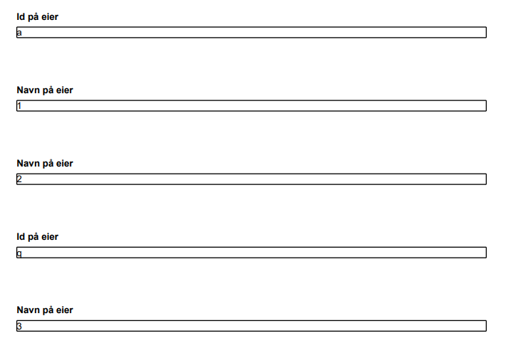

It is possible to exclude components, or entire pages from being a part of the pdf generation. 

There are two options when excluding data from a PDF: 

Det er to måter å ekskludere data fra PDF på

1. Configuring in the `Settings.json` file in the `App/ui` folder
2. Programmatically  
   For the programatically option there are some minor differences dependening on the version you are using.

{}


In previous versions you modify the `PdfHandler.cs` file in the `App/logic/Print` folder.



In version 7 the way to do custom code has changed. We now use an dependency injection based approach insted of overriding methods. If you previously used to place your custom code in the _FormatPdf_ methods in the _PdfHandler.cs_ class you will see that it's mostly the same, but in v7 there is no pre-defined class for you to put your custom code. Instead, do the following:

1. Create a class that implements the `IPdfFormater` interface found in the `Altinn.App.Core.Features.Pdf` namespace.  
    You can name and place the file in any folder you like within your project, but we suggest you use meaningful namespaces like in any other .Net project.
2. Register you custom implementation in the _Program.cs_ class
    ```C#
    services.AddTransient<IPdfFormater, PdfFormater>();
    ```
    This ensuers your custom code is known to the application and that it will be executed.


Since the `IPdfFormater` interface has the same method as the old `PdfHandler.cs`class the rest of the documentation and examples applies to all versions.

{}
If a page/component is to always be excluded from the PDF, it is recommended that this is
set in the configuraiton file.

If exclusion of a page/component depends on dynamics it _must_ be done programmatically.
{}

### Exclude pages

In the examples below, the page with id _page2_ is excluded from the PDF PDF.

### Configuration

Setup in `Settings.json` under `App/ui`:

```json {linenos=false,hl_lines=["3-5"]}
{
  "$schema": "https://altinncdn.no/schemas/json/layout/layoutSettings.schema.v1.json",
  "pages": {
    "excludeFromPdf": ["page2"]
  }
}
```

### Programmatically

```cs
public async Task<LayoutSettings> FormatPdf(LayoutSettings layoutSettings, object data)
{
    if (data.GetType() == typeof(Skjema))
    {
        layoutSettings.Pages ??= new();
        layoutSettings.Pages.ExcludeFromPdf ??= new();
        layoutSettings.Pages.ExcludeFromPdf.Add("page2");
    }
    return await Task.FromResult(layoutSettings);
}
```

## Exclude components


In the examples below, the component with id _image-component-id_ is excluded from the PDF.

### Configuration

Setup in `Settings.json` under `App/ui`:

```json {linenos=false,hl_lines=["3-5"]}
{
  "$schema": "https://altinncdn.no/schemas/json/layout/layoutSettings.schema.v1.json",
  "components": {
    "excludeFromPdf": ["image-component-id"]
  }
}
```

### Programmatically

```cs
public async Task<LayoutSettings> FormatPdf(LayoutSettings layoutSettings, object data)
{
    if (data.GetType() == typeof(Skjema))
    {
        layoutSettings.Components ??= new();
        layoutSettings.Components.ExcludeFromPdf ??= new();
        layoutSettings.Components.ExcludeFromPdf.Add("image-component-id");
    }
    return await Task.FromResult(layoutSettings);
}
```

## Exclude components in a repeating group

If you need to exclude one or more components from an entry in a repeating group, 
this is done by specifying the index of the group element in addition to the component id. 

The required format is: `componentId-<groupIndex>`.

If the component should be excluded for all elements in the repeating group, follow the instructions for the
section above.

In the example below, the component with id _ownerId_ in the group element with index 1 is excluded from the PDF.

### Programmatically

```cs
public async Task<LayoutSettings> FormatPdf(LayoutSettings layoutSettings, object data)
    {
        if (data.GetType() == typeof(Skjema))
        {
            layoutSettings.Components ??= new();
            layoutSettings.Components.ExcludeFromPdf ??= new();
            layoutSettings.Components.ExcludeFromPdf.Add("ownerId-1");
        }
        return await Task.FromResult(layoutSettings);
    }
```

The picture below shows that the component with index 0 and 2 is kept in the PDF, 
whilst the component with index 1 is excluded. 


