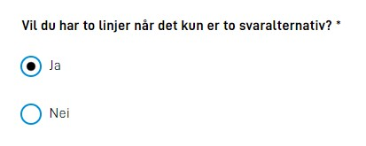

{}

This is new functionality. Setup must be done manually for now. Support for setup through Altinn Studio will be launched shortly.

**NOTE:** to use this functionality you need app-frontend version 3. See [this link](/community/changelog/app-frontend/v3/breaking-changes/) for changes that is required in the app.

{}

## Components placed side by side (grid)

It is possible to place components side by side in a form. This functionality is based on the grid system from [Material-UI](https://material-ui.com/components/grid/), and is similar to the grid system from bootstrap.
The grid system is based on a construction of containers in 12 parts, where you can assign children (items) of a grid-container a given part of this width. Material-UI also offers the ability to dynamically change how much of the screen you want to occupy based on which screen size the user is on.
The following sizes with breakpoints are defined:

- **xs**: 0px
- **sm**: 600px
- **md**: 1024px
- **lg**: 1440px
- **xl**: 1920px

To place components side by side horizontally, small changes must be done in formlayout. A seperate property `grid` has been defined, where you can fill in desired width on the different sizes. Here is an example where two input fields has been set to cover half the screen (some props are removed for readability):

```json
 {
     {
        "id": "input-felt-1",
        "type": "Input",
        ... 
        "grid": {
          "xs": 6,
        }
      },
      {
        "id": "input-felt-2",
        "type": "Input",
        ...
        "grid": {
          "xs": 6
        }
      }
}

```

For the components above, the size has been set to 6 (half width) for the size `xs`. Since: `xs` is the smallest size available, this will apply from size `xs` and up, i.e. from `xs` to `xl`.
The setup above will give the following result:


Since there are 12 sections available on the page width, it is up to the app developer to assign how large of a share a component should have. If you want a component to take up 2/12, and another 6/12 and the last one 4/12, then this is possible. 
It is important to consider the user experience when performing these changes, and before you place components side by side you should think it through. Components with longer texts and descriptions quickly become small and unclear if these are placed side by side. If you are to use longer texts and descriptions it is recommended that these occupy the full width of the form.

If you in the example above wanted the components to take up the whole width of the screen, until the screen passed 960px in size, you could set up the following layout:

```json
 {
     {
        "id": "input-felt-1",
        "type": "Input",
        ... 
        "grid": {
          "xs": 12,
          "sm": 12,
          "md": 6
        }
      },
      {
        "id": "input-felt-2",
        "type": "Input",
        ...
        "grid": {
          "xs": 12,
          "sm": 12,
          "md": 6
        }
      }
}

```

Then, the components would not be be placed side by side unless the user is using a screen of 960px or more. 

### innerGrid og labelGrid

In addition to setting the width of the `grid` in the component, we also have added the opportunity to control `innerGrid` and `labelGrid`. 
This gives you the opportunity to control the width of label and input in the same way. This is typically used when
you want to make an input field smaller (to give a visual indication that a small answer is expected), or if you want to display
label and input on the same line (like in a table.)

You can think of the component in this manner:
```html
<Grid id="grid"> 
    <Grid id="labelGrid">
        Komponentens tekster
    </Grid>
    <Grid id="innerGrid"> 
        Komponentens input
    </Grid>
</Grid>
```

Here, you will have the opportunity to control the width of both the outer grid and the inner grid. Example:

```json
{
     {
        "id": "input-felt-1",
        "type": "Input",
        ... 
        "grid": {
          "xs": 12,
          "innerGrid": {
              "xs": 6
          }
        }
      }
}

```

Here, it has been set that the component grid shall occupy the whole width, while limiting the component's input to only occupy half the width.
Innergrid can be controlled for these components:
- Input
- TextArea
- FileUpload
- Dropdown
- Datepicker


The example above will give the following output:


A tableview with labels placed to the side will appear if you set `labelGrid` and `innerGrid` so that the sum equals 12
(or less). This may be wise if you have a long list of related questions. It is often wise to not use
such a layout on the smallest screens, so feel free to use `md`.

```json
{
     {
        "id": "input-felt-1",
        "type": "Input",
        ... 
        "grid": {
          "labelGrid": {
              "md": 8
          },
          "innerGrid": {
              "md": 4
          }
        }
      }
}
```

This will look something like this:


## Two radiobuttons or checkboxes vertically aligned
By default radiobuttons and checkboxes with only two options will be displayed on one line. If you would like them to be displayed below each other as this:



you need to change/add "layout":"column" in the component configuration.
```json
{
        "id": "radio-under-hverandre",
        "type": "RadioButtons",
        "textResourceBindings": {
          "title": "Vil du har to linjer når det kun er to svaralternativ?"
        },
        "dataModelBindings": {
          "simpleBinding": "someRadiobuttonFieldWith2Options"
        },
        "options": [
          {
            "value": "1",
            "label": "Ja"
          },
          {
            "value": "0",
            "label": "Nei"
          }
        ],
        "required": true,
        "layout": "column"
      }
```

## Formatting numbers
Support has now been implemented to be able to specify formatting of numbers in input fields. This is done by adding a property `formatting` to
the input component. Formatting options are documented in a [JSON-schema](https://altinncdn.no/schemas/json/component/number-format.schema.v1.json),
and will appear automatically in intellisense when editing the component in e.g. VSCode.

The example below will result in an input field for numbers, where the number will be formatted with `,` between each thousand, and `$` in front of the number.

{}
The formatting is for frontend display only, and the numbers added to an input field with formatting will be saved unformatted.
{}


```json {hl_lines=["12-16"]} {linenos=inline}
{
  "id": "numberComponent",
  "type": "Input",
  "textResourceBindings": {
    "title": "number",
  },
  "dataModelBindings": {
    "simpleBinding": "someNumberField"
  },
  "required": true,
  "readOnly": false,
  "formatting": {
    "number": {
      "thousandSeparator": ",",
      "prefix": "$"
    }
  }
},
```
### Language-sensitive number formatting
It is possible to assign dynamic formatting of numbers in input fields. Can choose between the objects ```"currency"``` and ```"unit"```. Based on selected language in the app, they formatting thousand and decimal separators and prefix/suffix. 
Currency consists of ```"valuta"``` and ```"position"```. Unit consists of ```"unitType"``` and ```"position"```.   
Valid values for position are ```"prefix"``` and ```suffix```, but are optional to use.  
Default positions, prefix in currency and suffix in unit.

Examples:  
>```"currency": {valuta: "NOK", position: "prefix"}```  
>```"unit": {unitType: "kilogram", position: "suffix"}```

App developer can choose to leave some of the parts independent of the language. Properties in ```number``` overrides dynamic formatting. The configuration below makes prefix display as **kr** and thousand separator as **whitespace**. Otherwise in english, prefix would be **NOK** and thousand separator **","**

```json {hl_lines=["5-7","9-11"]} {linenos=inline}
{
  "id": "numberComponent",
  "type": "Input",
  "formatting": {
    "currency": {
      "valuta": "NOK", 
      "position": "prefix"
    },
    "number": {
      "thousandSeparator": " ",
      "prefix": "kr"
    }
  }
},
```


Valid values for **currency** are ISO 4217 currency codes, such as **NOK** for Norwegian kroner. [List of valid currencies](https://github.com/unicode-org/cldr/blob/main/common/validity/currency.xml)  
Valid values for **unit** are for now the following list:  
> celsius **|** centimeter **|** day **|** degree **|** foot **|** gram **|** hectare **|** hour **|** inch **|** kilogram **|** kilometer **|** liter **|** meter **|** milliliter **|** millimeter **|** millisecond **|** minute **|** month **|** percent **|** second **|** week **|** year 


## Aligning text in input fields
When a schema contains a list of numbers that are automatically summarized, it is common to align text to the right,
like when summarizing on paper and how Excel shows numbers. This can be done by setting `"align": "right"` under `formatting`
on the input componenten. Other valid values are `"center"` and `"left"`.


```json {hl_lines=["10"]} {linenos=inline}
{
  "id": "numberComponent",
  "type": "Input",
  ...
  "formatting": {
    "number": {
      "thousandSeparator": " ",
      "prefix": "kr "
    },
    "align":"right"
  }
},
