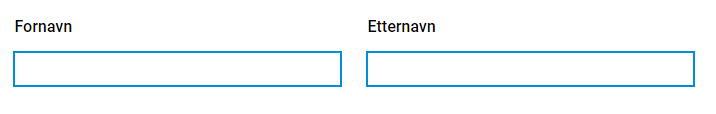
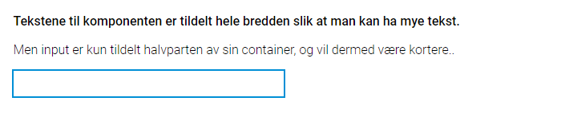
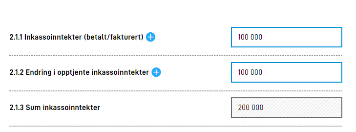
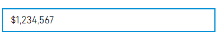

{}

Dette er helt ny funksjonalitet. Oppsett må gjøres manuelt inntil videre. Støtte for oppsett via Altinn Studio kommer snart.

**MERK:** for å benytte denne funksjonaliteten må man ha app-frontend versjon 3. Se [denne lenken](/community/changelog/app-frontend/v3/breaking-changes/) om endringer som må til i appen.

{}

## Sidestilte komponenter (grid)

Det er mulig å sidestille komponenter i skjema. Denne funksjonaliteten baserer seg på grid systemet til [Material-UI](https://material-ui.com/components/grid/), og vil også være kjent om man er kjent med grid-systemet til boostrap.
Grid systemet baserer seg på en oppbygning av containere i 12 deler, hvor man så kan tildele barn (items) av en grid-container en gitt andel av denne bredden. Material-UI tilbyr også muligheten til å dynamisk endre hvor stor andel av skjermen man ønsker å oppta basert på hvilken skjermstørrelse sluttbrukeren har.
Følgende størrelser med tilhørende breakpoints er definert:

- **xs**: 0px
- **sm**: 600px
- **md**: 1024px
- **lg**: 1440px
- **xl**: 1920px

For å sidestille komponenter horisontalt må man gjøre noen små endringer i formlayout. Det er definert en egen property `grid` som man kan fylle inn bredde ønsket på de ulik størrelsene. Her er et eksempel hvor to input-felt har blitt satt til å ta halve skjermen (enkelte props er fjernet for lesbarhet):

```json
 {
     {
        "id": "input-felt-1",
        "type": "Input",
        ... 
        "grid": {
          "xs": 6,
        }
      },
      {
        "id": "input-felt-2",
        "type": "Input",
        ...
        "grid": {
          "xs": 6
        }
      }
}

```

I komponentene over er størrelsen satt til 6 (altså halv bredde) for størrelse `xs`. Siden `xs` er den minste størrelsen tilgjengelig vil dette gjelde fra størrelse `xs` og opp, altså fra `xs` til `xl`.
Oppsettet over vil gi følgende resultat:



Siden man har 12 inndelinger tilgjengelig i sidebredden er det opp til apputvikler å tildele hvor stor andel komponenten skal ha. Om man ønsker at en komponent skal ta 2/12, en annen 6/12 og siste 4/12 så er det mulig.
Det er viktig å tenke på brukeropplevelsen når man gjør slike endringer, og sidestilling av komponenter bør gjøres med omhu. Komponenter med lengre tekster og beskrivelser blir også fort små og uoversiktelige om disse sidestilles. Skal det benyttes lengre tekster og beskrivelser anbefales det at disse benytter full bredde av skjema.

Om man i eksempelet over hadde ønsket at komponentene skulle ta hele bredden frem til skjermen ble større enn 960px så kunne man satt opp følgende layout:

```json
 {
     {
        "id": "input-felt-1",
        "type": "Input",
        ... 
        "grid": {
          "xs": 12,
          "sm": 12,
          "md": 6
        }
      },
      {
        "id": "input-felt-2",
        "type": "Input",
        ...
        "grid": {
          "xs": 12,
          "sm": 12,
          "md": 6
        }
      }
}

```

Da ville komponentene først legge seg sidestilt i det sluttbruker faktisk sitter på en skjerm som oppfyller kravet stilt.

### innerGrid og labelGrid

Utover det å sette bredde på `grid` i komponenten har vi også lagt til mulighet til å styre `innerGrid` og `labelGrid`. 
Dette gir deg mulighet til å påvirke på samme måte hvor stor bredde label og input skal ta. Dette brukes typisk når du
vil gjøre input feltet mindre (for å gi en visuell markering av at det forventes kort svar), eller hvis du ønsker å vise
label og input på samme linje (som i en tabell).

Du kan tenke på komponenten på denne måten:
```html
<Grid id="grid"> 
    <Grid id="labelGrid">
        Komponentens tekster
    </Grid>
    <Grid id="innerGrid"> 
        Komponentens input
    </Grid>
</Grid>
```

Her vil det da være mulig å styre bredden til både ytterste grid og den innerste griden. Eksempel:

```json
{
     {
        "id": "input-felt-1",
        "type": "Input",
        ... 
        "grid": {
          "xs": 12,
          "innerGrid": {
              "xs": 6
          }
        }
      }
}

```

Her har man satt at komponent griden skal ta hele bredden, mens man begrenser komponentens input til å kun ta halve bredden.
InnerGrid vil kunne styres for komponentene:
- Kort svar (Input)
- Langt svar (TextArea)
- Filopplaster (FileUpload)
- Nedtrekksliste (Dropdown)
- Datovelger (Datepicker)


Eksempelet over vil gi følgende output:



En tabellvisning med sidestilt label vil komme frem hvis du setter `labelGrid` og `innerGrid` slik at summen blir 12 
(eller mindre). Dette kan være lurt hvis du har en lang liste med relaterte spørsmål. Det er ofte lurt å ikke bruke
et slikt layout på de minste skjermene, så bruk gjerne `md`

```json
{
     {
        "id": "input-felt-1",
        "type": "Input",
        ... 
        "grid": {
          "labelGrid": {
              "md": 8
          },
          "innerGrid": {
              "md": 4
          }
        }
      }
}
```

Det vil se omtrent slik ut



## To radioknappalternativer eller avkrysningsbokser under hverandre
Som standard kommer radioknapper eller checkboxer som har kun to svaralternativer, på én linje. Dersom man ønsker at svarene skal ligge på hver sin linje slik:


må man legge til "layout":"column" for radioknappelementet på siden.
```json
{
        "id": "radio-under-hverandre",
        "type": "RadioButtons",
        "textResourceBindings": {
          "title": "Vil du har to linjer når det kun er to svaralternativ?"
        },
        "dataModelBindings": {
          "simpleBinding": "someRadiobuttonFieldWith2Options"
        },
        "options": [
          {
            "value": "1",
            "label": "Ja"
          },
          {
            "value": "0",
            "label": "Nei"
          }
        ],
        "required": true,
        "layout": "column"
      }
```

## Formatering av tall
Det er nå implementert støtte for å kunne spesifisere formatering av tall i _inputfelt_. Dette gjøres ved å legge til en property `formatting` på
Input-komponenten. Formateringsmuligheter er dokumentert i et [JSON-schema](https://altinncdn.no/schemas/json/component/number-format.schema.v1.json),
og vil dukke opp automatisk i intellisense når man redigerer komponenten i f.eks. VSCode. 

Eksempelet under vil resultere i et inputfelt for tall, hvor tallet vil bli formatert med `,` mellom hver tusen, og `$` foran tallet.

{}
Formateringen er kun for visning i frontend, og tallene som legges inn i et inputfelt med formatering vil lagres uformatert.
{}



```json {hl_lines=["12-16"]} {linenos=inline}
{
  "id": "numberComponent",
  "type": "Input",
  "textResourceBindings": {
    "title": "number",
  },
  "dataModelBindings": {
    "simpleBinding": "someNumberField"
  },
  "required": true,
  "readOnly": false,
  "formatting": {
    "number": {
      "thousandSeparator": ",",
      "prefix": "$"
    }
  }
},
```

## Aligning text in input fields
When a schema contains a list of numbers that are automatically summarized, it is common to align text to the right,
like when summarizing on paper and how Excel shows numbers. This can be done by setting `"align": "right"` under `formatting`
on the input componenten. Other valid values are `"center"` and `"left"`.


```json {hl_lines=["10"]} {linenos=inline}
{
  "id": "numberComponent",
  "type": "Input",
  ...
  "formatting": {
    "number": {
      "thousandSeparator": " ",
      "prefix": "kr "
    },
    "align":"right"
  }
},
