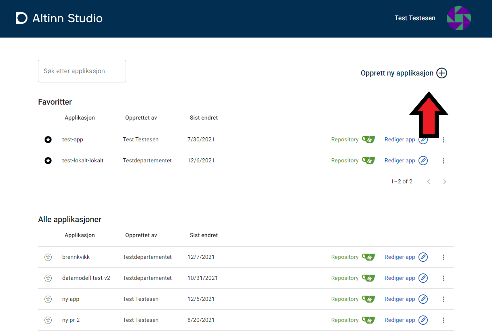
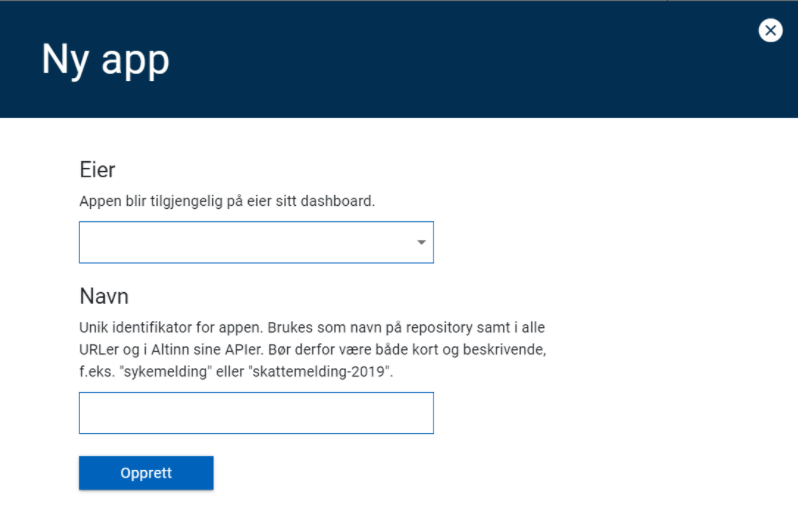
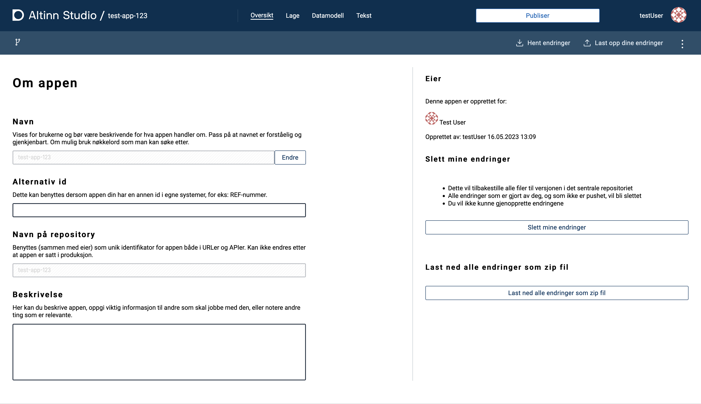

Altinn Studio brukes til å opprette applikasjoner (apps).
En app kan være alt fra enkle skjemaer til større applikasjoner med både API-er og UI.

Du lager en ny app fra [Altinn Studio dashboardet](https://altinn.studio/dashboard) (hvis du ikke ser dashboardet, klikk på logoen i øverste venstre hjørne).

1. Klikk på **Opprett ny applikasjon** i det øvre høyre hjørnet av dashboardet (indikert med rød pil).
2. Velg **eier** av appen i nedtrekksmenyen.

    Dette kan være en organisasjon du har tilgang til eller ditt eget brukernavn. Valget er deaktivert hvis din bruker er eneste alternativ.
3. Legg inn **navnet** på appen.

    Dette navnet er en ID brukt til å identifisere appen og brukes også som navn på repository, i URL-er og API-er.  

    >  **Applikasjonsnavn (ID)...**
    >
    > - bør være kort og beskrivende (for eksempel "sykemelding" eller "lokalvalg-2024")
    > - kan kun inneholde små bokstaver, tall og bindestrek (-)
    > - må begynne med en bokstav
    > - må ende med en bokstav eller et tall
    > - _**kan ikke endres etter at appen er opprettet**_

4. Opprett appen ved å klikke "**Opprett applikasjon**".

    

Når appen er opprettet vil du videresendes til en oversiktsside.
Herfra kan du navigere til **Lage**, **Datamodell** og **Tekst** via hovedmenyen for å begynne å utviklingen av appen.

