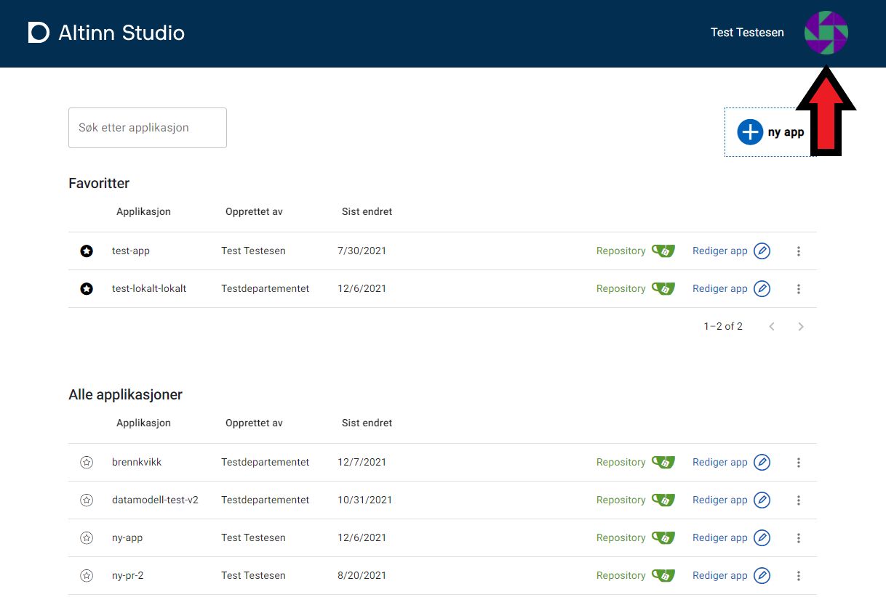
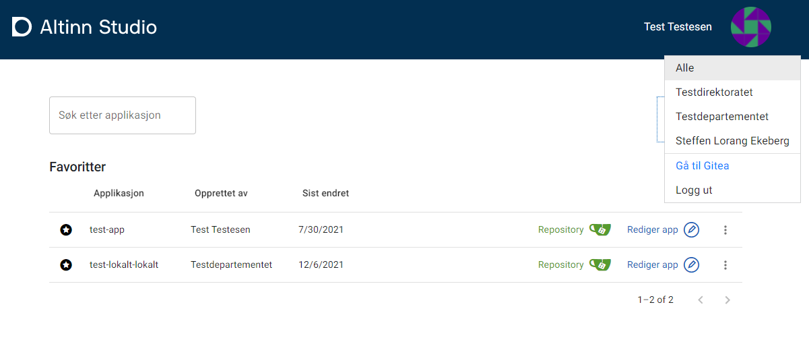
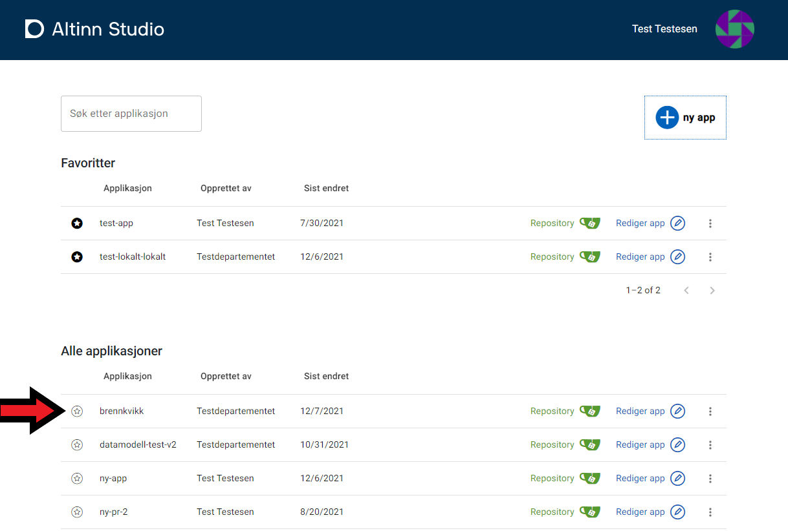

## Kontekst
I dashboardet har man mulighet til å sette hvilken kontekst man ønsker å filtrere applikasjoner på. Dette gjøres ved å klikke på profilikonet til høyre i dashboardet.

Her vil man få opp en meny over hvilke kontekster man kan filtrere på. Konteksten kan være en organisasjon man er del av, alle, eller seg selv.

Velger man en gitt organisajon vil det kun være disse appene som er synlig i listen i dashboardet.

## Favoritter
Fra dashboardet har man enkel tilgang til sine favoritter. Favorittene i dashboardet gjenspeiler "Star"-konseptet i Gitea, og markerer du et repository som starred i gitea vil det dukke opp som favoritt i dashboardet.
Disse applikasjonene vil alltid ligge øverst i dashboardet og vil være synlige uavhengig av valgt kontekst.

For å legge til eller fjerne en favorittmarkering kan man toggle stjerne-ikonet.

## Søk
Fra dashboardet kan man gjøre et søk blant de applikasjonene man har tilgang til. Dette gjøres fra søkefeltet, og resultatet vil dukke opp i listen under.

