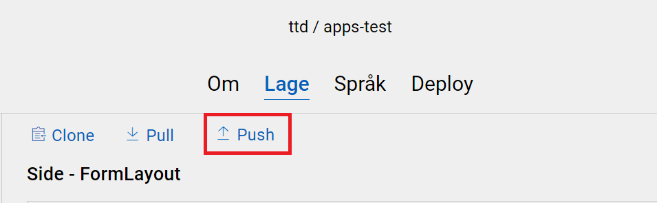
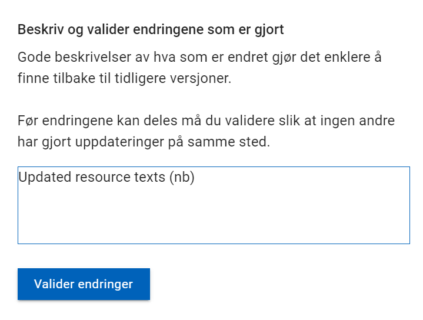
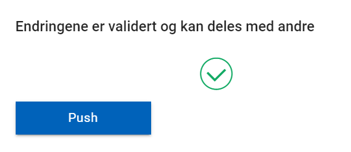
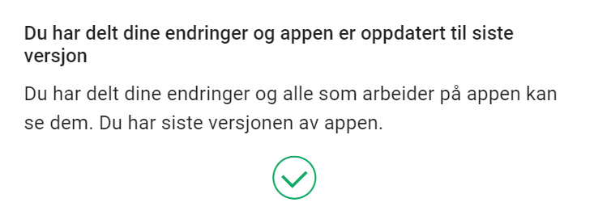
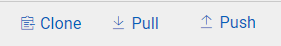

Under utvikling av en applikasjon vil man måtte jobbe både i Altinn Studio og 
i et lokalt utviklingsmiljø. 
Her er en oversikt over hvordan du kommer i gang med lokal utvikling. 

## Forberedelser 

Følg [stegene beskrevet på GitHub](https://github.com/Altinn/altinn-studio/blob/master/docs/LOCALAPP.md#prerequisites)
for å klargjøre ditt lokale utviklingsmiljø for utvikling og testing av Altinn apps

## Hvordan klone applikasjonen til et lokalt utviklingsmiljø

1. Finn applikasjonen du vil jobbe med lokalt i Dashboardet i Altinn Studio
   
2. Navigér til repositoriet ved å trykke på _Repository_-knappen
    

3. Kopiér lenken til repoet (den blå firkanten), enten manuelt
   eller ved å trykke på knappen markert med en rød sirkel.
    

4. Åpne en terminal i ditt lokale utviklingsmiljø
    - Naviger til ønsket lokasjon for applikasjonsrepoet
    - Skriv kommandoen `git clone` og lim inn URLen du kopierte i forrige steg
   
    ```cmd
    $git clone https://altinn.studio/repos/ORG/APP.git
    ```
   
    - I terminalen skal du se en output som likner dette
   
    ```cmd
    Cloning into 'APP'...
    remote: Enumerating objects: 982, done.
    remote: Counting objects: 100% (982/982), done.
    remote: Compressing objects: 100% (950/950), done.
    remote: Total 982 (delta 600), reused 0 (delta 0), pack-reused 0 
    Receiving objects: 100% (982/982), 166.38 KiB | 1.51 MiB/s, done.
    Resolving deltas: 100% (600/600), done.
    ```

Du vil nå se at det er opprettet en mappe der innholdet i applikasjonsrepoet nå er klonet inn.
Nå er det bare å åpne ditt foretrukne utviklingsverktøy og komme i gang med utviklingen.

## Hvordan synkronisere endringer i Altinn Studio

### Laste opp endringer til master

1. Trykk på _Push_ på Lage-siden til applikasjonen i Altinn Studio
   
2. Legg inn en beskrivende tekst for endringen(e) og trykk _Valider endringer_
    
3. Vent på at endringene valideres
   1. Oppstår det en konklikt trykker du på _Løs konflikt_ og følger instruksjonene
4. Trykk push for å laste opp endringene til master
    
5. Har alt gått bra vil du se denne bekreftelsen.
    

### Laste ned endringer fra master
1. Trykk på _Pull_ på Lage-siden til applikasjonen i Altinn Studio
   
2. Har alt gått bra vil du se denne bekreftelsen.
    

## Hvordan synkronisere endringer i lokalt utviklingsmiljø

Sykronisering av endringer gjort i det lokale utviklingsmiljøet kan gjøres på flere måter.
Mange utviklingsverktøy har gode integrasjoner for nettopp dette, 
sjekk gjerne om ditt verktøy har den typen støtte. 

Nedenfor er det beskrevet hvordan man kan synkronisere endringer 
fra kommandolinjen.

### Laste opp endringer til master

1. Navigér til applikasjonsrepoet ditt i en terminal.

2. Legg til filene du ønsker å pushe til master med kommandoen `git add {sti til filen}`
   Kommandoen kan kjøres for enkelt filer, flere filer samtidig eller en mappe

3. _Commit_ endringene med en fornuftlig melding med kommandoen `git commit -m {commit-melding}`

4. Push endringene til master med kommandoen `git push`

### Laste ned endringer fra master

Navigér til applikasjonsrepoet ditt i en terminal og kjør kommandoen `git pull`.

[Les mer om _git pull_ her](https://git-scm.com/docs/git-pull)