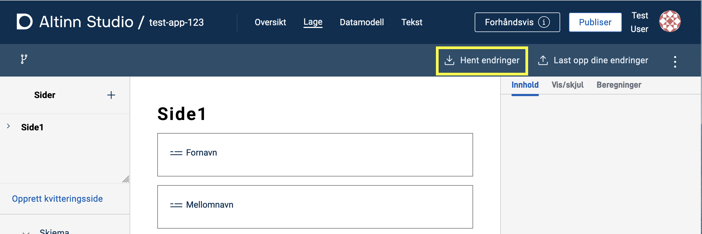
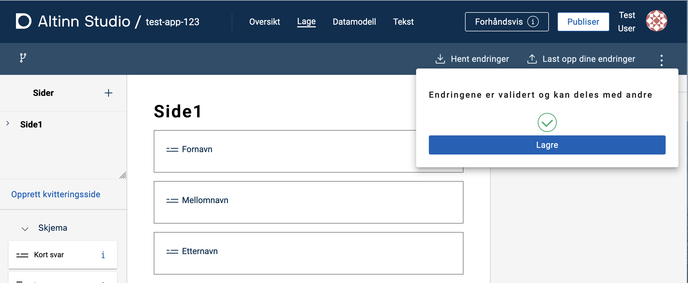

Under utvikling av en applikasjon vil man måtte jobbe både i Altinn Studio og 
i et lokalt utviklingsmiljø. 
Her er en oversikt over hvordan du kommer i gang med lokal utvikling. 

## Hvordan klone applikasjonen til et lokalt utviklingsmiljø

1. Finn applikasjonen du vil jobbe med lokalt i Dashboardet i Altinn Studio
2. Navigér til repositoriet ved å trykke på _Repository_-knappen
    
3. Kopiér lenken til repoet (den blå firkanten), enten manuelt
   eller ved å trykke på knappen markert med en rød sirkel.
    
4. Åpne en terminal i ditt lokale utviklingsmiljø
    - Naviger til ønsket lokasjon for applikasjonsrepoet
    - Skriv kommandoen `git clone` og lim inn URLen du kopierte i forrige steg
    ```cmd
    $ git clone https://altinn.studio/repos/<org>/<app-name>.git
    ```
    - I terminalen skal du se en output som likner dette
    ```cmd
    Cloning into 'app-name'...
    remote: Enumerating objects: 982, done.
    remote: Counting objects: 100% (982/982), done.
    remote: Compressing objects: 100% (950/950), done.
    remote: Total 982 (delta 600), reused 0 (delta 0), pack-reused 0 
    Receiving objects: 100% (982/982), 166.38 KiB | 1.51 MiB/s, done.
    Resolving deltas: 100% (600/600), done.
    ```

En mappe med samme navn som applikasjonen er opprettet og innholdet i applikasjonsrepoet er klonet inn i mappen.
 Nå er det bare å åpne ditt foretrukne utviklingsverktøy og komme i gang med utviklingen.

## Hvordan synkronisere endringer i lokalt utviklingsmiljø

Endringer som gjøres lokalt må lastes opp (_pushes_) til repoet koden ble klonet fra.
 Hvis det gjøred endringer i Altinn Studio Designer (og disse er lastet opp til repoet) må de hentes ned (_pull_) for å oppdatere den lokale koden.

Sykronisering av endringer gjort i det lokale utviklingsmiljøet kan gjøres på flere måter.
Mange utviklingsverktøy har gode integrasjoner for nettopp dette, 
sjekk gjerne om ditt verktøy har den typen støtte. 

Nedenfor er det beskrevet hvordan man kan synkronisere endringer 
fra kommandolinjen.

### Laste opp endringer

1. Navigér til applikasjonsrepoet ditt i en terminal.
2. Legg til filene du ønsker å laste opp endringer for (_pushe_) med kommandoen `git add <sti til filen>`.
   Kommandoen kan kjøres for enkeltfiler, flere filer samtidig eller en mappe.
3. Lagre (_commit_) endringene med en fornuftlig melding med kommandoen `git commit -m <commit-melding>`
4. Last opp (_push_) endringene til master med kommandoen `git push`.

### Laste ned endringer

Navigér til applikasjonsrepoet ditt i en terminal og kjør kommandoen `git pull`.

[Les mer om _git pull_ her](https://git-scm.com/docs/git-pull)

## Hvordan synkronisere endringer i Altinn Studio

I Altinn Studio må endringer synkroniseres på samme vis som ved lokale endringer.

### Laste ned endringer
1. Trykk på _Hent endringer_ på Lage-siden til applikasjonen i Altinn Studio.
   
2. Har alt gått bra vil du se denne bekreftelsen.
    

### Laste opp endringer

1. Trykk på _Last opp dine endringer_ på Lage-siden til applikasjonen i Altinn Studio.
   
2. Legg inn en beskrivende tekst for endringen(e) og trykk _Valider endringer_.
    
3. Vent på at endringene valideres. Oppstår det en konflikt trykker du på _Løs konflikt_ og følger instruksjonene.
4. Trykk _Lagre_ for å laste opp endringene til repoet (master).
    
5. Har alt gått bra vil du se denne bekreftelsen.
    

## Lokal testing

Når du jobber lokalt kan det være nyttig med forhåndsvisning av endringene du gjør.
*LocalTest* er et program som spinner opp en lokal mockup av Altinn Plattform.
 Denne gir deg mulighet til å teste og verifisere lokale endringer uten å måtte synkronisere med Altinn Studio.

{}
**MERK**
For å kunne kjøre appen i LocalTest må applikasjonen ha en tilknyttet [datamodell](/nb/app/development/data/data-modeling/).
{}

1. **Last ned og start LocalTest** ved å følg stegene [beskrevet på GitHub](https://github.com/Altinn/app-localtest/blob/master/README.md) (inkluderer start av app som også er forklart under).
2. **Kjør applikasjonen i LocalTest**: Åpne et nytt terminalvindu og naviger til undermappen *App* i din applikasjon (`<app-name>/App`). Start appen med kommandoen `dotnet run` og vent på bekreftelse i terminalen.
3. **Forhåndsvis og test applikasjonen**: Gå til [http://local.altinn.cloud](http://local.altinn.cloud) og logg inn med en [testbruker](/nb/app/testing/local/testusers/).

### Se endringer fortløpende

- Ved endringer knyttet til JSON-filer holder det å laste inn siden på nytt.
- Ved endringer i forhåndsutfylling må applikasjonen instansieres på nytt (gå til [http://local.altinn.cloud](http://local.altinn.cloud) og logg inn igjen).
- Ved endringer i *cs*-filer må applikasjonen stoppes (`ctrl+C`) og startes på nytt (`dotnet run`).

For å oppdatere automatisk ved endring i *cs*-filer, start applikasjonen med `dotnet watch`.
Denne kommandoen vil enten starte applikasjonen eller laste den inn på nytt ([hot reload](https://learn.microsoft.com/en-us/dotnet/core/tools/dotnet-watch#hot-reload)) ved endringer i kildekoden.

### Stoppe applikasjon og LocalTest

Applikasjonen stoppes ved å trykke `ctrl+C` i terminalvinduet der du startet den.
LocalTest stoppes ved å navigere til mappen `app-localtest` i terminalen og kjøre kommandoen `docker compose down`.
