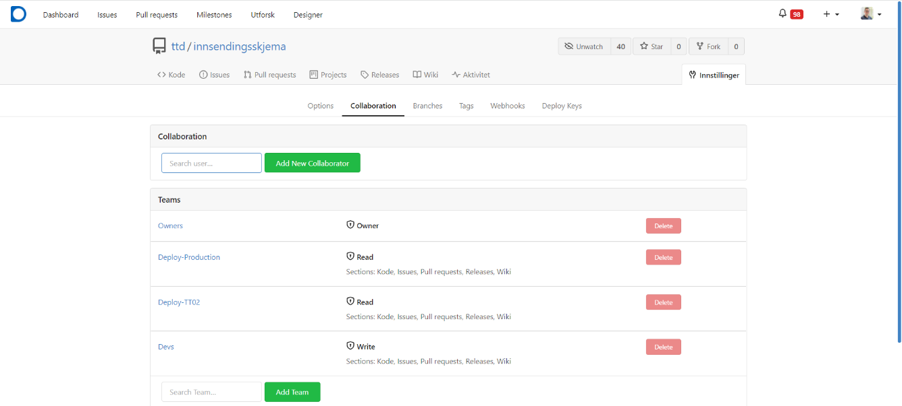

## Access Management for the Organization

As the owner of an organization in Altinn Studio, you have the ability to configure the access for other users
associated with the organization. This is done via Gitea at the following link:
https://altinn.studio/repos/org/{org}/teams/ Remember to replace `{org}`.

Four standard teams have been defined that set guidelines for what a user is allowed to do within an organization in
Altinn Studio. If necessary, as an owner, you can add/remove users in teams, create new teams, and change configurations
of existing teams.

### Owners
Members of this team can be considered as administrators for the organization. 
They will be able to manage access control for all teams and repositories related to the organization.

As a member of this team, you can:

- create/delete teams 
- add and remove users in various teams
- change configuration for teams

#### Configuration
This team is standard in all organizations and it is not possible to change the configuration for this team.

### Deploy-Production
Members of this team can deploy applications to the production environment.

Other rights can be freely defined by owners.
The default configuration includes rights for:

- Read access in all repositories
- Cannot create new repositories 
- Full access to all areas in Gitea

#### Configuration
The configuration of this team can be adjusted by owners as needed, 
the ability to deploy to the production environment is not dependent on the rest of the config.

The standard configuration for the team includes rights to:

- Read all repositories
- Access all areas in Gitea

### Deploy-TT02
Members of this team can deploy applications to the test environment.

Other rights can be freely defined by owners.
The default configuration includes rights for:

- Read access in all repositories
- Cannot create new repositories 
- Full access to all areas in Gitea

#### Configuration

  The configuration of this team can be adjusted by owners as needed, 
  the ability to deploy to the test environment is not dependent on the rest of the config.
  
  The standard configuration for the team includes rights to:
  - Read all repositories
  - Access all areas in Gitea

### Devs
Members of this team work on developing applications and have access to all repositories.

#### Configuration
The configuration of this team can be adjusted by owners as needed,
depending on how much freedom you want the app developer to have.
Note that it is possible to specify which repository(ies) the team should have access to.

The standard configuration for the team includes rights to:

- Create new repositories
- Write to all repositories
- Access all areas in Gitea

## Access Management for Repository

An administrator for the organization can also control who has access to each repository. This is done by going to the
repository in Gitea, and navigating to the `Collaboration` tab under `Settings`. Access can be granted to both teams and
individual users. To maintain oversight, we primarily recommend setting up teams for access control. To give a team
access, search for it and click `Add Team`.

