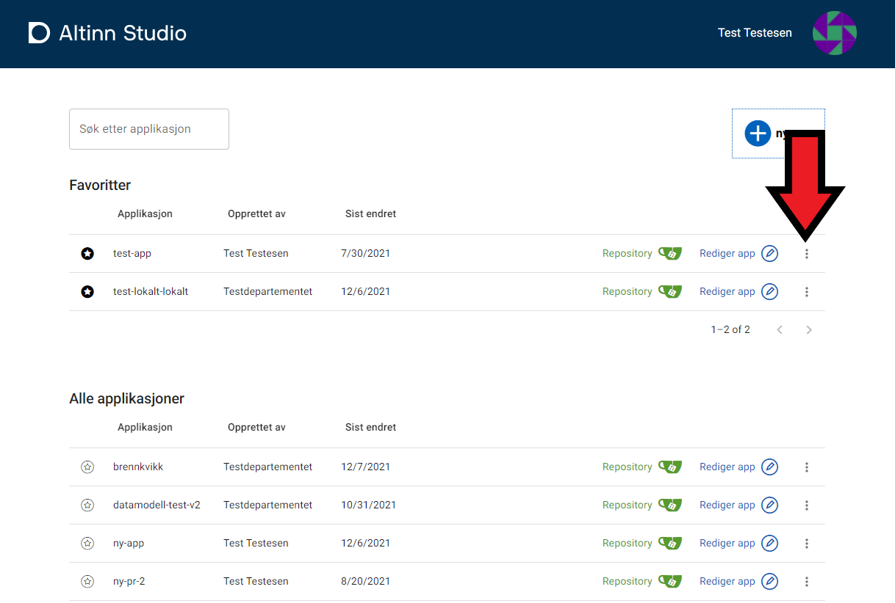
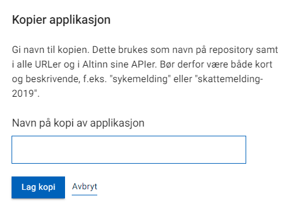
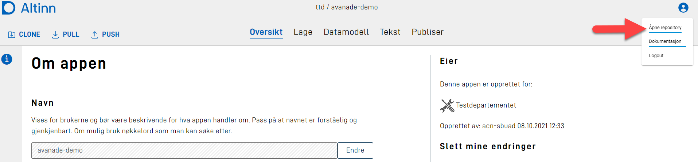
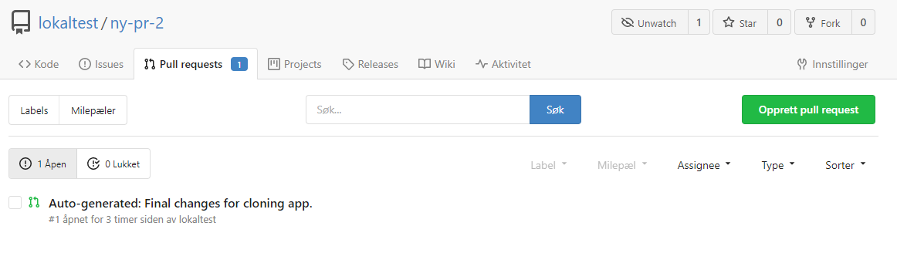
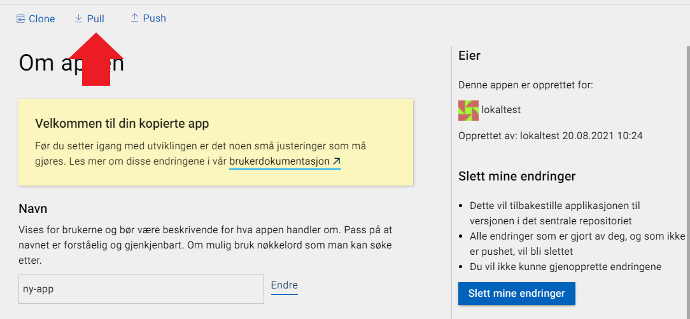

In Altinn Studio you can make a copy of an existing application within an organization. This is done through the dashboard.
In order to do this you have to have permission to create new repositories within your org. Members of the teams "**Owners**" and "**Developers**" have these rights by default.
If you don't have permissions you should talk to your organizations administrator.

1. Click the "..."-icon in the far right table row of the app you want to copy.
2. Press "**Lag kopi**" from the menu
3. Add the **name** you want for the new application. This name is used to identify the application, as well as the repository name, and URLS and API's.
   The name should be short and descriptive, for instance "sick-leave" or "local-election-2019". 
    _The name can not be changed after the application has been published._
4. Create the copy by clicking "**Kopier app**".
5. When the application has been copied you will be redirected to the copied app.
6. In order for the copied app to work there is some changes in the source code. These changes has automatically been added as a pull request against your repository. To navigate to the repo click the profile-icon in the top right corner and choose "**Åpne repository**" 
7. Navigate to the tab "**Pull requests**" and the that the changes under the pull request named "Auto-generated: Final changes for cloning app.". 
8. Look through the pull request and make sure that the changes matches the new name of your application.
9. If everything is in order the pull request can be merged by clicking "**Merge pull request**".
10. The final step is now to pull these changes to studio. Navigate to the tab with your created app and click "**Pull**" to fetch the changes you just merged. 
11. Voila! You are now ready to develop on your copied app.
